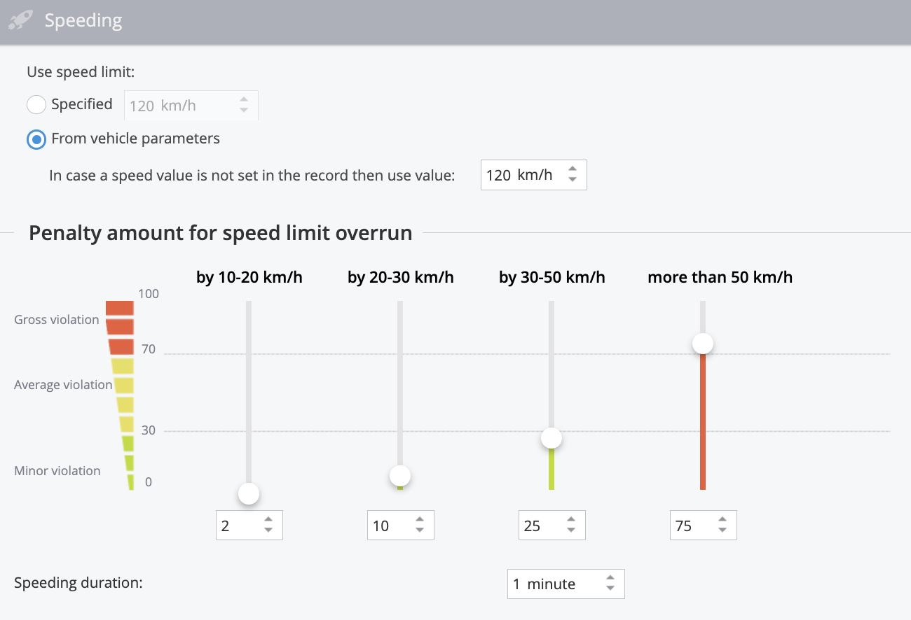

# Conducción ecológica - Eco Driving

El **reporte de Eco Driving** en Navixy es una potente herramienta diseñada para analizar y mejorar el comportamiento al volante de los conductores de su flota. Al asignar una puntuación entre 0 y 100 a cada conductor, el sistema proporciona una métrica clara del rendimiento de la conducción basada en los puntos de penalización acumulados por diversas infracciones de conducción. Estas infracciones se evalúan en función de su frecuencia y gravedad por cada 100 kilómetros recorridos, lo que garantiza una evaluación exhaustiva de los hábitos de cada conductor.

Para acceder al reporte Eco Driving, navegue hasta la sección **Aplicación de gestión de flotas** y seleccione la pestaña **"**&#x45;co Drivin&#x67;**".**

## Comprender los puntos de penalización

Los puntos de penalización son un componente clave del reporte de Eco Driving, ya que permiten calibrar el impacto de los distintos tipos de infracciones en el rendimiento del conductor. El sistema hace un seguimiento de tres categorías principales de infracciones al volante: exceso de velocidad, conducción brusca y ralentí excesivo. Cada tipo de infracción contribuye a la puntuación global, y las puntuaciones más bajas indican infracciones más frecuentes o graves.

## Personalización de reporte

El reporte de Eco Driving puede adaptarse a sus necesidades específicas, permitiéndole establecer sus propios criterios sobre lo que constituye una infracción y su gravedad. Puede asignar distintos puntos de penalización a diversas infracciones, lo que le permite dar prioridad a determinados aspectos del comportamiento al volante según las normas de su organización.

**Características principales**

* **Infracciones por exceso de velocidad:** Controlar los casos en que los conductores superan los límites de velocidad establecidos, con sanciones ajustadas en función del alcance y la duración del exceso de velocidad.
* **Conducción dura:** Realice un seguimiento de las maniobras agresivas, como frenadas bruscas, aceleraciones o giros bruscos, con umbrales personalizables basados en los dispositivos de su flota.
* **Ralentí excesivo:** Identificar y penalizar a los conductores por largos periodos de ralentí, que pueden desperdiciar combustible y reducir la eficiencia del vehículo.

Cálculos del reporte de Eco Driving

El reporte Eco Driving de Navixy está diseñado para evaluar y puntuar el comportamiento al volante de los empleados en función de una serie de criterios. La puntuación de cada conductor oscila entre 0 y 100 y está basada en los puntos de penalización asignados por diversas infracciones.

A continuación encontrará explicaciones detalladas sobre cómo se calculan estos puntos de penalización y cómo afectan a la puntuación global del conductor. Estos cálculos en reportes detallados permiten a los gestores de flotas evaluar el comportamiento al volante de forma exhaustiva, promoviendo prácticas de conducción más seguras y eficientes en toda su flota.

### Infracciones por exceso de velocidad

Las infracciones por exceso de velocidad se penalizan en función de cuánto supere el conductor el límite de velocidad y durante cuánto tiempo. Puede establecer un límite de velocidad universal o utilizar límites de velocidad específicos para cada vehículo.

**Cálculo de las sanciones por exceso de velocidad:**

Los puntos de penalización por exceso de velocidad se calculan mediante la siguiente fórmula:

`Factor de tiempo × Puntos de Penalización = Puntos totales de penalización`

Por ejemplo, si un vehículo supera el límite de velocidad en 21 km/h durante 1 minuto y 37 segundos, el sistema excluirá el primer minuto (no penalizado) y calculará la sanción por los 37 segundos restantes. Si la sanción por superar el límite de velocidad en 20-30 km/h se establece en 10 puntos, la fórmula sería:

`0.616 × 10 = 6.16 puntos de penalización`

### Infracciones graves al volante

Los eventos de conducción brusca, como aceleraciones rápidas, frenazos repentinos y giros bruscos, se registran mediante rastreadores GPS equipados con sensores de aceleración. La gravedad de cada incidente puede personalizarse y se asignan los puntos correspondientes.

**Cálculo de sanciones por conducción temeraria**

Cada incidente grave de conducción conlleva automáticamente un número preestablecido de puntos de penalización. Estos puntos se deducen de la puntuación total del conductor en función de la frecuencia de estos eventos.

### Infracciones por ralentí excesivo

El ralentí excesivo se controla cuando un vehículo permanece parado con el motor en marcha durante un periodo prolongado. Se asignan puntos de penalización en función del tiempo que el vehículo permanezca al ralentí por encima de un umbral predefinido.

**Cálculo de las sanciones por ralentí**

Por ejemplo, si un vehículo permanece al ralentí durante 8 minutos y 14 segundos y el umbral está fijado en 5 minutos, el cálculo de la sanción excluiría los 5 minutos iniciales y solamente penalizaría los 3 minutos y 14 segundos restantes. Si la sanción por ralentí se fija en 5 puntos por minuto, el cálculo sería:

`3.23 × 5 = 16.17 puntos de penalización`

### Total del periodo

La sección "Total del periodo" ofrece una visión general de todas las sanciones y puntuaciones de cada conductor o vehículo durante el periodo seleccionado. Incluye una representación gráfica y tablas detalladas.

**Gráfico del importe de la sanción**

Este gráfico muestra los puntos de sanción acumulados, codificados por colores según el tipo de infracción (rojo para el exceso de velocidad, azul para la conducción brusca y verde para el ralentí).

**Gráfico de clasificación**

Este gráfico muestra las puntuaciones de cada conductor o dispositivo, calculadas por cada 100 kilómetros recorridos. Las puntuaciones se ajustan en función de las sanciones, lo que permite comprender claramente el rendimiento de cada conductor.

### Cuadros con información detallada

Cada tipo de infracción se desglosa a su vez en cuadros detallados, que ofrecen información sobre hechos concretos como el exceso de velocidad, la conducción brusca y el ralentí.

#### Tabla de exceso de velocidad

Esta tabla enumera todos los incidentes de exceso de velocidad, con puntos de penalización asignados en función de la superación más grave de la velocidad durante el incidente.

#### Mesa de conducción dura

Los eventos registrados dentro de una ventana de 5 minutos se agrupan y se calculan las penalizaciones para cada grupo.

#### Tabla de intervalos de inactividad

Esta tabla proporciona detalles sobre cada caso de ralentí con el motor en marcha, incluidas la duración y los puntos de penalización correspondientes.

## Análisis de resultados

El reporte Eco Driving ofrece datos tanto gráficos como tabulares, lo que facilita ver de un vistazo qué conductores tienen un buen comportamiento y cuáles pueden necesitar más formación. La interfaz gráfica utiliza un código de colores para distinguir entre los distintos tipos de infracciones, mientras que las tablas ofrecen desgloses detallados de las sanciones por conductor o dispositivo.

### Ajustes y personalización

Puede ajustar el reporte de Eco Driving para centrarse en periodos de tiempo, días de la semana u horas del día concretos que sean más relevantes para su empresa. Además, el sistema le permite elegir si desea generar reportes basados en conductores individuales o en los vehículos que utilizan, lo que proporciona flexibilidad en función de sus preferencias de seguimiento.

### Programación del reporte de Eco Driving

El reporte de Eco Driving de Navixy puede programarse para que se ejecute automáticamente a intervalos especificados, lo que le permite supervisar y evaluar regularmente el comportamiento al volante sin intervención manual. Esta función le garantiza que recibirá información coherente y puntual sobre el rendimiento de su flota, lo que le ayudará a identificar tendencias y a abordar los problemas de forma proactiva.

Para programar el reporte, vaya a la pestaña "Programar" dentro de la sección Eco Driving, establezca la frecuencia deseada y especifique los destinatarios. El sistema generará el reporte de acuerdo con su configuración y lo entregará directamente en su bandeja de entrada o lo pondrá a su disposición para su descarga en la plataforma.

### Aplicaciones prácticas

El reporte Eco Driving es especialmente útil para las empresas que necesitan controlar de cerca el comportamiento de los conductores, como las de transporte de pasajeros, transporte de materiales peligrosos o servicios de emergencia. Mediante el análisis de este reporte, las organizaciones pueden prolongar la vida útil de los vehículos, reducir la probabilidad de accidentes y garantizar que los vehículos se utilicen de forma eficiente y responsable.

En general, el reporte de Eco Driving es una función esencial para cualquier gestor de flotas que desee mantener altos niveles de seguridad, eficiencia y cumplimiento de la normativa por parte de los conductores.
