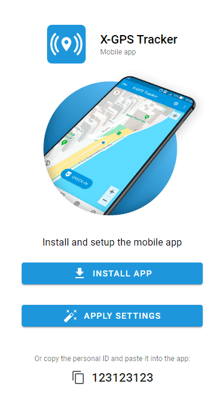

# Activar la aplicación de seguimiento X-GPS

En [Aplicación X-GPS Tracker](https://x-gps.app) transforma un teléfono inteligente o una tableta en un localizador GPS, proporcionando seguimiento en tiempo real para el personal de campo, como conductores, mensajeros, técnicos de servicio, trabajadores de la construcción, representantes de ventas, etc. Utilizando una combinación de señales de navegación por satélite (GPS), GSM y redes Wi-Fi, la aplicación determina con precisión la ubicación del propietario del dispositivo al tiempo que mantiene un bajo consumo de energía.

Además, la aplicación móvil X-GPS Tracker permite a los empleados de campo informar de su ubicación, estado y finalización de tareas en tiempo real. Permite a los usuarios compartir sus coordenadas GPS, subir fotos y rellenar formularios, lo que facilita a las empresas el seguimiento del progreso de su mano de obra, la gestión eficiente de las tareas y el buen funcionamiento de las operaciones sobre el terreno.

La activación de la aplicación X-GPS Tracker en la plataforma Navixy requiere dos sencillos pasos.

## Paso 1: Enviar una invitación a un empleado

Invite primero a un empleado a instalar la aplicación X-GPS Tracker. Puede hacerlo desde la interfaz web Navixy o desde la aplicación X-GPS Monitor.

#### **Utilizando la interfaz web de Navixy:**

* Acceda a su cuenta de usuario Navixy
* En el menú de la izquierda, haga clic en el icono "Activar dispositivo".
* Seleccione la opción "Aplicación móvil
* Cree una etiqueta para el dispositivo (por ejemplo, "Conductor John Smith")
* Introduzca el número de teléfono y/o la dirección de correo electrónico de su empleado donde enviarle una invitación

#### **Utilizando la aplicación X-GPS Monitor:**

* Abre la aplicación X-GPS Monitor en tu dispositivo móvil
* Seleccione "Activar dispositivo" en el menú
* Elija la opción "Aplicación móvil
* Introduzca los datos de contacto para enviar la invitación

## Paso 2: Aceptar la invitación y configurar la aplicación

#### Recibir la invitación

El empleado recibirá una invitación por SMS o correo electrónico. La invitación incluye:

* Un identificador personal de 12 dígitos
* Un enlace para descargar la aplicación X-GPS Tracker

#### Descargar e instalar la aplicación

Pida a su empleado que proceda con la invitación, que también implica la descarga de la aplicación X-GPS Tracker en el dispositivo móvil del empleado:

1. Visite el [App Store (iOS)](https://apps.apple.com/us/app/x-gps-tracker/id1612047534) o [Google Play Store (Android)](https://play.google.com/store/apps/details?id=com.navixy.xgps.tracker)
2. Busca "X-GPS Tracker" (no lo confundas con X-GPS Monitor, que es otra aplicación)
3. Descargue e instale la aplicación en su dispositivo móvil

#### Instalar y configurar la aplicación

Al iniciar la aplicación, el empleado tendrá que introducir el identificador de 12 dígitos de la invitación para completar la configuración.

* En la aplicación X-GPS Tracker, inicia la función de seguimiento
* Asegúrate de que la aplicación tiene los permisos necesarios para acceder a la ubicación de tu dispositivo.

Siguiendo estos pasos, podrá activar y utilizar correctamente la aplicación X-GPS Tracker con la plataforma Navixy, lo que le permitirá rastrear y gestionar su dispositivo móvil de forma eficaz. Si tiene algún problema, consulte al soporte técnico de su proveedor de servicios.
