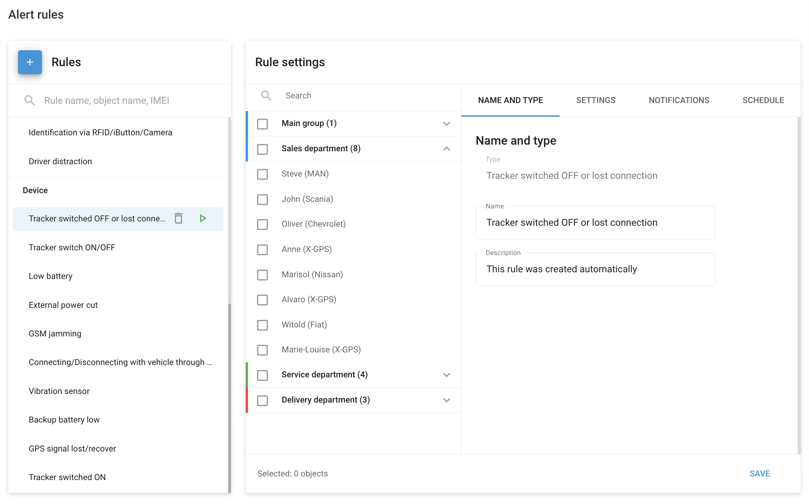
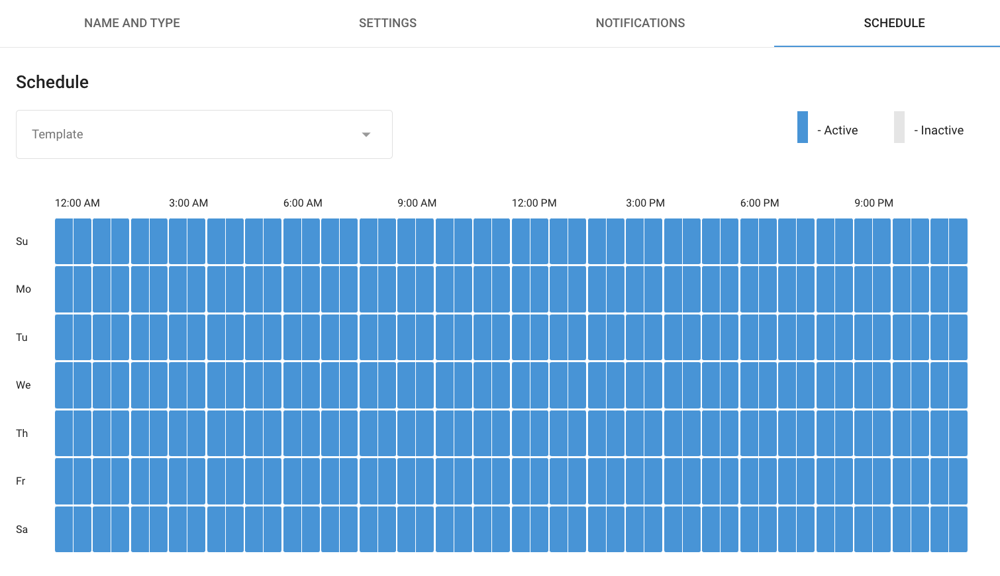

# Reglas y alertas

Utilizando **Reglas y alertas** en Navixy, puede detectar diversos eventos y recibir notificaciones sobre ellos. Estas funciones ayudan a los usuarios a supervisar y gestionar su flota, sus activos y sus empleados sobre el terreno de forma más eficaz. Los eventos pueden ir desde simples infracciones de geocercas hasta escenarios complejos como alertas antirrobo o prevención de robos de combustible. Vea los [ejemplos](./) para más detalles.

## Tipos de eventos detectados

Navixy ofrece un amplio conjunto de eventos estructurados en varias categorías para ayudarle a supervisar y gestionar eficazmente su flota, sus activos y sus empleados de campo. A continuación se indican las categorías de los eventos:

* [**Potencia del dispositivo**](https://squaregps.atlassian.net/wiki/x/WIBTpQ) - Supervisar el estado de alimentación del dispositivo, incluidas la batería y las conexiones externas
* [**Conexión de dispositivos**](conexin-de-dispositivos/) - Seguimiento de la conectividad de los dispositivos a la red
* [**Posicionamiento del dispositivo**](posicionamiento-del-dispositivo/) - Supervisar la señal GPS
* [**Seguridad**](seguridad/) - Sucesos relacionados con la seguridad y la manipulación de vehículos
* [**Seguridad**](../../readme/reglas-y-alertas/conduccion-segura/) - Eventos relacionados con la seguridad de los conductores
* [**Control de movimientos**](control-de-movimientos/) - Seguimiento del movimiento, la velocidad y la ruta de los vehículos
* [**Programación y expedición**](programacin-y-expedicin/) - Gestionar la programación de vehículos y personal
* [**Eficiencia del vehículo**](eficiencia-del-vehculo/) - Controlar el consumo de combustible y la eficiencia
* [**Entradas y salidas**](entradas-y-salidas/) - Seguimiento del estado de los sensores y equipos conectados

### Dónde se computan los eventos

En los sistemas IoT, los eventos pueden detectarse en el dispositivo o en el servidor:

* **Eventos detectados en el dispositivo**: Activados por los sensores o entradas del dispositivo de seguimiento GPS instalado en el vehículo o activo. Estos eventos se producen debido a acciones o condiciones físicas, como pulsar un botón de emergencia, detectar un accidente de tráfico o registrar un comportamiento de conducción brusco. Los eventos específicos detectados dependen de las capacidades del dispositivo utilizado.
* **Eventos detectados en el servidor**: Se generan analizando los datos recibidos del dispositivo en función de reglas y condiciones predefinidas por el usuario. Estos eventos se identifican mediante la lógica del servidor, como la detección de infracciones de la geovalla, desviaciones de ruta, alertas de mantenimiento programado o cambios inusuales en el nivel de combustible. El servidor procesa los datos y activa las alertas en función de los criterios configurados.

## Gestionar las alerta

Las reglas en Navixy son condiciones predefinidas que activan eventos cuando se cumplen. Para configurar, editar o eliminar las reglas que desea supervisar y sobre las que desea recibir notificaciones, seleccione **Alertas** desde el menú principal.

Seguir leyendo

Para acceder a la configuración de las reglas de notificación en Navixy, vaya al menú de la izquierda y seleccione **Alertas**. Se abrirá el panel de notificaciones. Haga clic en **Establecer alertas**y aparecerá la interfaz de reglas de alerta.

En la interfaz de reglas de alerta puedes:

* **Ver las alertas existentes**: La interfaz mostrará una lista de todas las reglas de alerta existentes.
* **Seleccionar o crear nuevas reglas**: Puede seleccionar reglas existentes para editarlas o crear nuevas reglas pulsando el botón "+".
* **Configuración de reglas**: Para cada regla, puede configurar las siguientes opciones:
  * **Nombre y tipo**: Establezca el nombre y la descripción de la regla.
  * **Ajustes**: Defina las condiciones y parámetros específicos de la regla.
  * **Notificaciones**: Configure cómo y a quién se enviarán las notificaciones.
  * **Horario**: Establezca el horario en el que la regla estará activa.

### Vincular reglas a objetos

Una regla puede vincularse a uno o varios objetos, como vehículos individuales o grupos de vehículos. Esta flexibilidad permite aplicar la misma regla a varios activos, lo que garantiza la coherencia de la supervisión y las notificaciones.

Pasos para vincular una regla a objetos

1. **Abrir la configuración de reglas**: Navegue hasta **Alertas** del menú principal y seleccione la regla que desea configurar.
2. **Seleccionar objetos**: En el **Configuración de reglas** verá una lista de objetos disponibles en el lado izquierdo. Estos objetos pueden ser vehículos individuales o grupos de vehículos organizados por departamentos.
3. **Elegir objetos**: Marque las casillas situadas junto a los objetos o grupos a los que desea vincular la regla. Por ejemplo, puede seleccionar vehículos individuales como "Oliver (Chevrolet)" y "Marisol (Nissan)", o grupos enteros como "Departamento de ventas".

### Tipo y nombre

En el **Nombre y tipo** del cuadro de diálogo, puede especificar los siguientes detalles para su regla de notificación:

* **Tipo de regla**: Seleccione uno de los muchos tipos de eventos que pueden supervisarse con Navixy.
* **Etiqueta de la regla**: Proporcione un nombre a la regla para identificarla fácilmente. Ejemplo: "El vehículo está fuera del depósito ABC".
* **Descripción de la alerta**: Añada una breve descripción de la norma para explicar su finalidad o cualquier detalle adicional. Ejemplo: "Esta regla activa una alerta cuando un vehículo sale de la zona ABC designada del depósito, lo que ayuda a controlar los movimientos no autorizados."

El uso de la etiqueta y la descripción le ayuda a organizar y gestionar muchas reglas de forma eficaz.

### Notificaciones

Puede recibir notificaciones a través de varios canales para asegurarse de que está puntualmente informado de los acontecimientos importantes. Estos canales incluyen:

* **Notificaciones por SMS**: Alertas inmediatas enviadas al teléfono móvil del usuario.
* **Notificaciones por correo electrónico**: Notificaciones detalladas enviadas a la dirección de correo electrónico del usuario.
* **Notificaciones push**: Alertas instantáneas a través de la aplicación móvil X-GPS.
* **Notificaciones en la aplicación**: Alertas mostradas en la interfaz web Navixy.

Cada canal de notificación puede personalizarse con opciones como los detalles del destinatario, la frecuencia de las notificaciones y la personalización del contenido.

### Horario

En el **Horario** puede definir cuándo sus reglas de notificación están activas o inactivas. Esto permite controlar con precisión cuándo deben activarse las alertas, en función de sus necesidades operativas específicas.

Configurar el horario

A continuación te explicamos cómo puedes configurar el horario:

* **Plantilla**: Seleccione una plantilla de programación predefinida, si está disponible, para aplicar rápidamente patrones de programación comunes, como Fines de semana, Días laborables y Todos los días.
* **Periodos activos**: Los bloques azules representan las horas en las que la regla está activa y activará las notificaciones. Puede establecer estos bloques para determinadas horas del día y días de la semana.
* **Periodos inactivos**: Los bloques grises indican las horas en las que la regla está inactiva y no activará notificaciones. Esto ayuda a evitar alertas innecesarias durante las horas no operativas.

Para personalizar la programación, basta con hacer clic en los bloques de tiempo deseados para alternar entre los estados activo e inactivo. Esta flexibilidad garantiza que reciba notificaciones solo durante los momentos relevantes, lo que reduce las posibilidades de fatiga por alertas y mejora la eficacia de sus esfuerzos de supervisión.

## Ver el historial de notificaciones

El historial de notificaciones puede consultarse en distintas plataformas, lo que permite a los usuarios revisar eventos y alertas anteriores.

* **Aplicación web**: Acceda al historial de notificaciones a través de la sección "Eventos" de la interfaz web de Navixy. Filtre por fecha, tipo de evento y otros criterios.
* **Aplicación móvil**: Consulta las notificaciones recientes y el historial en la aplicación móvil Navixy.
* **Informes**: Genere informes detallados sobre eventos pasados y notificaciones para su análisis y mantenimiento de registros.

## Alertas de suspensión y reanudación

Los usuarios pueden suspender temporalmente las reglas y reanudarlas cuando sea necesario. Esta función es útil durante periodos en los que las acciones de las reglas no son necesarias, como durante el mantenimiento o la inactividad estacional.

Cómo suspender una norma existente

1. **Navegar hasta las alertas**: Ir a la página **Alertas** del menú principal.
2. **Seleccione la regla**: Busque la regla que desea suspender en la lista de reglas de alerta.
3. **Suspender la alerta**: Haga clic en el icono de pausa (⏸️) situado junto al nombre de la regla para suspenderla.

Para reanudar la regla, basta con hacer clic de nuevo en el icono de pausa. Esto reactivará las acciones de la regla.

## Ejemplos

He aquí algunos ejemplos de cómo pueden utilizarse las notificaciones de eventos en diversos escenarios:

### Alertas de geocercas

Las alertas de geocercas son una potente función de Navixy que ayuda a los usuarios a supervisar los movimientos de sus vehículos y activos dentro de unos límites geográficos predefinidos, conocidos como geocercas. Esta funcionalidad es esencial para garantizar la eficiencia operativa, la seguridad y el cumplimiento de las políticas de la organización.

Seguir leyendo

Claro, aquí tienes el texto corregido y con los cambios solicitados:

**¿Qué es una geocerca?**

Una geocerca es un perímetro virtual establecido en un mapa alrededor de un área geográfica específica. Esta zona puede tener cualquier forma y tamaño, como un radio circular alrededor de un punto o un polígono más complejo que delimite una región específica.

**¿Cómo funcionan las alertas de geocercas?**

Cuando un vehículo o un activo equipado con un dispositivo de seguimiento GPS cruza los límites de una geocerca, se activa un evento. A continuación, el sistema registra este evento y envía notificaciones al usuario según la configuración predefinida.

**Configuración de alertas de geocercas**

**Definir la zona de la geocerca:**

* Geocerca circular: Establezca un radio alrededor de un punto central, como un almacén o una oficina.
* Geocerca poligonal: Dibuje una forma compleja en el mapa para cubrir zonas como obras, áreas de entrega o distritos urbanos.
* Geocerca de corredor: Cree una geocerca estrecha y alargada que siga una ruta o camino específico, como una autopista, una vía férrea o un oleoducto, para supervisar el movimiento a lo largo de esa ruta y detectar desviaciones.

**Configurar las condiciones de la alerta:**

* Alertas de entrada: Notifican cuando un vehículo o activo entra en la geocerca.
* Alertas de salida: Notifican cuando un vehículo o activo abandona la geocerca.
* Alertas de tiempo de permanencia: Se activan si un vehículo o activo permanece dentro o fuera de una geocerca durante un periodo especificado.

**Establecer preferencias de notificación:**

* Elija los canales a través de los cuales se enviarán las notificaciones, como SMS, correo electrónico, notificaciones _push_ o alertas dentro de la aplicación.
* Personalice el contenido del mensaje para incluir detalles relevantes como el ID del vehículo, la ubicación y la hora del evento, etc.

**Usos prácticos de las alertas de geocercas:**

* Gestión de flotas: Garantizar que los vehículos cumplan las rutas predefinidas y detectar viajes no autorizados o desviaciones de las rutas asignadas.
* Seguridad de los activos: Supervisar la ubicación de activos valiosos y recibir alertas inmediatas si se mueven fuera de una zona segura.
* Gestión de los empleados: Realizar un seguimiento de los empleados de campo y asegurarse de que se encuentran dentro de las zonas de trabajo designadas durante sus turnos.
* Eficacia operativa: Optimizar la logística controlando los tiempos de entrada y salida en ubicaciones clave como almacenes y puntos de entrega.

**Ejemplo de un escenario**

Una empresa de reparto establece una geocerca alrededor de su almacén principal. Cuando un camión de reparto entra en esta geocerca, se activa una alerta de entrada que notifica al responsable del almacén mediante una notificación push. Esto permite al encargado prepararse para descargar el camión. Si el camión abandona la geocerca sin una salida programada, se envía una alerta de salida al equipo de seguridad, lo que indica un posible uso no autorizado o robo.

Mediante el uso de alertas de geocercas, las organizaciones pueden aumentar su control operativo, mejorar la seguridad y garantizar el cumplimiento de las normativas internas y externas.

### Alertas antirrobo

Las alertas antirrobo de vehículos son una función crucial de Navixy diseñada para mejorar la seguridad de los vehículos detectando movimientos no autorizados o manipulaciones. Esta funcionalidad proporciona tranquilidad a los propietarios de vehículos y a los gestores de flotas, ya que garantiza la adopción de medidas inmediatas en caso de actividades sospechosas.

Seguir leyendo

#### ¿Cómo funcionan las alertas antirrobo de los coches?

Las alertas antirrobo para coches se activan cuando se cumplen determinadas condiciones que indican un uso no autorizado o una manipulación. Estas condiciones pueden personalizarse en función de los requisitos del usuario y las necesidades de seguridad del vehículo.

#### Configurar las alertas antirrobo del coche

Definir los criterios de movimiento no autorizado:

* Detección de ignición: Supervisa el estado de encendido del vehículo para detectar si se arranca sin autorización.
* Detección de movimientos: Utiliza el seguimiento por GPS para identificar cuándo un vehículo se desplaza inesperadamente de su lugar de estacionamiento.
* Restricciones temporales: Establece alertas para el movimiento de vehículos fuera del horario laboral o de las horas de funcionamiento designadas.

Detección de manipulaciones:

* Sensores de puertas y ventanas: Instala sensores para detectar si se abren puertas o ventanas por la fuerza o sin la debida autorización.
* Desconexión de la batería: Establece alertas para los casos en que la batería del vehículo sea desconectada, un método común utilizado por los ladrones para desactivar los sistemas de seguimiento.
* Interferencias de la señal GPS: Supervisa si hay interferencias en la señal GPS, lo que podría indicar una posible manipulación.

Configurar las notificaciones de alerta:

* Notificaciones instantáneas: Configura el envío inmediato de SMS, correos electrónicos, notificaciones _push_ o alertas dentro de la aplicación cuando se detecte actividad no autorizada.
* Receptores de alertas: Designa a personas o equipos específicos (por ejemplo, personal de seguridad, gestores de flotas) para que reciban estas alertas.
* Personalización del contenido de las alertas: Incluye detalles esenciales en la notificación, como la ubicación actual del vehículo, la hora del suceso y el tipo de actividad no autorizada detectada.

#### Usos prácticos de las alertas antirrobo para coches

* Seguridad de vehículos privados: Los propietarios de vehículos particulares pueden utilizar alertas antirrobo para proteger sus coches de robos o usos no autorizados, especialmente en zonas de alto riesgo.
* Gestión de flotas: Los gestores de flotas pueden garantizar la seguridad de sus vehículos, evitando el uso no autorizado por parte de los empleados o los robos en aparcamientos y depósitos.
* Servicios de alquiler: Las empresas de alquiler de coches pueden vigilar sus vehículos para detectar y responder a movimientos no autorizados o manipulaciones, salvaguardando así sus activos.
* Logística y entrega: Las empresas de logística y reparto pueden proteger sus vehículos y las valiosas mercancías que transportan frente a robos o accesos no autorizados.

#### Ejemplo de un escenario

Una empresa de logística ha equipado sus camiones de reparto con un sistema de alerta antirrobo. Una noche, fuera del horario laboral, el sistema detecta que el contacto de uno de los camiones ha sido activado. Se envía una alerta instantánea al gestor de la flota mediante una notificación _push_, un SMS y un correo electrónico, indicando el encendido no autorizado.

Simultáneamente, el seguimiento por GPS muestra que el camión se está alejando de su lugar de estacionamiento designado. El gestor de la flota se pone inmediatamente en contacto con las autoridades locales y les facilita la ubicación del camión en tiempo real. Gracias a la alerta a tiempo, las autoridades interceptan el vehículo, evitando el robo y asegurando los activos de la empresa.

Utilizando alertas antirrobo para coches, las organizaciones pueden mejorar significativamente la seguridad de sus vehículos, responder rápidamente a posibles robos y minimizar el riesgo de pérdida de activos.

### Alertas de control de temperatura

Las alertas de control de temperatura son una función de ayuda de Navixy diseñada para garantizar que la carga sensible se transporta en condiciones óptimas. Esta funcionalidad es crucial para industrias como la farmacéutica, la de alimentación y bebidas y otros sectores en los que mantener un rango de temperatura específico es esencial para preservar la calidad y seguridad de los productos.

Seguir leyendo

#### ¿Cómo funcionan las alertas de control de temperatura?

Las alertas de control de temperatura supervisan la temperatura de la carga en tiempo real mediante sensores instalados en el interior del vehículo de transporte. Cuando la temperatura supera o desciende por debajo de los límites predefinidos, se activa una alerta. Esto permite tomar medidas inmediatas para rectificar la situación y evitar daños a la carga.

#### Configuración de alertas de control de temperatura

Instalar sensores de temperatura:

* Colocación del sensor: Coloque sensores de temperatura en lugares estratégicos de la zona de carga para garantizar una supervisión precisa y exhaustiva.
* Calibración del sensor: Asegúrese de que los sensores estén calibrados correctamente para proporcionar lecturas de temperatura precisas.

Definir los límites de temperatura:

* Umbrales superior e inferior: Establezca límites máximos y mínimos de temperatura en función de los requisitos de la carga específica.
* Rangos de temperatura: Defina rangos de temperatura aceptables para diferentes tipos de carga que puedan tener requisitos variables.

Configurar las condiciones de alerta:

* Control en tiempo real: Supervise continuamente la temperatura y active alertas si se desvía de los límites establecidos.
* Alertas basadas en la duración: Configure las alertas para que se activen si la temperatura permanece fuera del rango aceptable durante un tiempo especificado, lo que indica un problema persistente.
* Múltiples umbrales: Defina varios umbrales para distintos niveles de alerta (por ejemplo, advertencia, crítico) en función de la gravedad de la desviación de la temperatura.

Establecer preferencias de notificación:

* Canales de notificación: Elija los canales a través de los cuales se enviarán las alertas, como SMS, correo electrónico, notificaciones _push_ o alertas dentro de la aplicación.
* Receptores de alertas: Especifique las personas o equipos responsables de responder a las alertas de temperatura (por ejemplo, control de calidad, responsables de logística).
* Personalización del contenido de las alertas: Incluya detalles esenciales en las notificaciones, como la etiqueta del objeto, la temperatura actual, la ubicación, la hora de la alerta y las acciones recomendadas.

#### Usos prácticos de las alertas de control de temperatura

* Industria farmacéutica: Garantizar que las vacunas, los medicamentos y otros productos farmacéuticos sensibles a la temperatura se transporten dentro del intervalo requerido para mantener su eficacia y seguridad.
* Industria alimentaria: Evitar el deterioro y garantizar la seguridad de los alimentos manteniendo la temperatura correcta de productos perecederos como lácteos, carne y productos agrícolas durante el transporte.
* Industria química: Proteger los productos químicos sensibles a la temperatura de la degradación o de reacciones peligrosas mediante la supervisión y el control de las condiciones de transporte.
* Logística de la cadena de frío: Optimizar el proceso de la cadena de frío garantizando que todos los eslabones de la cadena de suministro mantengan las condiciones de temperatura requeridas, desde la producción hasta la entrega.

#### Ejemplo de un escenario

Una empresa farmacéutica utiliza alertas de control de temperatura para supervisar el transporte de vacunas. Estas vacunas deben mantenerse entre 2 °C y 8 °C para seguir siendo eficaces. La empresa instala sensores de temperatura en sus camiones frigoríficos y establece los umbrales de temperatura en consecuencia.

Durante una entrega, uno de los camiones sufre una avería en su unidad de refrigeración, lo que hace que la temperatura supere el límite de 8 °C. El sistema activa inmediatamente una alerta y envía notificaciones al equipo de control de calidad por SMS, correo electrónico y notificaciones _push_.

La notificación incluye detalles como la temperatura actual (10 °C), la ubicación del camión y la hora de la alerta. El equipo de control de calidad se pone en contacto con el conductor y le indica que tome medidas correctoras, como parar en la instalación más cercana con servicios de reparación de refrigeración.

Además, el equipo organiza un vehículo alternativo para continuar la entrega, garantizando que las vacunas permanezcan dentro del intervalo de temperatura seguro. La rápida respuesta evita el posible deterioro de las vacunas, lo que ahorra a la empresa importantes pérdidas económicas y mantiene la integridad de sus productos.

Mediante el uso de alertas de control de temperatura, las organizaciones pueden garantizar el transporte seguro y eficaz de cargas sensibles, minimizar el riesgo de deterioro o daños y cumplir las normativas del sector.

### Alertas de prevención de robo de combustible

Las alertas de prevención de robo de combustible son una función esencial de Navixy diseñada para proteger a los vehículos de los desvíos de combustible no autorizados y garantizar un uso eficiente del combustible. Esta funcionalidad ayuda a los gestores de flotas y a los propietarios de vehículos a controlar los niveles de combustible en tiempo real y a recibir alertas inmediatas cuando se detectan caídas sospechosas en los niveles de combustible, lo que permite intervenir rápidamente y mitigar las pérdidas.

Alertas de prevención de robo de combustible

#### ¿Cómo funcionan las alertas de prevención de robo de combustible?

Las alertas de prevención de robo de combustible se activan cuando el nivel de combustible en el depósito de un vehículo desciende de forma inesperada, lo que indica un posible robo o uso no autorizado. El sistema utiliza los datos de los sensores de nivel de combustible instalados en el vehículo para supervisar y analizar continuamente dichos niveles.

#### Establecer alertas de prevención de robo de combustible

Instalar sensores de nivel de combustible:

* Colocación del sensor: Instale sensores dentro del depósito para obtener lecturas precisas del nivel de combustible.
* Calibración del sensor: Asegúrese de que los sensores estén correctamente calibrados para reflejar con precisión los niveles, teniendo en cuenta la forma y el tamaño del depósito.

Definir las condiciones de alerta:

* Caídas inesperadas: Establezca condiciones para detectar caídas significativas en los niveles de combustible que se producen fuera de los patrones de uso normales, como cuando el vehículo está aparcado o no está en uso.
* Límites de umbral: Fije umbrales específicos para las caídas de combustible (por ejemplo, más de 10 litros en un periodo corto) para activar las alertas.
* Alertas temporales: Configure las alertas para que sean más sensibles durante las horas en las que el vehículo no debería estar en uso, como fuera del horario laboral o durante los fines de semana.

Configurar las notificaciones:

* Canales de notificación: Elija los canales para recibir alertas, como SMS, correo electrónico, notificaciones _push_ o alertas dentro de la aplicación.
* Receptores de alertas: Designe a personas o equipos (por ejemplo, gestores de flotas, personal de seguridad) responsables de responder a las alertas de robo de combustible.
* Personalización de alertas: Incluya información detallada en las alertas, como el ID del vehículo, la ubicación actual, la hora de la pérdida y la cantidad de combustible sustraído.

#### Usos prácticos de las alertas de prevención de robos de combustible

* Gestión de flotas: Proteja los vehículos de la flota contra el robo de combustible, reduciendo los costes operativos y garantizando registros precisos de su uso.
* Equipos fijos: Proteja equipos estacionarios, como los generadores eléctricos diésel, contra el robo de combustible, garantizando un funcionamiento constante y evitando costosas pérdidas.

#### Ejemplo de un escenario

Una empresa de logística utiliza alertas de prevención de robo de combustible para controlar sus camiones de reparto. Han instalado sensores de nivel de combustible en todos sus vehículos y han configurado el sistema para detectar caídas inesperadas, especialmente durante las horas no operativas.

Una noche, después de que se hayan completado todas las entregas y los camiones estén aparcados en el depósito de la empresa, el sistema detecta una caída repentina de 15 litros en el nivel de combustible de uno de los camiones. Este descenso inesperado activa una alerta inmediata, que envía notificaciones al gestor de la flota a través de SMS, correo electrónico y notificaciones _push_.

La alerta incluye la identificación del camión, su ubicación dentro del depósito, la hora y la cantidad de combustible perdido. El gestor de la flota se pone rápidamente en contacto con el equipo de seguridad para investigar la situación. El equipo de seguridad encuentra pruebas de que el depósito de combustible ha sido manipulado y detiene al sospechoso, con lo que se evitan nuevos robos.

Mediante el uso de alertas de prevención de robos de combustible, la empresa de logística puede supervisar y proteger eficazmente sus activos, reduciendo las pérdidas por robo y garantizando una gestión eficiente del combustible. Este enfoque proactivo no solo ahorra costes, sino que también ayuda a mantener la integridad de sus operaciones.

## Reglas creadas automáticamente

Cuando [activar automáticamente](../inicio-rpido/activar-el-dispositivo-gps.md) un nuevo dispositivo en la plataforma Navixy, el sistema crea automáticamente reglas basadas en las capacidades del dispositivo, como una regla "Emergency Signal" para un localizador GPS personal con un botón de emergencia. Esta automatización le ahorra tiempo al configurar las funciones esenciales de seguimiento desde el principio, garantizando que su dispositivo esté listo para usarse inmediatamente.

Estas reglas preconfiguradas son totalmente personalizables: puede añadir fácilmente notificaciones, ajustar la configuración o suspender cualquier regla si no es necesaria. Este enfoque racionalizado mejora la seguridad y la experiencia del usuario, lo que le permite centrarse en lo que más importa sin las molestias de la configuración manual.

## Personalización de las notificaciones en el navegador

Puede personalizar sus notificaciones de eventos en el navegador haciendo clic en el icono de engranaje de la lista de eventos. Para acceder a la configuración de las notificaciones y personalizarlas, haz clic en "Alertas" en el menú de la izquierda para abrir Notificaciones y, a continuación, haz clic en el icono del engranaje.

* **Notificaciones del navegador:** Active esta opción para recibir alertas de eventos directamente en el centro de notificaciones de su sistema operativo (por ejemplo, el Centro de actividades de Windows). Tu navegador te pedirá que permitas estas notificaciones.
* **Mostrar notificaciones:** Los nuevos eventos aparecerán como notificaciones emergentes en la esquina superior derecha de la página de la plataforma de monitorización.
* **Notificación de audio:** Cada nuevo evento activará una alerta sonora en el navegador.
* **Volumen:** Ajusta el volumen de las notificaciones sonoras de tu navegador según tus preferencias.
