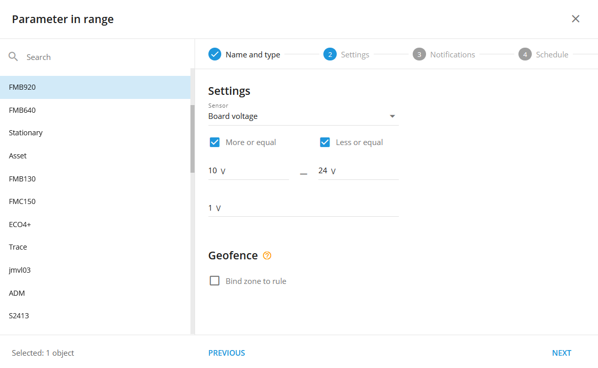

# Parámetro en rango

## Visión general

La regla "Parámetro dentro del intervalo" es una potente herramienta que le ayuda a supervisar los datos críticos de los sensores en tiempo real. Le avisa automáticamente cuando las mediciones, como la temperatura o la tensión, se sitúan dentro o fuera de los umbrales especificados. Esta regla le permite mantenerse informado sobre las métricas importantes y actuar con rapidez cuando sea necesario.

Por ejemplo, una empresa de logística puede utilizar la regla "Parámetro en rango" para controlar la carga sensible a la temperatura. Al establecer límites de temperatura (por ejemplo, de +2 °C a +10 °C o de 35 °F a 50 °F), el sistema envía alertas instantáneas si la temperatura de la carga sale del intervalo seguro. Esto permite responder a tiempo para proteger el envío y mantener la conformidad.

## Configuración de reglas

#### Sensor

Especifique el sensor de medición (físico o virtual) que servirá como fuente de datos para las alertas. Sólo se puede asignar un único sensor por regla, lo que significa que cada rastreador requiere una regla distinta.

#### Más o igual

Establece el límite inferior del intervalo aceptable.

#### Menos o igual

Establece el límite superior del intervalo aceptable.

#### Valor umbral

Este parámetro añade un búfer alrededor de los límites definidos para tener en cuenta el ruido o las imprecisiones del sensor. El umbral ayuda a distinguir entre los estados "En rango" y "Fuera de rango", creando una zona de tolerancia alrededor de los valores establecidos. Si no se especifica ningún umbral, el valor predeterminado es 0,03. De este modo se evitan frecuentes disparos de eventos debidos a pequeñas fluctuaciones en las lecturas de los sensores.

Para los ajustes habituales, consulte [Reglas y alertas](../).

## Detalles del funcionamiento del sistema

* **Cambios de estado**:
  * Salida de rango: Ocurre cuando el valor supera el umbral exterior.
  * Entrada a rango: Ocurre cuando el valor regresa por debajo del umbral exterior, pero sin cruzar el umbral interior.
  * Salida de rango: Ocurre cuando el valor supera el umbral exterior.
  * Entrada a rango: Ocurre cuando el valor regresa por debajo del umbral exterior, pero sin cruzar el umbral interior.
* **Sensores virtuales:** Cuando se utiliza un sensor virtual como fuente de datos, el rango se define según el valor original del sensor virtual. Esto resulta útil para controlar campos de estado o códigos de evento específicos dentro de un rango especificado.
* **Reinicia el temporizador:** La alerta "Parámetro dentro del intervalo" tiene un temporizador de reinicio de 10 segundos, lo que garantiza que las alertas no se activen con más frecuencia que cada 10 segundos, lo que ayuda a evitar notificaciones redundantes.
* **Compatible con un solo dispositivo:** Cada regla sólo admite un dispositivo debido a la complejidad de cruzar múltiples sensores, rastreadores y datos de calibración.
* **Procesamiento independiente del GPS:** La plataforma procesa y muestra los eventos incluso si el paquete de datos carece de coordenadas GPS válidas, garantizando que todos los eventos relevantes se capturen y muestren independientemente de la configuración de la geocerca.
