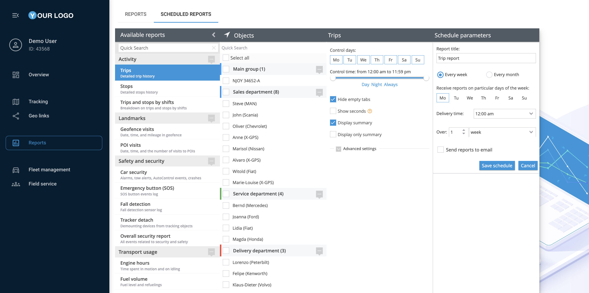

# Reportes

Navixy ofrece una potente función de reportes que le permite generar reportes detallados sobre diversos aspectos de las operaciones de su flota. Esta guía le apoyará a crear, programar y gestionar reportes utilizando la plataforma Navixy, asegurando que pueda acceder y analizar fácilmente los datos que necesita.

## Acceder a la sección de reportes

1. **Vaya a la aplicación reportes:**

* En el menú principal de la parte izquierda de la interfaz de Navixy, haga clic en la opción "reportes". Esto le llevará a la sección donde puede ver, crear y gestionar sus reportes.

2. **Visualización de los reportes generados:**

* La sección "reportes generados" muestra una lista de todos los reportes que se han creado previamente. Puede acceder rápidamente a cualquiera de estos reportes y revisarlos haciendo clic en su título.

3. **Creación de un nuevo reporte:**

* Para generar un nuevo reporte, haga clic en el botón "Crear reporte" situado en la parte superior de la lista de reportes generados. Se abrirá la interfaz de creación de reportes.

## Generar un único reporte

Un reporte único es un documento generado a medida que proporciona información detallada sobre aspectos concretos de las operaciones de su flota, como la actividad de los vehículos, el consumo de combustible o el comportamiento de los conductores, basándose en criterios y periodos de tiempo seleccionados. A continuación se explica cómo generar un reporte único:

1. **Elija un tipo de reporte:**

* En el panel "reportes disponibles", encontrará varios tipos de reportes agrupados por categorías, como Actividad, Hitos, Protección y seguridad, y Uso del transporte. Seleccione el reporte que desea generar haciendo clic sobre él.

2. **Selecciona los objetos:**

* Tras elegir el tipo de reporte, deberá seleccionar los objetos (vehículos, conductores, etc.) para los que se generará el reporte. Utilice el panel "Objetos" para marcar las casillas correspondientes junto a los elementos deseados.

3. **Personalizar la configuración de los reportes:**

* En el panel de configuración del reporte, introduzca un título para el reporte y seleccione el intervalo de fechas. También puede elegir días y horas de control específicos, y decidir si desea incluir resúmenes o ajustes avanzados.

4. **Elabore el reporte:**

* Una vez configurados todos los parámetros, haga clic en el botón "Generar reporte". El reporte se generará y se añadirá a la parte superior de la lista de "reportes generados" para su acceso inmediato.

## Programación de reportes

Los reportes programados son reportes automatizados que se generan a intervalos predefinidos, como diarios, semanales o mensuales, lo que le permite recibir regularmente información sobre las operaciones de su flota sin intervención manual. A continuación se explica cómo programar un reporte:

1. **Acceda a los reportes programados:**

* En la aplicación "reportes", haga clic en la pestaña "reportes programados" situada junto a la pestaña "reportes". Esta sección permite automatizar la generación de reportes en función de un calendario establecido.

2. **Añade un nuevo horario:**

* Para configurar un nuevo reporte programado, haga clic en "Añadir nueva programación para reporte".

3. **Configurar los parámetros de programación:**

* Seleccione el tipo de reporte, los objetos y personalice los parámetros de programación, como los días de control, la hora de envío y el intervalo (por ejemplo, cada semana, cada mes). También puede optar por enviar los reportes directamente a direcciones de correo electrónico especificadas.

4. **Guarda el horario:**

* Una vez configurados todos los ajustes, haga clic en "Guardar programación". El reporte programado se generará ahora automáticamente según los parámetros especificados y se podrá acceder a él o modificarlo en la sección "reportes programados".

## Gestión de reportes

1. **Descargar reportes:**

* Para descargar un reporte, basta con hacer clic sobre él en la lista "reportes generados" y elegir la opción de descarga. Puede guardar el reporte en varios formatos, como XLS o PDF.

2. **Imprimir reportes:**

* Si necesita una copia impresa de un reporte, puede imprimirlo directamente desde el navegador sin descargarlo pulsando el botón "Imprimir".

3. **Borrar reportes:**

* Para eliminar un reporte que ya no es necesario, selecciónelo en la lista y haga clic en la opción eliminar. Confirme la eliminación cuando se le solicite.

## Ver también

* [Tipos de reportes](tipos-de-reportes.md)
* [Cómo leer y comprender los reportes](leer-y-comprender-los-reportes.md)
