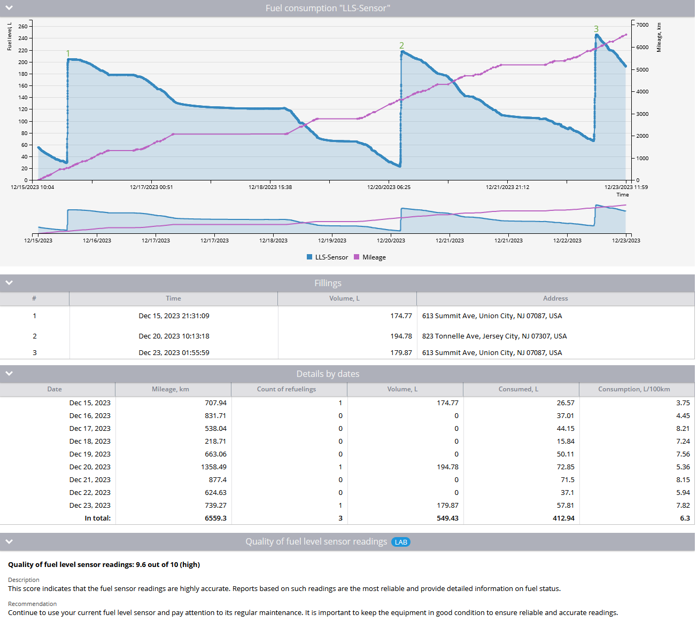

# Reporte de consumo de combustible

En el **Reporte sobre el volumen de combustible** de Navixy, ofrece una visión completa del uso del combustible en toda su flota, proporcionando datos cruciales sobre los cambios en el volumen de combustible, los eventos de repostaje y el consumo de combustible durante un período de tiempo especificado.

Este reporte es esencial para los gestores de flotas que deseen controlar la eficiencia del combustible, detectar posibles robos de combustible y gestionar eficazmente los costes de combustible. A continuación encontrará una guía detallada sobre el funcionamiento de este reporte, los parámetros que intervienen y cómo interpretar los datos.

## Visión general

El reporte sobre el volumen de combustible consta de varias secciones:

1. **Gráfico de variación del volumen de combustible:** Una representación visual de los cambios en el nivel de combustible a lo largo del tiempo.
2. **Tabla de rellenos:** Una lista detallada de los repostajes, con la hora, el volumen y el lugar de cada repostaje.
3. **Detalles por tabla de fechas:** Resúmenes diarios de los cambios en el volumen de combustible, incluido el kilometraje, el recuento de repostajes y los cálculos de consumo de combustible.
4. **Evaluación de la calidad del sensor de nivel de combustible LAB:** Función experimental que evalúa la precisión y fiabilidad de los datos de los sensores de combustible. Véase también: [Mejora de la precisión de la gestión del combustible con el índice de calidad del sensor de combustible](https://www.navixy.com/blog/enhancing-fuel-management-accuracy-with-fuel-sensor-quality-index/).

## Principales características y casos de uso

El reporte de volumen de combustible puede utilizarse en varios escenarios:

* **Control del consumo de combustible:** Realice un seguimiento del uso del combustible e identifique patrones o anomalías que puedan indicar ineficiencias o posibles robos de combustible.
* **Evaluación de la precisión de los sensores:** Evaluar el rendimiento de los sensores de nivel de combustible para garantizar una recopilación de datos fiable.
* **Detección del fraude de combustible:** Identificar patrones o ubicaciones de repostaje inusuales que puedan indicar una actividad fraudulenta.

## Parámetros del reporte

Para generar un reporte de Volumen de Combustible preciso, asegúrese de que las siguientes configuraciones están correctamente establecidas:

1. **Calibración del sensor de nivel de combustible:**

* Para un único sensor de nivel de combustible, asegúrese de que la tabla de calibración se rellena de acuerdo con las recomendaciones del fabricante. Además, establezca los umbrales para el filtrado de emisiones en la sección "Avanzado" debajo de la tabla de calibración.
* Para vehículos con varios depósitos, calibre cada sensor por separado y cree un sensor agregado con las unidades de volumen establecidas en litros o galones. Evite utilizar "Opción personalizada" en el ajuste de unidad de medida del sensor.
* Para los sensores que informan de los niveles de combustible en porcentaje, también se requiere calibración, con volúmenes de combustible mínimos y máximos especificados.

2. **Tratamiento de datos de sensores:**

* La plataforma recoge datos sin procesar de dispositivos y sensores de combustible, que luego se filtran en función de los valores ignorados establecidos en la configuración del sensor. La plataforma registra los datos tal como los recibe, sin modificarlos.

3. **Generación de gráficos:**

* La plataforma genera un gráfico de los valores almacenados en función de los parámetros del reporte. Los ajustes del sensor de combustible, incluidos los valores umbral, se aplican a este gráfico.

4. **Alisado automático:**

* El proceso de suavizado del gráfico está totalmente automatizado, y todos los ajustes de suavizado y filtrado se aplican automáticamente para producir un gráfico legible y fácil de usar.

## Secciones detalladas del reporte

1. **Gráfico de cambio de volumen de combustible:**

* Este gráfico presenta las lecturas del sensor de nivel de combustible a lo largo del tiempo. Si se utilizan varios sensores, el gráfico mostrará los datos del sensor agregado solamente. Los eventos de repostaje están numerados y trazados en sus puntos correspondientes en el gráfico.

2. **Tabla de rellenos:**

* La tabla enumera todos los eventos de repostaje durante el periodo seleccionado, incluyendo la fecha, la hora, el volumen de combustible y la ubicación.

3. **Detalles por tabla de fechas:**

* Proporciona resúmenes de datos diarios, incluyendo:
  * **Date:** El día concreto para el que se calculan los datos.
  * **Kilometraje:** La distancia recorrida ese día.
  * **Recuento de repostajes:** Número de repostajes.
  * **Volumen:** Volumen total de combustible repostado.
  * **Consumido:** Consumo real de combustible del día, calculado como `nivel de combustible inicial + volumen de llenado - volumen final de combustible`.
  * **Consumo por 100 km:** Consumo de combustible por 100 km, calculado como `(nivel de combustible inicial + volumen de llenado - volumen final de combustible) / millas * 100`.

4. **Evaluación de la calidad de la lectura del sensor de combustibleLAB:**

* Esta sección evalúa la calidad de las lecturas del sensor de combustible, proporcionando una puntuación cuantitativa (de 1,0 a 10,0) y una calificación cualitativa (baja, media, alta) basada en el ruido y la precisión de los datos del sensor.
* El sistema puede mostrar un mensaje indicando datos insuficientes para la evaluación de la calidad si el sensor se ha instalado recientemente o si el período de recogida de datos es demasiado corto.

## Conclusiones del reporte

El reporte sobre el volumen de combustible puede revelar datos fundamentales, como:

* **Detección del fraude de combustible:** Detección de discrepancias entre las incidencias de repostaje notificadas y el uso real de combustible, sobre todo en las estaciones de servicio.
* **Eficacia operativa:** Analizar el consumo de combustible en relación con el kilometraje para identificar posibles ineficiencias o áreas de reducción de costes.
* **Control del rendimiento de los sensores:** Evaluar periódicamente la precisión y fiabilidad de los sensores de combustible para garantizar que los datos utilizados en la toma de decisiones son fiables.
