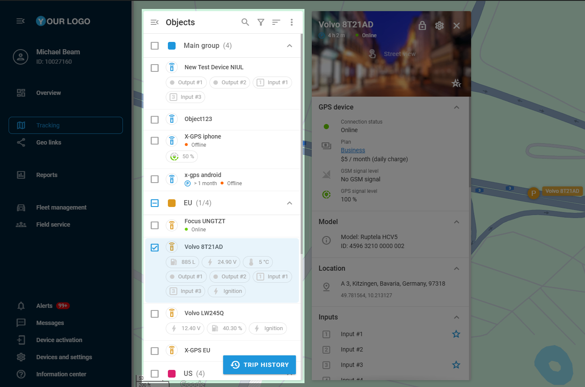

# Lista de objetos

La **lista de objetos** es el centro de control de todos los dispositivos conectados en tiempo real. Proporciona una visión clara y de un vistazo de cada activo rastreado, mostrando su estado actual y los parámetros clave seleccionados. Diseñada para ser eficiente, se abre automáticamente cuando se navega al módulo de **Seguimiento**, asegurando un acceso instantáneo a la información que se necesita. Desde aquí, puede profundizar en cada entidad a través de su widget de objetos específico, lo que facilita el seguimiento, el análisis y la gestión de sus activos con precisión.

## Resumen de la lista

### Visibilidad y control de acceso

**lista de objetos** responde a los roles de los usuarios y a la configuración de visibilidad dentro de la plataforma:

* **Los propietarios** pueden ver todos los objetos de la cuenta de la organización.
  * **Los usuarios** sólo ven los objetos que han creado personalmente o los que les ha asignado el propietario.
* Este control de acceso basado en roles garantiza la seguridad de los datos al tiempo que mantiene accesible la información necesaria. Para obtener más información sobre los roles de la plataforma, consulte [Usuarios y roles](https://squaregps.atlassian.net/wiki/x/Wokyrg).

### **Estructura**

Por defecto, los objetos se muestran en **grupos**, estructurados del mismo modo que en [Dispositivos y ajustes](../../dispositivos-y-ajustes/), para garantizar la coherencia en toda la plataforma. Los objetos no pueden moverse de un grupo a otro desde la **lista de Objetos;** estas modificaciones sólo pueden realizarse en **Dispositivos y Ajustes**. Los grupos son plegables para facilitar la interacción con varios objetos.

> \[!NOTE] La agrupación puede desactivarse mediante la opción No agrupar. Para más detalles, consulte [Ajustes adicionales.](https://squaregps.atlassian.net/wiki/spaces/USERDOCSOLD/pages/edit-v2/2909015397#Additional-settings)

### Navegación

Como puede haber numerosos dispositivos en su cuenta, la **lista Objetos** incluye varias herramientas para ayudarle a acceder a ellos:

* **Buscar** 
* encuentre rápidamente objetos concretos introduciendo su nombre, etiqueta o IMEI.
* **Filtrado**
* concéntrese en objetos específicos por **estado de movimiento** (por ejemplo, muestre sólo activos en movimiento o estacionarios).
* **Opciones de ordenado**
* cambia el orden de aparición de los objetos en la lista en función de determinados parámetros.
* Por nombre (A - Z o Z - A)
* Por estado
* Por distancia (útil para seguir la proximidad)

> \[!NOTE] El filtrado y la clasificación no afectan a la estructura de **los grupos**, sino que reordenan los objetos dentro de ellos. Los grupos sin objetos coincidentes se ocultan de la lista.

### Ajustes adicionales

También en la lista de **objetos** se encuentra el menú 

que proporciona acceso a ajustes adicionales que influyen en la visibilidad de los objetos y en las interacciones con el mapa. Ayuda a configurar el comportamiento del mapa en relación con los objetos y a ajustar las preferencias de visibilidad para una\
experiencia de seguimiento más centrada.

Opciones de menú de tres puntos

* **Agrupar marcadores de objetos** - agrupa varios objetos próximos en un único icono que muestra el número de objetos que contiene. Esto ayuda a despejar el mapa cuando hay muchos vehículos en una misma zona. Esta función se activa automáticamente cuando hay más de 300 dispositivos a la vista.
* **Etiquetas de objetos** - muestra el nombre del objeto cerca de su icono en el mapa.
* **Rastro** - Muestra un rastro de movimiento detrás del objeto a medida que se desplaza.
* **Animación** - si está activada, el movimiento del objeto se muestra de forma suave y animada en el mapa. Si está desactivada, la posición del objeto se actualiza estáticamente a intervalos basados en la recepción de datos.
* **Mostrar sólo los objetos seleccionados** - por defecto, todos los objetos disponibles son visibles en el mapa. Cuando se activa, sólo se muestran los objetos seleccionados de la lista.
* **Ocultar objetos sin conexión en el mapa** - Oculta de la vista del mapa los objetos que tienen un estado **sin conexión**.
* **Mostrar información al hacer clic** - define cómo se abre **el widget Objeto**. Si está activado, el widget se abre tras un solo clic en un dispositivo ib la lista. Si está desactivado, es necesario hacer doble clic en el objeto o en el botón  que aparece para abrir el widget.
* **No agrupar** - muestra todos los objetos de la lista individualmente en lugar de agruparlos. Si se activa, las reglas de ordenación y filtrado se aplican a toda la lista.
* **Seguir el objeto seleccionado** - mantiene el mapa centrado en el objeto seleccionado a medida que se desplaza, evitando que se salga de la pantalla.

### Historia del viaje

Se puede acceder al historial de viajes a través del botón 

de la **lista Objetos**. Esta función permite revisar los movimientos y eventos pasados de un objeto rastreado, proporcionando\
información sobre su actividad durante un periodo seleccionado. Esta herramienta ayuda a analizar rutas, detectar anomalías y mejorar la eficiencia operativa. Para obtener más información sobre esta función, consulte la [vista de Historial](../historial/).

## Objetos

Cada objeto de la **Lista de Objetos** representa un dispositivo de seguimiento conectado a la plataforma e incluye detalles críticos:

* **Etiqueta de objeto** - Muestra el **nombre** del dispositivo y detalles adicionales (si se ha configurado en [Vista detallada del objeto](vista-detallada-del-objeto.md)).
  * **Indicadores de estado** - Un indicador del estado de la conexión que muestra el estado actualizado del dispositivo. Para obtener un desglose detallado del indicador de estado, consulte [Estado de la conexión](estado-de-la-conexin.md).

### Acciones del objeto

Al hacer clic en un objeto de la lista, el mapa se centra en ese dispositivo.

Cada objeto dispone de un menú 

que ofrece más acciones rápidas:

* **Compartir ubicación**: comparta al instante la ubicación del objeto mediante la función [Geolinks](../../geolinks.md).
* **Cambiar icono** - Modifique la representación visual del objeto seleccionando [Iconos de objeto](iconos-de-objetos.md).
* **Reglas de alerta abiertas**: gestione alertas para condiciones específicas en la sección Alertas de la plataforma.
* **Configuración del dispositivo** - Navegue rápidamente a la configuración del dispositivo concreto en la sección [Dispositivos y ajustes](https://squaregps.atlassian.net/wiki/x/1JUyrg) de la plataforma.
* **Ver informes**: acceda a los informes relacionados con la actividad del objeto en la sección [Reportes](../../reportes/) de la plataforma.

Estas acciones permiten acceder rápidamente a las herramientas de gestión esenciales directamente desde la lista.

### Widget de objeto

Este widget es una vista detallada de un objeto seleccionado, que muestra los parámetros disponibles del dispositivo, indicadores de estado y bloques de datos personalizables. Para acceder al **widget Objeto**, haga doble clic en un objeto de la **lista Objetos** o pase el ratón por encima del objeto y Para acceder al widget\
Objeto, haga doble clic en un objeto de la **lista Objetos** o pase el ratón por encima del objeto y haga clic en el icono 

que aparece.

> \[!NOTE] Si la opción **Mostrar información al hacer clic** está activada en [Ajustes adicionales](https://squaregps.atlassian.net/wiki/spaces/UDOCES/pages/edit-v2/2922547887#Ajustes-adicionales), al hacer clic en un objeto también se abre el [Vista detallada del objeto](vista-detallada-del-objeto.md)[.](https://squaregps.atlassian.net/wiki/spaces/USERDOCSOLD/pages/edit-v2/2909015397#Object-Widget)

Aquí puede acceder a métricas esenciales como el nivel de batería, la intensidad de la señal y el estado de movimiento, con opciones para configurar los datos mostrados. Dado que muchos de estos parámetros pueden ser esenciales para realizar un seguimiento general, el widget ofrece un mecanismo de Favoritos que permite mostrar una selección de bloques de datos de dispositivos en la lista de objetos, justo debajo de la etiqueta de un dispositivo.\
Para más detalles sobre la funcionalidad del widget, véase [Vista detallada del objeto](vista-detallada-del-objeto.md).

## Contenido de la sección

* [Vista detallada del objeto](vista-detallada-del-objeto.md)
* [Estado de la conexión](estado-de-la-conexin.md)
* [Iconos de objetos](iconos-de-objetos.md)
* [Widgets de información sobre dispositivos](broken-reference)
