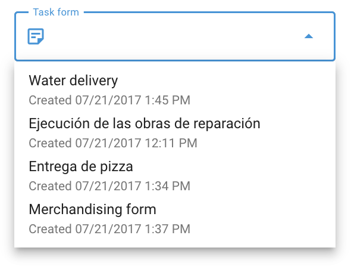

# Formularios

Los **Formularios** son documentos electrónicos que pueden adjuntarse a las tareas, lo que permite a los empleados enviar los resultados de las tareas directamente a través del **X-GPS Tracker** aplicación móvil. Estos formularios pueden incluir varios tipos de campos, como campos de texto para pedidos de clientes, reportes de inspección y secciones multimedia para subir fotos y vídeos.



## Cómo empezar

### Crear un formulario

Para empezar a utilizar los formularios en Navixy:

1. Inicie la aplicación **Servicio de campo** desde el menú principal.
2. Haga clic en la pestaña **Formularios** para abrir la interfaz de gestión de formularios.
3. Inicie el proceso de creación del formulario haciendo clic en el icono **+**.
4. Elija los componentes necesarios (por ejemplo, campos de texto, casillas de verificación, desplegables, fecha, calificación, imagen, archivo adjunto, firma y separadores de sección) en la parte izquierda de la pantalla. Personalice el formulario para adaptarlo al flujo de trabajo y las tareas específicas de su empresa.

Este proceso le permite crear tantos formularios como necesite, asegurándose de que se adaptan a las tareas que realizan sus empleados.

Al crear un formulario hay dos opciones disponibles:

* **"Usar por defecto al crear una tarea"**: Si está activado, este formulario se adjuntará automáticamente a las nuevas tareas a menos que se seleccione otro formulario. En la lista de formularios, este formulario aparecerá marcado con una "estrella".
* **"Enviar formulario solo en la zona"**: Si se activa, el formulario solo puede enviarse cuando el empleado se encuentra dentro de una zona geográfica predefinida, lo que garantiza que la notificación de tareas se produce en el lugar correcto.

Después de guardar, se puede acceder a los formularios creados en la lista de formularios.

### Adjuntar un formulario a una tarea

Para adjuntar un formulario a una tarea, siga estos pasos:

1. Abra la ventana de creación de tareas: vaya a la pestaña Tareas y haga clic en el botón "+" para crear una nueva tarea.
2. En el campo "Formulario de tareas", seleccione de la lista desplegable el formulario que creó anteriormente.
3. Proporcione otros detalles de la tarea, como la selección del empleado responsable de llevarla a cabo.
4. Finalice la creación de la tarea haciendo clic en "Guardar".

El empleado seleccionado recibirá la tarea con el formulario adjunto en la aplicación móvil X-GPS Tracker, garantizando que toda la documentación necesaria esté disponible durante la ejecución de la tarea.

### Completar un formulario en X-GPS Tracker

Los empleados deben rellenar formularios durante o después de realizar una tarea. He aquí cómo pueden rellenar y enviar un formulario:

1. Abra la aplicación móvil **X-GPS Tracker** en un dispositivo móvil.
2. Pase a la sección "**Tareas**" para ver la lista de tareas asignadas.
3. Seleccione la tarea que debe completarse.
4. Haga clic en el formulario dentro de la descripción de la tarea y rellene todos los campos obligatorios.
5. Una vez rellenados todos los campos, el formulario se envía automáticamente al servicio de seguimiento, marcando la tarea como completada.

### Configuración de notificaciones para el envío de formularios

Para garantizar notificaciones puntuales cuando se envía un formulario, configure las alertas siguiendo estos pasos:

1. Navegue hasta [Reglas y alertas](../reglas-y-alertas/) en la plataforma.
2. Empiece a crear una nueva regla de notificación haciendo clic en el botón "Añadir regla".
3. Seleccione los objetos (por ejemplo, vehículos, empleados) a los que se aplicará esta regla.
4. Elija [Realización de tareas](../reglas-y-alertas/programacin-y-expedicin/realizacin-de-tareas.md) de la lista de eventos y proceda.
5. En la sección "Opciones de la regla", marque la casilla "Formulario enviado".
6. En la pestaña "Notificaciones", elija cómo desea recibir las notificaciones (por ejemplo, SMS, correo electrónico).

Estos ajustes le permiten estar informado en tiempo real sobre el progreso de las tareas y el envío de formularios.

### Visualización de formularios cumplimentados

Puede revisar y comparar los formularios cumplimentados para evaluar el rendimiento de los empleados y los resultados de las tareas:

1. Navegue hasta la aplicación "Servicio de campo".
2. Haga clic en la pestaña "Formularios" para ver todos los formularios disponibles.
3. Pase el mouse por encima del formulario que desee revisar y haga clic en "Envíos" en la parte derecha.
4. Elija el formulario específico de la lista de la parte inferior.

**Funcionalidad de las presentaciones:**

* **Descargar formularios:** Exporte los formularios en formato Excel, CSV o PDF.
* **Filtrado:** Utilice filtros para limitar los envíos en función de parámetros como la fecha de creación de la tarea o el nombre del empleado.
* **Personalización de la mesa:** Añada u oculte columnas y campos de formulario para centrarse en los datos más relevantes.

### Reporte de datos del formulario de tareas

El reporte "Datos de formularios de tareas" proporciona información sobre el rendimiento de los empleados basada en los formularios cumplimentados. Para generar este reporte:

1. Ir a la sección de [reportes](../reportes/).
2. Haga clic en el botón "Crear reporte".
3. Elija la opción "Datos del formulario de tareas".
4. Marque los objetos pertinentes (por ejemplo, empleados, tareas) para los que necesita el reporte.
5. Especifique el marco temporal del reporte.
6. Haga clic en el botón "Crear reporte" para generar el reporte.

**Detalles del reporte:**\
El reporte muestra estadísticas de formularios, incluidas la frecuencia y los tipos de componentes seleccionados. Estos datos le ayudan a evaluar el rendimiento de los empleados y los resultados de las tareas con mayor eficacia.
