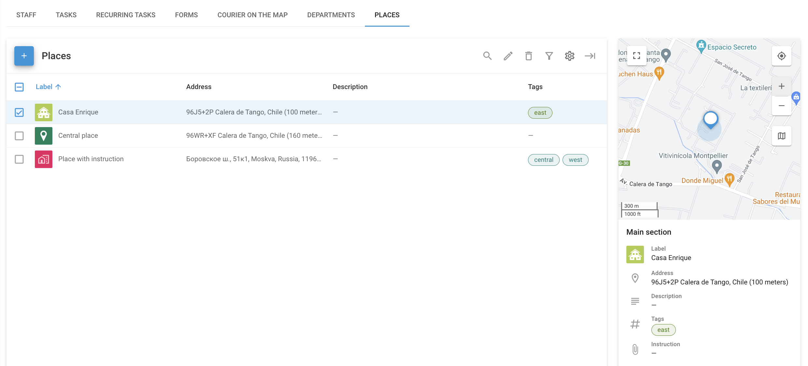

# Lugares - Servicio de campo

La pestaña de **Lugares** en **Servicio de campo** puede utilizarse para organizar y gestionar las ubicaciones clave que el personal de campo debe visitar, como direcciones de clientes, sedes de la empresa u otros puntos de interés importantes. Esto ayuda a racionalizar la asignación de tareas, optimizar las rutas y garantizar la eficacia de las operaciones sobre el terreno.

Al entrar en la sección Lugares, verás una lista de todos los lugares disponibles junto con sus detalles, incluidos los campos personalizados que hayas añadido.

## Crear y gestionar lugares

Al crear un nuevo Lugar en el apartado de Servicio de Campo de Navixy, se puede introducir toda la información necesaria para facilitar su identificación y gestión. Empiece por dar un nombre al Lugar, especificando su dirección o seleccionando su ubicación en el mapa. También puede añadir detalles como una descripción, etiquetas y cualquier instrucción relevante para el lugar.

### Campos personalizados

Los campos personalizados le permiten añadir detalles adicionales que no están cubiertos por las opciones estándar. Estos campos se adaptan a las necesidades de su empresa, garantizando que tenga toda la información importante al alcance de la mano. Por ejemplo:

* **Tipo de equipo**: Registra qué equipos hay en el lugar, como "Antena 4G" o "Generador eléctrico".
* **Calendario de mantenimiento**: Indique la frecuencia con la que el sitio necesita mantenimiento, por ejemplo "Mensualmente" o "Trimestralmente".
* **Código de acceso**: Guarde los códigos de seguridad o las instrucciones necesarias para acceder al sitio.
* **Contacto gerente**: Incluya los datos de contacto de la persona responsable de la ubicación.

El uso de campos personalizados garantiza que toda la información necesaria esté organizada y sea fácilmente accesible, lo que aumenta la eficacia de las operaciones sobre el terreno.
