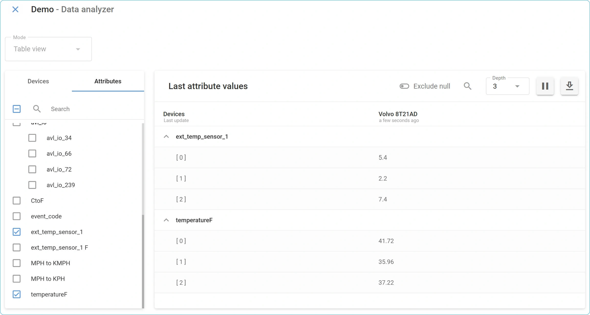

# El nodo Logic

### Descripción técnica y capacidades 

El nodo Logic crea puntos de ramificación inteligentes que enrutan los datos entrantes por diferentes rutas basándose en condiciones lógicas. Recibe datos de otros nodos, los valida contra sus condiciones definidas y enruta los resultados por diferentes rutas según si la validación tiene éxito o falla. El nodo le permite construir flujos de trabajo IF->THEN/ELSE donde diferentes acciones ocurren automáticamente basándose en condiciones de datos en tiempo real.

<figure><figcaption></figcaption></figure>


Los nodos **Logic** se configuran por separado para cada flujo en la interfaz de usuario de la plataforma Navixy. Cada nodo contiene solo una fórmula lógica, basándose en el [Lenguaje de Expresión IoT Logic de Navixy](https://app.gitbook.com/s/tx3J5BxnWyPV0nP2xr0z/technologies/navixy-iot-logic-expression-language).\
Para opciones de sintaxis específicas relacionadas con expresiones lógicas, consulte [Expresiones y sintaxis del ](https://squaregps.atlassian.net/wiki/spaces/UDOCES/pages/3383885881/Expresiones+y+sintaxis+del+nodo+Logic?atlOrigin=eyJpIjoiNjQyNWI5MjZlNDA3NGQ3NmJkNDgwMTUzOTQ2Y2MwMzYiLCJwIjoiYyJ9)nodo Logic.


<figure><figcaption></figcaption></figure>

#### Cómo funcionan los nodos Logic 

Cuando los datos llegan por primera vez a un nodo Logic, el sistema crea un atributo booleano definido por el usuario que almacena los resultados de evaluación. Cada paquete de datos subsiguiente se evalúa contra su expresión lógica, actualizando el valor de este atributo y enrutando los datos en consecuencia:

* **Resultados verdaderos**: Los datos fluyen a través de la conexión THEN (<mark style="color:green;">verde</mark>) con el atributo booleano establecido en `true`
* **Resultados falsos**: Los datos fluyen a través de la conexión ELSE (<mark style="color:red;">roja</mark>) con el atributo booleano establecido en `false`

Esta evaluación ocurre independientemente para cada paquete de datos, permitiendo que diferentes registros del mismo dispositivo sigan diferentes rutas basándose en condiciones en tiempo real.

#### Integración de arquitectura de flujo 

Los atributos booleanos creados por los nodos Logic se extienden más allá del enrutamiento de flujo e se integran con las capacidades de monitoreo más amplias de Navixy. Dado que estos son atributos personalizados definidos por el usuario, pueden ser:

* **Monitoreados en tiempo real**: Vea los resultados de evaluación en el [Analizador de flujo de datos](../../../../../guia-del-usuario/cuenta/iot-logic/analizador-de-flujo-de-datos.md) para solucionar problemas de condiciones y verificar la lógica
* **Agregados como sensores personalizados**: Integre con la interfaz principal de Navixy para monitoreo continuo

Como sensores personalizados, estos atributos generados por Lógica habilitan dos capacidades clave:

* **Activar alertas**: Usted puede crear reglas personalizadas basadas en el valor de un sensor para recibir notificaciones en caso de desviaciones. Para detalles sobre la creación de reglas, consulte [Reglas y alertas](https://squaregps.atlassian.net/wiki/spaces/UDOCES/pages/2922548483/Reglas+y+Alertas?atlOrigin=eyJpIjoiZjIxYjM4NDM1ZDY0NGQzZGExNzczNmRhNmZjY2I2OTYiLCJwIjoiYyJ9).
* **Monitorear entidades**: Puede agregar un atributo al widget [Lista de objetos](../../../../../guia-del-usuario/seguimiento/lista-de-objetos/) para monitorear su valor junto con otras lecturas del dispositivo. Para detalles sobre cómo crear un sensor personalizado a partir de un atributo de IoT Logic, consulte [Visualización de nuevos atributos calculados en la plataforma Navixy](https://squaregps.atlassian.net/wiki/spaces/UDOCES/pages/3383984173/Visualizaci+n+de+nuevos+atributos+calculados+en+la+plataforma+Navixy?atlOrigin=eyJpIjoiZDYyODMzNzhkMmY3NDdkNmEyN2UzNGJmNTJhM2JlN2MiLCJwIjoiYyJ9).


El nodo **Logic** requiere una conexión a al menos un nodo precedente (**Fuente de Datos** u otros nodos de procesamiento) para recibir datos de entrada para validación.


#### Capacidades del nodo 

El nodo **Logic** ofrece:

* **Enrutamiento condicional de datos**: Cree flujos de trabajo de ramificación que dirijan automáticamente los datos basándose en expresiones lógicas que devuelven resultados verdaderos o falsos.
* **Validación en tiempo real**: Pruebe los datos entrantes del dispositivo contra reglas de negocio y umbrales operacionales a medida que llegan los datos.
* **Soporte de condiciones complejas**: Combine múltiples parámetros usando operadores lógicos (Y, O, etc.) para toma de decisiones sofisticada.
* **Creación de atributos**: Genere atributos booleanos que registren resultados de validación para uso en otros nodos, sistemas de monitoreo de Navixy y servicios de terceros.
* **Rutas de salida flexibles**: Enrute datos a través de conexiones THEN (true) y ELSE (false) para activar diferentes acciones subsiguientes.

### Opciones de configuración 

El nodo **Logic** le permite definir expresiones condicionales que evalúan datos entrantes y crean rutas de ramificación en su flujo basándose en los resultados.

<figure><figcaption></figcaption></figure>

Veamos qué elementos usa este nodo y qué puede configurar al trabajar con él.

#### Pasos de configuración 

1. **Especifique el título del nodo**: Ingrese un nombre descriptivo para este nodo **Logic**.
   * Use un nombre que identifique claramente el propósito de validación (p. ej., _Verificación de Alerta de Temperatura_, _Detección de Violación de Velocidad_).
   * Este nombre se mostrará en el diagrama de flujo para fácil identificación.
2. **Defina el nombre de la expresión**: Ingrese el nombre para el atributo booleano que almacenará el resultado de validación.
   * Este atributo aparecerá en el [Analizador de flujo de datos](../../../../../guia-del-usuario/cuenta/iot-logic/analizador-de-flujo-de-datos.md) y estará disponible para uso en nodos subsiguientes.
   * Use nombres descriptivos como _alerta\_temperatura\_alta_ o violacion\_velocidad\_detectada.
   * El sistema generará automáticamente nombres como _logic\_1_, _logic\_2_ si no se especifica.
3. **Cree una expresión lógica**: Construya su declaración condicional usando el campo de expresión.
   * Use [operadores lógicos según la sintaxis del Lenguaje de Expresión IoT Logic de Navixy](https://squaregps.atlassian.net/wiki/spaces/UDOCES/pages/3383885881/Expresiones+y+sintaxis+del+nodo+Logic?atlOrigin=eyJpIjoiZjA5ZmQ1OWI1MmIwNDM1N2IyODBjNDhlODZlNWNmZDgiLCJwIjoiYyJ9) para referenciar parámetros del dispositivo y atributos calculados.
   * La expresión debe devolver un valor booleano (verdadero/falso) para el funcionamiento adecuado del nodo.
   * Use la [función de autocompletado](https://squaregps.atlassian.net/wiki/pages/createpage.action?spaceKey=UDOCES\&title=Managing%20attributes\&linkCreation=true\&fromPageId=3383885843) para seleccionar atributos disponibles de fuentes de datos conectadas.
4. **Conecte las rutas de salida**: Establezca conexiones para los resultados de validación.
   * **Conexión THEN** (verde): Se conecta a nodos que deben procesar datos cuando la expresión se evalúa como verdadera.
   * **Conexión ELSE** (roja): Se conecta a nodos que deben procesar datos cuando la expresión se evalúa como falsa o nula.
   * La conexión THEN es obligatoria, mientras que la conexión ELSE es opcional.

Cuando las expresiones lógicas no pueden evaluarse debido a valores nulos, tipos de datos inválidos o errores de sintaxis, el resultado se trata como `false`, y los datos fluyen a través de la ruta ELSE.

Para información detallada sobre sintaxis de expresiones, operadores y comportamiento de flujo de datos, consulte [Expresiones y sintaxis del nodo Logic](https://squaregps.atlassian.net/wiki/spaces/UDOCES/pages/3383885881/Expresiones+y+sintaxis+del+nodo+Logic?atlOrigin=eyJpIjoiYzU2ZjQ0ZjVhZmQ3NDY3OWFjOTY4NmYxODFiZWRhOTAiLCJwIjoiYyJ9).

### Conexiones de salida y flujo de datos 

El nodo **Logic** crea dos rutas de salida distintas basándose en los resultados de evaluación de la expresión.

#### Conexión THEN (verde) 

* **Se activa cuando**: La expresión lógica devuelve `true`.
* **Requisito de conexión**: Obligatorio — cada nodo Logic debe tener al menos una salida THEN.
* **Conexiones múltiples**: Puede conectarse a múltiples nodos subsiguientes para procesamiento paralelo.
* **Usos típicos**: Activar alertas, procesamiento especial, cálculos condicionales o enrutar datos a puntos finales específicos.

#### Conexión ELSE (roja) 

* **Se activa cuando**: La expresión lógica devuelve `false`, `null`, o encuentra errores de evaluación.
* **Requisito de conexión**: Opcional — use solo cuando necesite manejar resultados negativos.
* **Manejo de errores**: Procesa casos donde las expresiones no pueden evaluarse debido a datos faltantes o errores de sintaxis.
* **Usos típicos**: Registrar validaciones fallidas, enrutar datos a través de rutas de procesamiento alternativas o continuar operaciones normales.

### Preguntas frecuentes 

#### ¿Puedo usar atributos creados por otros nodos en expresiones lógicas? 

Sí. Los nodos Logic pueden referenciar cualquier atributo disponible de fuentes de datos conectadas, incluyendo parámetros originales del dispositivo y atributos calculados por nodos **Iniciar Atributo** precedentes. La función de autocompletado le ayuda a seleccionar de todos los atributos disponibles.

#### ¿Qué pasa si mi expresión contiene errores de sintaxis? 

Si una expresión contiene errores de sintaxis o no puede evaluarse, el nodo Logic trata el resultado como `false` y enruta los datos a través de la conexión ELSE. Verifique la sintaxis de la expresión y asegúrese de que todos los atributos referenciados existan en su flujo de datos.

#### ¿Puedo conectar múltiples nodos a la misma salida del nodo Logic? 

Sí. Tanto las conexiones THEN como ELSE soportan múltiples conexiones salientes, permitiéndole activar varias acciones diferentes basándose en la misma condición lógica. Esto habilita procesamiento paralelo para flujos de trabajo de negocio complejos.

#### ¿Cómo monitoreo los resultados del nodo Logic? 

Los resultados del nodo **Logic** aparecen como atributos booleanos en la tabla del [Analizador de flujo de datos](https://squaregps.atlassian.net/wiki/spaces/UDOCES/pages/3232334554/Analizador+de+flujo+de+datos?atlOrigin=eyJpIjoiMjNlNzU1NzRlOTFhNDFhN2EwM2ZjZmEzMzAyOGNlOWUiLCJwIjoiYyJ9). Seleccione sus dispositivos y busque el nombre del atributo que especificó en el campo nombre de expresión. Los valores se mostrarán como `true` o `false` basándose en los resultados de evaluación.

#### ¿Puedo encadenar múltiples nodos Logic juntos? 

Sí. Puede conectar nodos **Logic** secuencialmente para crear árboles de decisión complejos. Cada nodo **Logic** puede referenciar los atributos booleanos creados por nodos **Logic** anteriores, habilitando flujos de trabajo de validación sofisticados de múltiples etapas.

&#x20;
