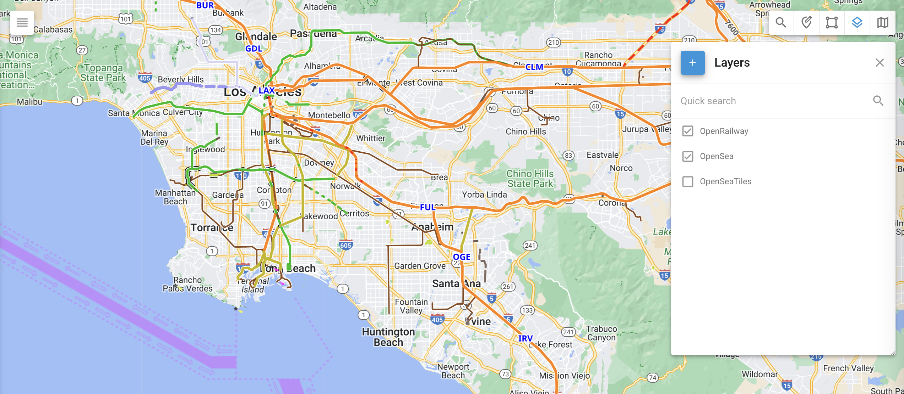

# Capas

Las capas del mapa le permiten agregar superposiciones de datos personalizados a su mapa, mejorando la visualización de áreas específicas que no están incluidas en la vista de mapa estándar. Esta función es particularmente útil para mostrar detalles geográficos únicos, como distritos de la ciudad, áreas de responsabilidad, rutas personalizadas y otros mapas especializados. Al usar capas del mapa, puede comprender mejor las ubicaciones y situaciones de su flota.

### Aplicación práctica 

Estas son algunas de las formas en que puede usar las capas del mapa:

* Marcar lugares específicos y resaltarlos gráficamente.
* Cargar rutas personalizadas de trenes, barcos o agricultura.
* Mostrar mapas especializados, como terreno, profundidad del océano o densidad forestal, que no están disponibles en la lista de mapas estándar y son creados por empresas especializadas.

### Cómo crear una capa KML

Hay varios instrumentos disponibles para crear capas KML, que van desde software GIS profesional hasta servicios de mapeo en línea accesibles. **Google My Maps** y **Google Earth** son dos opciones fáciles de usar para crear capas KML, mientras que las herramientas más avanzadas incluyen **ArcGIS** y **QGIS**.

Creación de capas KML con Google Earth

1. Abra **Google Earth**.
2. Busque la ubicación que desea mapear.
3. Use la barra de herramientas superior para seleccionar:
   * **Marcador de posición** para un punto
   * **Polígono** para un área
   * **Ruta** para una trayectoria
4. Nombre su polígono, ruta o marcador de posición.
5. Configure los colores y ajuste la transparencia.
6. Delinee el área haciendo clic en los puntos de vértice.
7. Presione OK para finalizar su trabajo.
8. En el panel **Lugares**, haga clic derecho en su lugar.
9. Seleccione **Guardar lugar como** y elija dónde guardar el archivo.
10. Guarde el archivo como KML.

### Agregar capas del mapa a la plataforma Navixy

Para agregar una capa de mapa personalizada, siga estos pasos:

1. Haga clic en la herramienta **Capas** en la esquina superior derecha del mapa.
2. Haga clic para agregar una nueva capa KML.
3. Ingrese el nombre de la capa, elija su archivo KML y guárdelo.

Una vez que haya agregado exitosamente una capa de mapa, puede mostrarla haciendo clic en la casilla de verificación a la izquierda del nombre de la capa.
