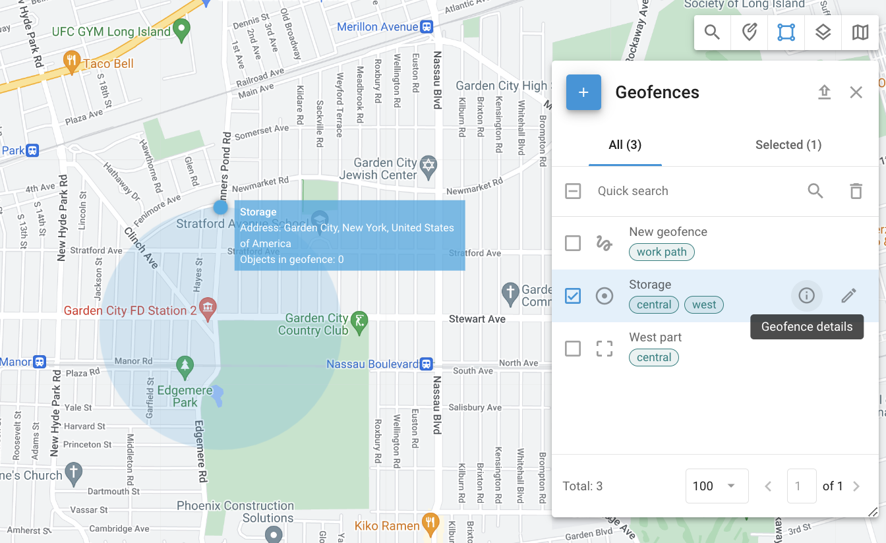

# Geocercas

Las geocercas son perímetros virtuales que permiten al sistema monitorear si un objeto ha cruzado el borde de la geocerca ("dentro" o "fuera"). Estos eventos se registran, lo que permite a los usuarios generar informes de geocercas y [recibir alertas](../../../guia-del-usuario/reglas-y-alertas/control-de-movimientos/geocerca-de-entrada-o-salida.md). Las geocercas también pueden relacionarse con [reglas específicas para eventos](../../../guia-del-usuario/reglas-y-alertas/) dentro de áreas particulares, como recibir alertas de exceso de velocidad solo dentro de una ciudad o a lo largo de una ruta.

Para acceder a la herramienta **Geocercas**, haga clic en  en la esquina superior derecha del mapa. Seleccionar cualquiera de las geocercas mostrará los objetos ubicados actualmente dentro de sus límites.

### Tipos de geocercas

Están disponibles tres tipos de geocercas:

* Una **geocerca circular** es un área geográfica con un centro dado y una forma circular con un radio mínimo de 50 metros. Los usuarios pueden definir el radio y el centro del círculo.
* Una **geocerca poligonal** es un área definida por un polígono arbitrario con múltiples vértices (hasta 500), lo que permite la creación de formas complejas. Este tipo de geocerca es particularmente útil para definir con precisión áreas de forma irregular, como vecindarios, parques o cualquier zona específica que no se ajuste a un límite circular simple.
* Una **geocerca de ruta** crea un perímetro virtual entre dos o más puntos. Este tipo de geocerca es muy adecuado para monitorear la [adherencia a rutas planificadas](../../../guia-del-usuario/reglas-y-alertas/programacin-y-expedicin/desviacin-carretera.md) y asegurar que los vehículos no se desvíen de su trayectoria prevista. La geocerca de ruta se define por una serie de puntos que crean una ruta continua, con un radio especificado que determina la desviación permitida del camino.

<figure><figcaption>
Una geocerca de ruta
</figcaption></figure>

### Crear, editar y eliminar geocercas

#### Crear geocercas

Para crear una geocerca, siga estos pasos:

1. Localice el área deseada en el mapa usando **Búsqueda rápida**.
2. Abra la herramienta **Geocercas** haciendo clic en .png>) en la esquina superior derecha del mapa.
3. Coloque el cursor sobre el botón  y seleccione el tipo de geocerca que desea crear.
   * **Círculo**:
     1. Arrastre el círculo sobre el mapa para establecer su ubicación.
     2. Use el controlador de redimensionamiento en su borde para ajustar su tamaño. También puede ajustarlo manualmente en el menú **Radio**. La lista desplegable contiene varias opciones comunes para selección rápida.
   * **Polígono**:
     1. Comience con un pentágono.
     2. Ajústelo arrastrando vértices o agregando nuevos.
   * **Ruta**:
     1. Seleccione los puntos de inicio y fin. El sistema construirá la ruta.
     2. Agregue más puntos de ruta haciendo clic y arrastrando los controladores de ajuste a lo largo de la ruta.
     3. Establezca el radio. El radio determina qué tan lejos puede desviarse el objeto del camino antes de que se detecte la desviación de ruta. La lista desplegable contiene varias opciones comunes para selección rápida.
     4. Si es necesario, active el modo manual para ajustar los puntos manualmente para un control preciso sobre el camino.
4. Ingrese el nombre de la geocerca en el campo **Etiqueta de geocerca**.
5. Elija el color para una mejor visualización en el mapa. Esto es particularmente útil al gestionar múltiples geocercas, ya que diferentes colores pueden diferenciar rápidamente entre varias zonas. La herramienta de selección de color permite establecer un color específico y ver su código HEX.
6. Agregue o modifique etiquetas para categorizar y organizar geocercas. Etiquetas como "Central" y "Oeste" ayudan a ordenar y gestionar múltiples geocercas.
7. Guarde la geocerca.

#### Editar geocercas

Para editar una geocerca, haga clic en  junto a la geocerca que desea editar en la herramienta **Geocercas**. Al editar una geocerca, puede ajustar los mismos campos que durante su creación.\
Para la descripción de esos campos, vea Crear geocercas.

#### Eliminar geocercas

Para eliminar una geocerca, selecciónela y haga clic en  en la esquina superior derecha junto a **Búsqueda rápida**.


Solo se pueden eliminar las geocercas que no estén incluidas en ninguna regla de **Alerta**. Para quitar la geocerca de una regla de **Alerta**, vaya a **Alertas** → **Establecer reglas** y seleccione la regla que contiene la geocerca. Abra la pestaña **Configuración** y haga clic en ⨂ junto al nombre de la geocerca.


### Detalles de geocerca

Para ver detalles sobre la geocerca seleccionada, haga clic en .png>) junto a ella.

* **Etiquetas**: Etiquetas asociadas con la geocerca, como “Central,” ayudan a categorizar y organizar geocercas para fácil identificación y gestión.
* **Ubicación**: La ubicación geográfica de la geocerca, como “Condado de Queens, Nueva York, Estados Unidos de América.”
* **Objetos**: Una lista de objetos dentro de la geocerca.

### Importar geocercas

Cuando necesite agregar una gran cantidad de geocercas, es más rápido importarlas desde un archivo en lugar de crearlas manualmente. Puede importar geocercas desde archivos Excel o KML.

#### Importar geocercas circulares desde Excel

1. Abra la herramienta **Geocercas**.
2. Coloque el cursor sobre el botón .png>) y haga clic en el botón **Importar geocercas circulares**.
3. Descargue el archivo de ejemplo proporcionado.
4. Agregue información sobre sus geocercas al archivo como se detalla en el ejemplo.
5. Cargue el archivo editado al servicio de monitoreo.
6. Si su archivo tiene encabezados, habilite la opción **Usar encabezados del archivo**.
7. Verifique los campos de encabezado y haga clic en **Siguiente**.
8. Revise los registros y haga clic en **Proceder**.
9. Una vez completada la importación, las nuevas geocercas aparecerán en la lista.

#### Importar geocercas poligonales desde KML

1. Abra la herramienta **Geocercas**.
2. Coloque el cursor sobre el botón .png>) y haga clic en el botón **Importar geocercas desde KML**.
3. Haga clic en **Examinar** para seleccionar el archivo KML en su computadora.
4. Cambie el radio predeterminado si es necesario.
5. Haga clic en **Cargar**.
6. Una vez completada la importación, las nuevas geocercas aparecerán en la lista. Tenga en cuenta que el radio predeterminado solo se usa para geocercas de ruta. Para otros tipos, este paso se puede omitir.

### Exportar geocercas

Puede exportar sus geocercas a un archivo KML para uso posterior. Para hacer esto:

1. Abra la herramienta **Geocercas**.
2. Haga clic en  en el panel de herramientas.
3. Descargue el archivo KML para uso posterior.


Tenga en cuenta que hay un límite de 500 puntos por geocerca.

