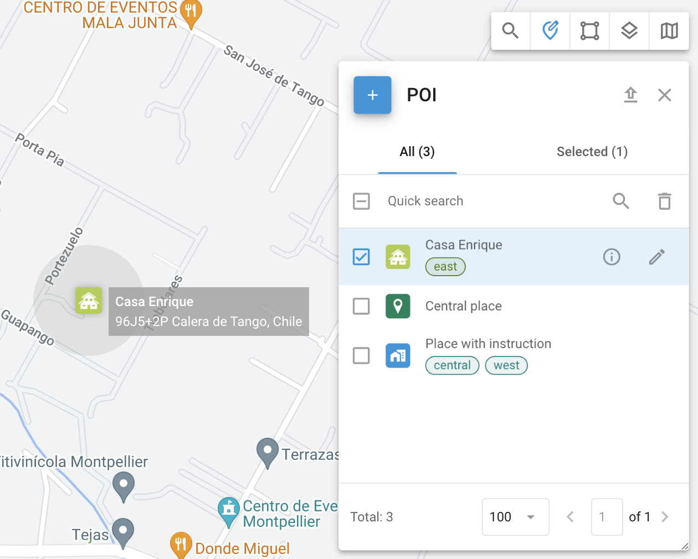

# Lugares (POI)

Los **Lugares**, también conocidos como **Puntos de interés (POI),** son una característica esencial de la gestión de flotas y el seguimiento de activos. Las organizaciones pueden crear una lista detallada de Lugares, incluyendo ubicaciones clave como oficinas y almacenes, así como numerosos sitios cruciales para las operaciones logísticas. Los Lugares mejoran la eficiencia operativa al optimizar la planificación de rutas y agilizar las asignaciones de tareas para empleados de campo.

Para acceder a la herramienta **Lugares**, haga clic en  en la barra de herramientas en la esquina superior derecha del mapa.

### Aplicación práctica 

* **Encontrar ubicaciones:** Encuentre rápidamente un Lugar escribiendo su nombre o etiqueta en **Búsqueda rápida**.
* **Crear rutas y geocercas:** Use Lugares para establecer rutas y dibujar geocercas.
* **Asignar tareas:** Simplifique la asignación de tareas usando nombres de Lugares en lugar de direcciones completas.

### Crear y editar lugares

Para acceder a la herramienta Lugar, haga clic en el icono PDI de la barra de herramientas situada en la parte superior derecha del mapa.

#### Crear lugares

Para crear un Lugar, siga estos pasos:

1. Abra la herramienta **Lugar** haciendo clic en .png>) en la esquina superior derecha del mapa.
2. Haga clic en  para abrir el formulario de creación de Lugar.
3. Asígnele un nombre como "Oficina" o "Almacén" en el campo **Etiqueta**.
4. En la esquina superior izquierda, elija de una biblioteca de iconos o cargue el suyo propio.
5. Ingrese manualmente la dirección del Lugar o selecciónela en el mapa.
6. Defina el radio del Lugar para determinar su área de influencia. La lista desplegable contiene varias opciones comunes para selección rápida.
7. (Opcional) Agregue etiquetas para mejor gestión y búsqueda más fácil.
8. (Opcional) Agregue cualquier información adicional sobre el Lugar en el campo **Descripción**.
9. (Opcional) Adjunte cualquier archivo adicional.

Los campos en el formulario de Lugar pueden ajustarse en la sección [Campos personalizados](../../../guia-del-usuario/cuenta/campos-personalizados.md).

#### Editar Lugares 

Para editar un Lugar, haga clic en  junto a la geocerca que desea editar en la herramienta **Lugares**. Al editar un Lugar, puede ajustar los mismos campos que durante su creación.\
Para la lista de esos campos, vea [Crear Lugares](lugares.md#crear-lugares).

### Detalles del Lugar 

Para ver detalles sobre el Lugar seleccionado, haga clic en .png>) junto a su nombre. Verá los mismos campos que en la sección [Crear Lugares](lugares.md#crear-lugares), así como cualquier campo personalizado.

### Importar Lugares desde un archivo Excel 

Si necesita agregar una gran cantidad de Lugares rápidamente, puede importarlos desde un archivo Excel. Para hacerlo, siga estos pasos:

1. Abra la herramienta **Lugar** haciendo clic en .png>) en la esquina superior derecha del mapa.
2. Haga clic en .png>) en la esquina superior derecha para abrir el diálogo **Importación de POI**.
3. Descargue la plantilla de Excel proporcionada.
4. Ingrese la información según se especifica en la plantilla y guarde el archivo.
5. Navegue al archivo en su sistema y haga clic en **Seleccionar**.
6. Después de hacer clic en **Siguiente**, verifique los nombres de las columnas y corrija cualquier discrepancia.
7. Asegúrese de que todos los datos sean correctos y proceda. Sus Lugares aparecerán en la lista.
