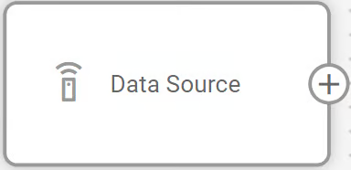

# Mettax

La telemática de video es una funcionalidad vital para muchas empresas. Existen soluciones propietarias que manejan la transmisión de video desde cámaras de tablero, pero ofrecen posibilidades limitadas para las lecturas telemáticas de dichos dispositivos. Por esta razón, ampliamos nuestro enfoque hacia las integraciones para que nuestros clientes puedan aprovechar las aplicaciones de terceros existentes para video y beneficiarse de las características telemáticas extendidas de Navixy al mismo tiempo.

Mettax es un gran ejemplo de este escenario. Veamos qué tan fácil es integrar sus capacidades directamente dentro de la interfaz de usuario de Navixy.



#### **Establecimiento de la integración**

Primero, necesita realizar las preparaciones necesarias del lado de Mettax.


En Mettax, los datos del dispositivo se almacenan bajo cuentas de usuario individuales. Si su organización utiliza una estructura de cuenta principal, **necesitará realizar los siguientes pasos para cada cuenta de usuario que tenga dispositivos**. Aunque esto puede requerir iniciar y cerrar sesión en diferentes cuentas, garantiza una cobertura integral y dirigida en toda su flota de dispositivos.


1. Inicie sesión en una cuenta de usuario que contenga dispositivos reales.
2.  Active el modo **Desarrollador** para habilitar las configuraciones necesarias para nuestra integración:\

    <figure><figcaption></figcaption></figure>

    1. Haga clic en el nombre de su cuenta en la esquina superior derecha de la ventana.
    2. Vaya a **Configuración del Cliente**.
    3. Abra la pestaña **Configuración de la Aplicación**.
    4. Habilite la opción **Desarrollador**.
3. Instale **Webhooks** para establecer una conexión entre las dos soluciones:
   1.  Haga clic en el icono de aplicaciones y seleccione **Desarrollador**.\

       
<figure><figcaption></figcaption></figure>

   2. Vaya a **Detalles**.
   3. Abra la pestaña **WEBHOOK**.
   4.  Encuentre estos tres webhooks, necesitará editarlos:\

       1. **pushDeviceInfo**
       2. **pushAlarm**
       3. **pushGpsInfo**

       <figure><figcaption></figcaption></figure>
   5. Haga clic en **Editar** en la fila del webhook necesario para abrir sus parámetros.
   6. Complete el campo URL con la dirección de su instancia de Navixy, dependiendo de la región:
      1. EU - https://mettax-tracker.navixy.com
      2. US - https://mettax-tracker.us.navixy.com
   7. Repita el paso de la URL para los 3 webhooks.
4. (opcional) Repita los pasos anteriores para todas las cuentas de usuario requeridas.


¡Su cuenta de Mettax está lista para la integración!




#### **Agregar un dispositivo Mettax a Navixy**

La plataforma Navixy maneja la funcionalidad GPS de los dispositivos de video y sus capacidades telemáticas. Para aprovechar al máximo la integración, necesita agregar su dispositivo Mettax a la plataforma, siguiendo el procedimiento habitual:

1. Vaya a **Activación de dispositivo**.
2. Seleccione su dispositivo Mettax de la lista.
3. Seleccione la opción **Tarjeta SIM comprada por separado** y vaya al siguiente paso.
4. Ingrese un **ID de Dispositivo** correcto.
5. Complete la configuración del dispositivo.

Para instrucciones detalladas sobre cómo activar un dispositivo en Navixy, consulte [Activar dispositivo GPS](../../guia-del-usuario/inicio-rpido/activar-el-dispositivo-gps.md).


¡Su dispositivo y cuenta de Navixy están listos para la integración!




#### **Integrar Mettax en la interfaz de usuario de Navixy**

En este paso, realizamos la integración real. Navixy ofrece funcionalidad de [Aplicaciones de usuario](../../guia-del-usuario/cuenta/aplicaciones/) que permite integrar aplicaciones de terceros directamente en la interfaz de la plataforma. La usaremos para integrar Mettax.


#### **Navegación**

La sección **Aplicaciones de usuario** es accesible para los **Propietarios** de cuenta en la sección **Configuración de Cuenta**. Para encontrarla:

* Haga clic en el icono de perfil en la esquina superior izquierda de la pantalla para abrir la configuración de su cuenta.
* En la barra lateral de configuración, seleccione **Aplicaciones de usuario**.


1. Crear nueva aplicación Comience haciendo clic en el botón  en la lista de **Aplicaciones de usuario**.
2. Configurar la nueva aplicación
3. Coloque [https://www.mettaxiot.com/#/dashboard](https://www.mettaxiot.com/#/dashboard) en el campo **URL de la Aplicación**.
4. Ingrese una **Etiqueta** para la aplicación (por ejemplo, Panel de Mettax).
5. Seleccione **Integrado** en el campo **Mostrar como** para mostrar la funcionalidad de Mettax dentro de Navixy.
6. Haga clic en **Guardar** para completar la configuración.


Su nueva aplicación aparece automáticamente en la barra lateral izquierda de Navixy. Ábrala e inicie sesión con sus credenciales de Mettax.

<h3 align="center"></h3>



