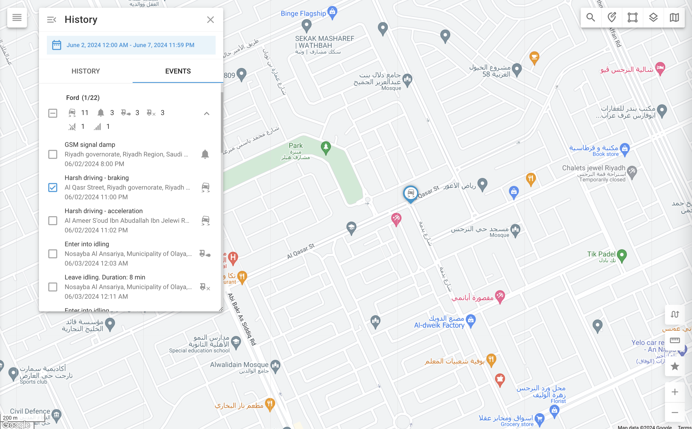

# Historia del evento

La pestaña Evento de la vista Historial proporciona un registro detallado de todos los eventos relacionados con los objetos seleccionados durante un periodo determinado. Estos eventos varían en función del tipo de rastreador y de las actividades supervisadas, ofreciendo una visión completa del estado operativo de su flota y de lo ocurrido con sus activos rastreados.

Para ver el historial de eventos, seleccione los objetos que desee revisar y haga clic en el botón de historial (la flecha circular azul situada en la parte inferior derecha de la lista de objetos). Se le pedirá que seleccione un intervalo de fechas y horas. Una vez elegido el intervalo deseado, vaya al cuadro de diálogo Historial y seleccione la opción **"Pestaña "Eventos**.

## Lista de actos

La lista de eventos muestra una secuencia cronológica de eventos para cada objeto. Cada entrada incluye:

* **Marca de tiempo**: Fecha y hora en que se produjo el suceso.
* **Tipo de acontecimiento**: El evento específico, como "Seguidor apagado" o "Seguidor encendido".
* **Ubicación**: Lugar donde se produjo el suceso, si procede.
* **Detalles del evento:** En función del tipo de evento supervisado, como un umbral de temperatura.

## Tipos de actos

Los tipos de eventos que se muestran vienen determinados por los eventos que se están supervisando. Navixy puede detectar y registrar una amplia gama de eventos, desde notificaciones básicas de movimiento y parada hasta alertas más complejas de sensores y recordatorios de mantenimiento. Para obtener más información sobre la configuración y gestión de estos eventos, consulte la sección [Normas y notificaciones](../../reglas-y-alertas/) sección.

## Acciones con eventos

* **Revisar los detalles del evento**: Desplácese por la lista de eventos para consultar información detallada sobre cada uno de ellos.
* **Filtrar eventos**: Aplica filtros para limitar los tipos de eventos o centrarte en objetos específicos.
* **Exportar eventos**: Exporta los datos de los eventos para su posterior análisis o registro.
