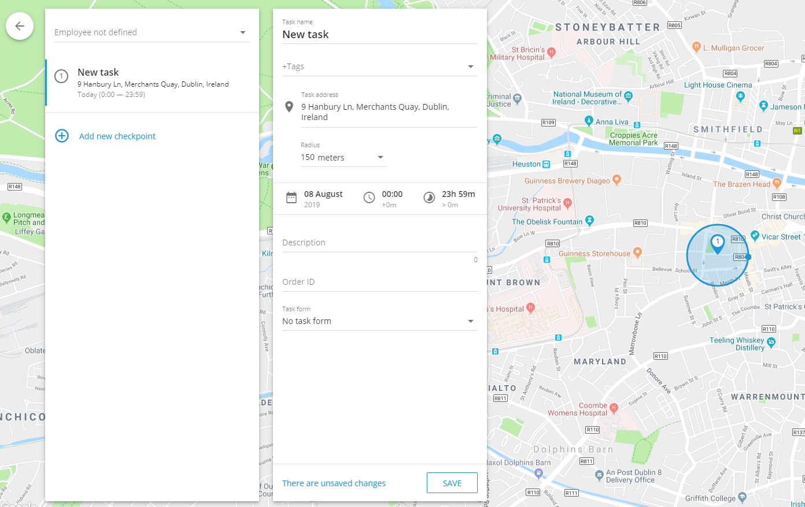

# Tareas

La pestaña de **Tareas** en Navixy se refiere a una tarea o trabajo específico que debe realizar un empleado o un trabajador sobre el terreno. Incluye instrucciones detalladas sobre lo que hay que hacer, dónde hay que hacerlo y en qué plazo. Las tareas pueden ir desde asignaciones sencillas y puntuales, como la entrega de un paquete en un único lugar, hasta operaciones más complejas, como la visita a varios puntos de control a lo largo de una ruta para realizar inspecciones, instalaciones u otros servicios.

Las tareas son esenciales para gestionar y coordinar las operaciones sobre el terreno, garantizar que los empleados tengan claras sus responsabilidades y permitir a los directivos supervisar los progresos, optimizar las rutas y asegurarse de que todos los trabajos se realizan con eficacia.

## Cómo crear una tarea

1. Vaya a la pestaña Tareas de la aplicación Servicio de campo.
2. Haga clic en el botón **"+"** para iniciar el proceso de creación de una nueva tarea.
3. **Defina el nombre de la Tarea:**

* Introduzca un nombre de tarea descriptivo que ayude a identificar el propósito de la tarea. Puede ser el nombre del cliente o una breve descripción de la tarea, como "Instalar equipos" o "Inspeccionar comunicaciones".

4. **Especifique la dirección de la tarea:**

* Introduzca manualmente la dirección de la tarea, seleccione un punto en el mapa o utilice coordenadas geográficas. Esto definirá la ubicación principal para una tarea individual o el primer punto de control para una tarea de ruta.

5. **Establezca el tiempo de la tarea:**

* Defina la fecha y el intervalo de tiempo durante el cual el empleado debe completar la tarea. Esto garantiza que la tarea se complete dentro del plazo designado.

6. **Añada puntos de control para tareas de ruta:**

* Para crear una tarea de ruta, haga clic en "Añadir nuevo punto de control" después de establecer la ubicación inicial. Cada punto de control representa una parada adicional a lo largo de la ruta, y se conectarán automáticamente en secuencia. El empleado debe completar estos puntos de control en el orden especificado.

7. **Asigne la tarea a un empleado:**

* Seleccione el empleado que será responsable de la tarea. Si es necesario, puede asignar la tarea más tarde utilizando la lista de tareas o utilizar herramientas adicionales proporcionadas en la interfaz para facilitar la asignación.

8. **Detalles adicionales de la tarea:**

* **Descripción de la tarea:** Proporcione cualquier detalle adicional que pueda ser útil para el empleado, como información de contacto o instrucciones especiales.
* **Molde:** Seleccione el formulario que el empleado necesita rellenar mientras realiza la tarea. Los formularios se pueden rellenar directamente en la aplicación X-GPS Tracker.
* **Etiquetas:** Añade etiquetas relevantes a la tarea para facilitar su búsqueda y categorización posterior.
* **Número de pedido:** Asigne un ID de pedido que el cliente pueda utilizar para seguir el estado de la tarea a través de la función "Correo en el mapa".

9. Haga clic en **"Guardar"** para finalizar y enviar la tarea al dispositivo móvil del empleado.

### Tareas individuales y de ruta

* **Tareas individuales:** Se trata de tareas sencillas en las que el empleado visita un único lugar para realizar las tareas asignadas. La tarea se completa una vez que el empleado ha llegado a la dirección especificada y ha realizado las acciones requeridas.
* **Tareas de ruta:** Se trata de varios puntos de control que el empleado debe visitar en un orden determinado. Este tipo de tarea es ideal para situaciones en las que el empleado tiene que visitar varios lugares a lo largo de una ruta planificada, como entregas o inspecciones.

La interfaz está diseñada para ser intuitiva, lo que permite a los gestores y expedidores crear y gestionar rápidamente tareas individuales y de ruta con facilidad, garantizando que todas las operaciones sobre el terreno se gestionen con eficiencia y eficacia.

### Optimización de rutas

La **Optimización de rutas** de Navixy ayuda a los mensajeros a entregar paquetes de forma eficaz, determinando la mejor secuencia para visitar varias direcciones de una ciudad. Tiene en cuenta la ubicación de cada dirección, las ventanas de tiempo de entrega específicas y el punto de partida de la tarea para crear la ruta más óptima.

#### Ventajas clave:

* **Ahorro de combustible:** Minimiza la distancia recorrida, reduciendo el consumo de combustible.
* **Entregas más rápidas:** Optimiza la secuencia para completar las tareas más rápidamente.
* **Mayor productividad:** Automatiza la planificación de rutas, lo que permite a los mensajeros centrarse en las entregas.

La plataforma puede optimizar hasta 25 puntos en una sola tarea de ruta, garantizando que todas las entregas se realicen a tiempo y en el orden más eficiente.

## Importación de tareas

Cuando se gestiona una plantilla numerosa o numerosas tareas, importar tareas desde un archivo Excel es más eficaz que crearlas manualmente y asignarlas una a una. Esto resulta especialmente útil cuando las tareas son generadas por sistemas externos, como los CRM.

### Importar desde archivo Excel

Aunque los desarrolladores pueden utilizar una API para importar tareas, existe un método más sencillo: importar tareas desde un archivo de Excel. Los datos deben presentarse en formatos de hoja de cálculo XLS, XLSX o CSV.

#### Cómo importar tareas desde un archivo Excel

1. **Inicie el proceso de importación:**

* Pase el ratón por encima del botón "+" de la sección de tareas.
* Haga clic en el botón **XLS** opción.

2. **Ventana de importación de tareas:**

* En la ventana "Importación de tareas", puede descargar un **Ejemplo de expediente** plantilla.
* Establezca los parámetros de la tarea según sea necesario.

3. **Campos obligatorios:**

* Los campos marcados como "Obligatorios" deben rellenarse para que la importación se realice correctamente. El sistema rechazará la importación si falta algún campo obligatorio.

4. **Dirección frente a coordenadas:**

* Puede especificar una dirección en lugar de las coordenadas; el sistema determinará automáticamente la ubicación.

#### Importar configuración

Además de los ajustes de tareas individuales, puede configurar los siguientes ajustes globales:

* **Radio por defecto:** Define la desviación permitida de la ubicación especificada. Si el empleado (o el vehículo) llega dentro de este radio, la tarea se considerará completada aunque no llegue a la ubicación exacta.
* **Autoasignación de tareas:**
  * **Ignorar dirección:** Las tareas se asignan equitativamente a todos los empleados.
  * **Utilice la dirección del empleado:** Las tareas se asignan en función de la proximidad al domicilio del empleado.
  * **Utilice la dirección del departamento:** Las tareas se asignan en función de la distancia al departamento del empleado._Nota:_ Las direcciones de los departamentos y empleados deben especificarse en sus respectivas tarjetas de perfil.

Utilizando estos ajustes, puede agilizar el proceso de asignación de tareas, garantizando que las tareas se distribuyan y completen de forma eficaz.

### Importar desde archivo TXT

#### Cómo importar tareas desde un archivo TXT

1. **Inicie el proceso de importación:**

* Pase el ratón por encima del **"+"** en la sección de tareas.
* Haga clic en el botón **TXT** opción.

2. **Ventana de importación de tareas:**

* Verá la ventana "Importación de tareas", que contiene un campo grande.
* Pegue la lista de tareas de su hoja de cálculo directamente en este campo utilizando el portapapeles (copiar-pegar).

Este proceso le permite importar eficazmente varias tareas a la vez, agilizando su flujo de trabajo de gestión de tareas.
