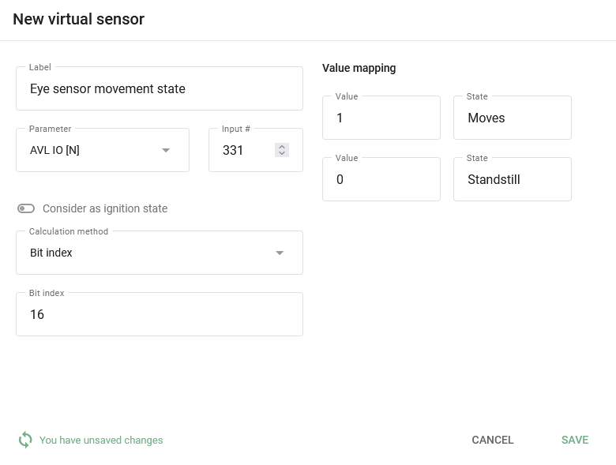
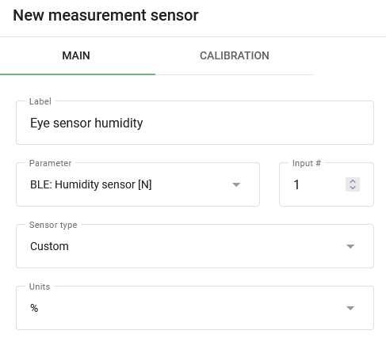
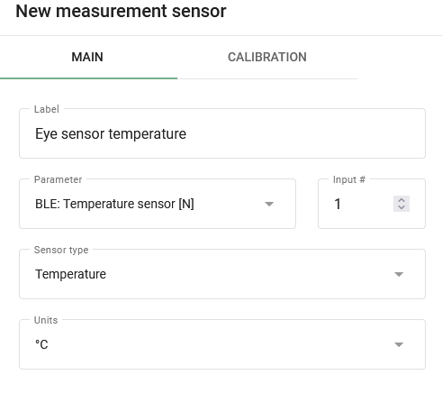

# Configuration du capteur oculaire

# Configuration du capteur oculaire

Pour illustrer l'utilisation des capteurs virtuels, nous vous présentons les éléments suivants [Teltonika Eye Sensors](https://teltonika-gps.com/products/accessories/sensors-beacons/eye)Ces capteurs sont capables d'enregistrer des données précieuses telles que la température, l'humidité, le mouvement et l'état de l'aimant. Les informations sur l'état des mouvements, en particulier, étaient auparavant indisponibles, mais elles sont désormais accessibles grâce à l'utilisation de capteurs virtuels. Si vous souhaitez en savoir plus sur ces capteurs et sur la manière de les configurer pour obtenir des informations importantes, nous serons heureux de vous fournir des instructions détaillées.

## Configuration des capteurs sur un appareil

Pour configurer la transmission des données entre le capteur et la plate-forme, il est recommandé d'utiliser la commande [Configurateur Teltonika](https://wiki.teltonika-gps.com/view/Teltonika_Configurator_Introduction). Veillez à [télécharger la version](https://wiki.teltonika-gps.com/view/Teltonika_Configurator_versions) qui correspond au micrologiciel et au modèle d'appareil actuels. Une fois que vous avez téléchargé et lancé le configurateur, accédez aux paramètres du système et sélectionnez le protocole de données Codec 8 Extended.

Activation du Codec 8 Extended dans le configurateur Teltonika.

Dans la section Bluetooth 4.0, nous recommandons de désactiver la fonction de balayage non-stop et de régler la "fréquence de mise à jour" et la "durée du balayage" sur toutes les 30 secondes. En ajustant ces paramètres, vous obtiendrez des résultats optimaux pour le balayage BLE, ce qui garantira une collecte de données fiable et précise.

Fréquence de balayage pour les capteurs BLE.

Ensuite, sélectionnez le numéro de connexion et réglez le mode de fonctionnement sur Avancé. Cela permet d'accéder aux paramètres détaillés du capteur. Recherchez les boutons situés dans le coin supérieur droit et sélectionnez la liste des préréglages. Cela vous permettra de rationaliser le processus de configuration du capteur.

Réglage du mode avancé pour le capteur et de l'emplacement du bouton de la liste des préréglages.

Lorsque vous cliquez sur le bouton de la liste des préréglages, une nouvelle fenêtre s'ouvre et affiche une sélection de capteurs disponibles. Il vous suffit de choisir celui que vous utilisez actuellement, par exemple le capteur EYE SENSOR. Ce tableau configurera automatiquement tous les paramètres nécessaires. Ensuite, naviguez vers l'onglet E/S pour configurer la transmission des données de ces capteurs dans les paquets de votre appareil.

Pour configurer la transmission des données de ces capteurs dans les paquets de votre appareil, naviguez jusqu'à l'onglet I/O. Ici, vous devrez définir les paramètres appropriés pour les réglages souhaités. Par exemple, si le numéro de connexion de votre capteur est 1, configurez les paramètres avec le même numéro. Dans la plupart des cas, il est préférable de définir la priorité sur Faible pour les paramètres qui doivent être surveillés sur la plate-forme. Il est également important de s'assurer que tous les autres paramètres sont laissés à leurs valeurs par défaut, à moins que vous n'ayez modifié quelque chose précédemment. Dans ce cas, les paramètres recommandés sont les suivants :

- Priorité = faible
- Niveau bas = 0
- Niveau élevé = 0
- Événement uniquement = Non
- Opérande = monitoring

Configuration de l'envoi des données des capteurs dans les paquets de l'appareil.

## Configuration sur la plate-forme

### Capteur d'état de mouvement

La lecture de ce capteur est entièrement configurable à l'aide de capteurs virtuels avec [la méthode de calcul de l'indice de Bit](https://squaregps.atlassian.net/wiki/spaces/UDOCFR/pages/3027441027/Virtual+sensors#Bit-index). Les données relatives à l'état de mouvement sont contenues dans le bit 16 du champ BLE 1 Custom 1. La configuration de l'état de mouvement nécessite les étapes suivantes :

1. Créez un capteur virtuel et spécifiez son nom.
2. Sélectionnez l'option [ID AVL approprié](https://wiki.teltonika-mobility.com/view/Full_AVL_ID_List#BLE_Sensor_I.2FO_elements) comme entrée. Par exemple, pour BLE 1 Custom 1, utilisez le nombre 331.
3. Définir le numéro de bit correspondant aux données sur l'état du mouvement. Dans ce cas, le bit 16 du champ BLE 1 Custom 1 doit être sélectionné.
4. Définissez les noms des états comme vous le souhaitez. Par exemple, "Standstill" et "Moves" peuvent être utilisés.
5. Spécifiez les valeurs correspondantes, où 0 indique qu'il n'y a pas de mouvement et 1 indique un mouvement enregistré par le capteur.

Configuration du capteur virtuel pour lire l'état de mouvement du capteur oculaire.

À ce stade, vous avez réussi à récupérer l'état actuel du mouvement. Toutefois, n'oubliez pas que les informations ne peuvent être obtenues dans les rapports et les règles que si l'état du mouvement est défini comme étant l'allumage.

L'obtention de rapports et de règles pour les capteurs virtuels de non-allumage n'est pas prise en charge pour le moment.

### Capteurs de température et d'humidité

La configuration de ces capteurs est similaire à la configuration d'un capteur standard. [capteurs de mesure](../measurement-sensors.md). Voyons un exemple de configuration pour chacun de ces capteurs :

L'humidité est transmise par l'appareil en %.

- Spécifiez le nom du capteur souhaité.
- Sélectionnez l'entrée BLE : Humidité \[N\] appropriée et spécifiez son numéro.
- Sélectionnez le type de capteur Personnalisé.
- Spécifier l'unité de mesure en %.
- D'autres réglages ne sont pas nécessaires.

Configuration du capteur d'humidité BLE.

La température est transmise par l'appareil en °C.

- Spécifiez le nom du capteur souhaité.
- Sélectionnez l'entrée BLE : Température \[N\] appropriée et indiquez son numéro.
- Sélectionnez le type de capteur Température.
- Spécifier l'unité de mesure en °C.
- D'autres réglages ne sont pas nécessaires.

Configuration du capteur de température BLE.

En utilisant les relevés des capteurs, vous pouvez générer un rapport Capteurs de mesure qui fournit des informations utiles sur les données collectées par le capteur. En outre, vous pouvez suivre les relevés en configurant des alertes à l'aide de la règle "Paramètre dans la plage", qui vous permet de recevoir des notifications lorsque des paramètres spécifiques sortent des plages prédéterminées.

En outre, des capteurs virtuels peuvent être créés et fournir des noms compréhensibles pour recevoir les valeurs des capteurs dans les widgets. Pour ce faire, utilisez [la méthode de calcul Value in Range](https://squaregps.atlassian.net/wiki/spaces/UDOCFR/pages/3027441027/Virtual+sensors#Value-in-range). Cela vous permettra de personnaliser les données du capteur affichées et de faciliter l'interprétation des informations présentées par le capteur.

### Capteur d'état magnétique

La configuration des capteurs d'état magnétiques est un processus simple et direct. En fait, aucune configuration supplémentaire n'est nécessaire en dehors de la connexion des capteurs à la plate-forme. Les données relatives à l'état de l'aimant sont transmises à la plate-forme sous forme de champs d'état et sont affichées dès qu'elles sont reçues de l'appareil connecté.

Utilisation de capteurs virtuels avec le [Méthode de calcul de la valeur à la source](https://squaregps.atlassian.net/wiki/spaces/UDOCFR/pages/3027441027/Virtual+sensors#Source-Value)Vous pouvez personnaliser les valeurs de vos champs d'état pour qu'ils soient affichés comme "ouverts" ou "fermés" et leur donner des noms facilement reconnaissables.

En configurant la règle "Valeur du champ d'état", vous pouvez suivre les champs d'état et recevoir des alertes lorsque des événements spécifiques se produisent.

Exemple de réglage du capteur d'état de l'aimant avec ses valeurs et son nom.

Vous avez réussi à obtenir des informations du capteur Eye et elles sont maintenant à portée de main. Vous êtes maintenant équipé pour suivre facilement ces précieuses données.