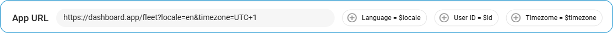

# Création de nouvelles applications utilisateur

Lors de la mise en place d'un nouveau **Application utilisateur**Avec la plateforme, vous travaillerez avec plusieurs configurations clés qui déterminent comment votre application externe s'intègre à la plateforme. Examinons chaque composant essentiel.

Commencez par cliquer sur le bouton 

 dans le **Applications utilisateur** liste. Dans le formulaire de configuration apparu, procédez comme suit :

### 1\. Configurer l'URL

Spécifiez l'URL de votre application - l'adresse où votre application est hébergée, elle sert de base à l'intégration.

> [!INFO]
> **Important**
> - Assurez-vous que l'URL est valide, qu'elle utilise une connexion HTTPS, qu'elle mène à une ressource fiable et qu'elle ne contient pas plus de 1000 caractères.
> - Assurez-vous que le paramètre iFrame de l'application est activé, sinon vous ne pourrez pas l'ouvrir dans l'interface de la plate-forme.

### 2\. Configurer les paramètres de base

Pour personnaliser votre application, vous pouvez inclure différents paramètres dans l'URL. Vous pouvez ajouter manuellement des paramètres dans le champ de l'URL ou utiliser l'une de nos suggestions : la langue, l'identifiant de l'utilisateur ou le fuseau horaire. Cliquez sur une suggestion de paramètre pour l'ajouter à la fin de l'URL. Développez la description ci-dessous pour en savoir plus sur les paramètres suggérés et les exemples.

Comprendre les paramètres URL suggérés

Nous proposons quelques paramètres de base pour la personnalisation

1. `?locale={locale_code}`  
Paramètre de langue qui correspond automatiquement à la langue de la plate-forme de l'utilisateur.
  - Exemple : `https://your-app.com/dashboard?locale=en`
2. `?user_id={user_identifier}`  
Paramètre du contexte de l'utilisateur qui transmet l'identité de l'utilisateur pour filtrer les informations personnalisées.
  - Exemple : `https://your-app.com/dashboard?user_id=12345`
3. `?timezone={timezone}`  
Paramètre de temps qui correspond automatiquement au fuseau horaire de la plate-forme de l'utilisateur.
  - Exemple : `https://your-app.com/dashboard?timezone=UTC+1`

Vous pouvez modifier le nom du paramètre suggéré ou lui attribuer une certaine valeur.

> [!NOTE]
> Testez votre configuration pour vous assurer que l'application se charge correctement. Cliquez sur 
> 
>  pour afficher un aperçu.

### 3\. Ajuster l'apparence

Créez une identité reconnaissable pour votre application afin d'en faciliter l'accès. Les paramètres suivants vous aideront à le faire :

- **Étiquette** - Ajoutez un nom unique et descriptif pour votre application (jusqu'à 24 caractères). Il sera affiché dans la barre latérale de la plateforme.
- **Description** - Ajoutez une brève explication avec des détails sur les fonctionnalités de l'application ou mettez en évidence des informations importantes (jusqu'à 50 caractères). Une description informative aidera vos utilisateurs à mieux comprendre l'objectif de l'application.
- **Icône** - Sélectionnez une icône qui représente la fonction de votre application pour une navigation encore plus native.

### 4\. Sélectionner la méthode d'affichage

Décidez de la manière dont votre application s'ouvrira en choisissant l'une des deux options de la fenêtre d'accueil. **Ouvrir en** liste déroulante :

- **Embarqué** - L'application apparaît dans l'interface de la plateforme
- **Nouvel onglet** - L'application s'ouvre dans un onglet séparé du navigateur

> [!NOTE]
> Notre plateforme utilise iFrame pour l'intégration. Étant donné que cette technologie ne permet pas de traiter avec succès toutes les URL, veillez à prévisualiser le résultat de l'intégration. Si vous rencontrez des problèmes avec cette méthode d'affichage, veuillez envisager d'utiliser **Nouvel onglet**.

### 5\. Mise en place de l'authentification (facultatif)

Configurez l'authentification si votre application repose sur l'API de la plateforme. Dans ce cas, la plateforme fournira les données d'authentification directement à l'application lorsqu'elle est ouverte, ce qui élimine la nécessité d'implémenter une fonctionnalité de connexion supplémentaire du côté de votre application.  
Vous pouvez choisir l'une des deux méthodes d'authentification :

- **Clé API**
  - Cette méthode est destinée aux applications pour lesquelles la gestion des rôles ou les autorisations des utilisateurs ne sont pas nécessaires.
  - La clé API correspond au niveau d'accès du propriétaire du compte. Cela signifie que le fait de fournir une clé API à un utilisateur commun peut lui permettre d'accéder aux éléments suivants **toutes les données** à la disposition de l'utilisateur principal.  
Par exemple, si votre application utilise des traceurs pour lesquels un utilisateur a des droits limités ou n'a pas du tout accès, l'utilisation de la clé API exposera quand même tous les traceurs du compte principal.
- **Clé de session**
  - Cette méthode est recommandée lorsque la gestion des rôles est impliquée.
  - Transmet la clé de session de l'utilisateur actuel à l'application.

> [!NOTE]
> Sélection de la **Clé API** désactivera automatiquement la méthode **Clé de session** et vice versa. Une seule méthode peut être utilisée à la fois.

Lorsque l'authentification est activée, la plate-forme ajoute l'élément `?session_key=` à l'URL de votre application.

- Si vous avez sélectionné un **Clé API**la valeur du paramètre contiendra cette clé.
- Si vous avez opté pour un **Clé de session**la valeur du paramètre comprendra la clé de la session utilisateur actuelle à partir de laquelle l'application est accédée.

Assurez-vous que l'application est capable de lire et d'utiliser ce paramètre.

### 6\. Sauvegarder la nouvelle application

Cliquez sur le bouton **Économiser** bouton. Votre demande apparaîtra dans le **Applications utilisateur** et la barre latérale de la plate-forme. Les applications activées deviennent automatiquement disponibles pour les utilisateurs du compte.

Conseils de dépannage rapide

Si votre application ne s'affiche pas correctement lorsqu'elle est intégrée, essayez :

- L'ouvrir dans un nouvel onglet
- Vérifier que votre URL est correcte et accessible
- Vérification du formatage correct de tous les paramètres

Les applications créées restent entièrement configurables après leur enregistrement. Vous pouvez ajuster leurs paramètres et leur apparence à tout moment. Pour en savoir plus sur la gestion des applications, voir [Gestion des applications utilisateur existantes](gestion-des-applications-utilisateur-existantes.md).