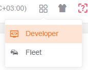

# Intégration Mettax pour la télématique vidéo

La télématique vidéo est une fonctionnalité vitale pour de nombreuses entreprises. Il existe des solutions propriétaires qui gèrent le flux vidéo des caméras embarquées mais offrent des possibilités limitées pour les lectures télématiques de ces appareils. Pour cette raison, nous avons élargi notre approche des intégrations afin que nos clients puissent utiliser les applications tierces existantes pour la vidéo et bénéficier en même temps des fonctionnalités télématiques étendues de Navixy.

Mettax est un excellent exemple de ce scénario. Voyons à quel point il est facile d'intégrer ses capacités directement dans l'interface utilisateur de Navixy.

## 1\. Établissement de l'intégration

Tout d'abord, vous devez effectuer les préparations nécessaires du côté de Mettax.

> [!WARNING]
> Dans Mettax, les données des appareils sont stockées sous des comptes utilisateur individuels. Si votre organisation utilise une structure de compte parent, **vous devrez effectuer les étapes suivantes pour chaque compte utilisateur qui possède des appareils**. Bien que cela puisse nécessiter de se connecter et de se déconnecter de différents comptes, cela garantit une couverture complète et ciblée de votre flotte d'appareils.

1. Connectez-vous à un compte utilisateur qui contient des appareils réels.
2. Activez le mode **Développeur** pour activer les paramètres nécessaires à notre intégration :
  1. Cliquez sur le nom de votre compte dans le coin supérieur droit de la fenêtre.
  2. Allez dans **Paramètres client**.
  3. Ouvrez l'onglet **Paramètres de l'application**.
  4. Activez l'option **Développeur**.
3. Installez les **Webhooks** pour établir une connexion entre les deux solutions :
  1. Cliquez sur l'icône des applications et sélectionnez **Développeur**.
  2. Allez dans **Détails**.
  3. Ouvrez l'onglet **WEBHOOK**.
  4. Trouvez ces trois webhooks, vous devrez les modifier :
    1. **pushDeviceInfo**
    2. **pushAlarm**
    3. **pushGpsInfo**
  5. Cliquez sur **Modifier** dans la ligne du webhook nécessaire pour ouvrir ses paramètres.
  6. Remplissez le champ URL avec l'adresse de votre instance Navixy, selon la région :
    1. EU - https://mettax-tracker.navixy.com
    2. US - https://mettax-tracker.us.navixy.com
  7. Répétez l'étape URL pour les 3 webhooks.
4. (optionnel) Répétez les étapes ci-dessus pour tous les comptes utilisateur requis.

> [!TIP]
> Votre compte Mettax est prêt pour l'intégration !

## 2\. Ajout d'un appareil Mettax à Navixy

La plateforme Navixy gère la fonctionnalité GPS des appareils vidéo et leurs capacités télématiques. Pour tirer le meilleur parti de l'intégration, vous devez ajouter votre appareil Mettax à la plateforme, en suivant la procédure habituelle :

1. Allez dans **Activation d'appareil**.
2. Sélectionnez votre appareil Mettax dans la liste.
3. Sélectionnez l'option **Carte SIM achetée séparément** et passez à l'étape suivante.
4. Entrez un **ID d'appareil** correct
5. Complétez la configuration de l'appareil

Pour des instructions détaillées sur l'activation d'un appareil dans Navixy, consultez [Activer un appareil GPS](/wiki/pages/createpage.action?spaceKey=UDOCFR&title=Activate%20GPS%20device&linkCreation=true&fromPageId=3371139121).

> [!TIP]
> Votre appareil et votre compte Navixy sont prêts pour l'intégration !

## 3\. Intégration de Mettax dans l'interface utilisateur de Navixy

À cette étape, nous effectuons l'intégration réelle.  
Navixy offre une fonctionnalité [Applications utilisateur](https://squaregps.atlassian.net/wiki/spaces/USERDOCSOLD/pages/3017179152/User+applications?atlOrigin=eyJpIjoiYzVjMjI4Mjg4NWQ1NDU0ZjlhYTEyOWE2ZjAwM2RhZTYiLCJwIjoiYyJ9) qui permet d'intégrer des applications tierces directement dans l'interface de la plateforme. Nous l'utiliserons pour intégrer Mettax.

> [!NOTE]
> **Navigation**
> La section **Applications utilisateur** est accessible aux **Propriétaires** de compte dans la section **Paramètres du compte**. Pour la trouver :
> 1. Cliquez sur l'icône de profil dans le coin supérieur gauche de l'écran pour ouvrir les paramètres de votre compte
> 2. Dans la barre latérale des paramètres, sélectionnez **Applications utilisateur**

1. Créez une nouvelle application  
Commencez par cliquer sur le bouton 
 dans la liste **Applications utilisateur**.
2. Configurez la nouvelle application
  1. Mettez [https://www.mettaxiot.com/#/dashboard](https://www.mettaxiot.com/#/dashboard) dans le champ **URL de l'application**.
  2. Entrez un **Libellé** pour l'application (par exemple, Tableau de bord Mettax).
  3. Sélectionnez **Intégré** dans le champ **Afficher comme** pour afficher la fonctionnalité Mettax dans Navixy.
3. Cliquez sur **Enregistrer** pour terminer la configuration.

> [!TIP]
> Votre nouvelle application apparaît automatiquement dans la barre latérale gauche de Navixy. Ouvrez-la et connectez-vous avec vos identifiants Mettax.
> 