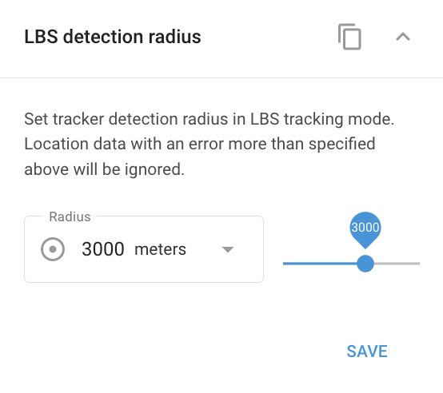

# Widget du rayon de détection LBS

Le **Rayon de détection LBS (Location-Based Service)** détermine la distance à laquelle le système recherchera les signaux des stations de base cellulaires ou des points Wi-Fi pour localiser un appareil. Ce paramètre est essentiel pour garantir un suivi précis de la localisation en fonction de l'environnement dans lequel l'appareil fonctionne.

- **Zones rurales**: Dans les zones rurales où il y a moins de stations de base, il est conseillé d'augmenter le rayon LBS. Cela permet au système d'utiliser des stations de base plus éloignées, ce qui augmente les chances de localiser l'appareil.
- **Zones urbaines**: Dans les villes à forte densité de stations de base, le rayon d'action LBS doit être réduit. La proximité de plusieurs stations de base fournit des signaux suffisants pour un suivi précis de la localisation, de sorte qu'un rayon plus petit permet de maintenir une plus grande précision.

Ajustez le rayon de détection LBS en fonction de l'environnement de fonctionnement de l'appareil afin de trouver un équilibre entre la précision et la couverture du signal.

Dans Navixy, les emplacements LBS sont affichés sur la carte sous forme de cercles. Le centre indique l'emplacement estimé, tandis que le rayon indique l'imprécision possible. Un cercle plus petit indique une plus grande précision, généralement observée dans les zones urbaines, tandis qu'un cercle plus grand indique une plus grande imprécision, fréquente dans les zones rurales.