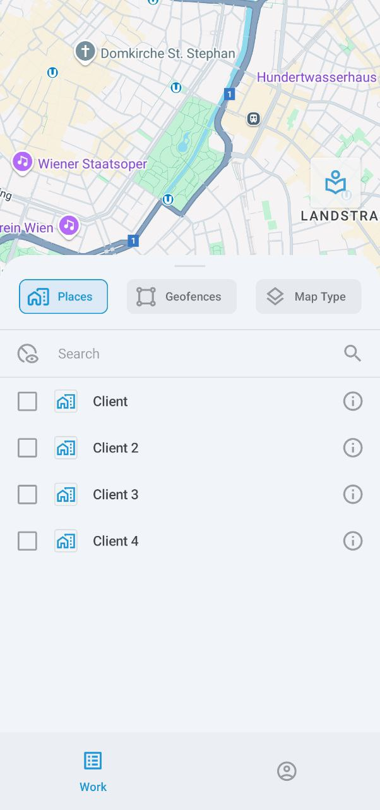

# Liste des actifs

Cet écran affiche tous vos actifs : véhicules, personnel et objets (appareils GPS non assignés). Pour consulter plus d'informations sur l'un de vos actifs, appuyez simplement sur son entrée. Pour trouver un actif spécifique, appuyez sur 

 et saisissez son nom.

L'icône à droite de chaque actif indique son état de mouvement, comme en déplacement ou stationné.

### Événements

Appuyez sur 

 pour voir les événements.

Cet écran affiche divers événements concernant vos actifs, comme quitter ou entrer dans une géofence, passer au ralenti, excès de vitesse, accomplissement de tâches, et plus encore. Pour filtrer par type de catégorie, appuyez sur **Tous**, **Véhicules**, **Personnel**, ou **Objets**.

Le deuxième menu affiche vos filtres actuels, qui peuvent tous être configurés : période, véhicules ou personnel spécifiques, et types d'événements. Le filtre **Non lus** affichera uniquement les notifications non lues, tandis que **Urgence** réduira votre recherche aux événements urgents.

### Carte

Appuyez sur 

 pour ouvrir une carte interactive affichant vos actifs.

Vous pouvez zoomer et dézoomer et centrer la carte sur vos propres coordonnées GPS. Appuyez sur l'icône du véhicule pour suivre son itinéraire et voir son état et sa position actuels. Appuyez à nouveau sur 

 pour ouvrir les détails du véhicule.

Appuyez sur 

 pour afficher le menu d'options de la carte :

Ici, vous pouvez sélectionner des lieux (comme les emplacements des clients pour la livraison), des géofences et le type de carte. Notez que la sélection du type de carte n'est actuellement disponible que sur les appareils Android.

### Tri et filtrage

La liste dispose de deux méthodes de filtrage : par catégorie et par statut.

Pour filtrer par catégorie, appuyez sur **Tous**, **Véhicules**, **Personnel**, ou **Objets**.

Pour filtrer par statut (en déplacement, arrêté, stationné, au ralenti et hors ligne), appuyez sur 

 pour ouvrir le menu **Filtre et tri**. En plus du filtrage, ce menu permet également de trier les actifs par nom.

