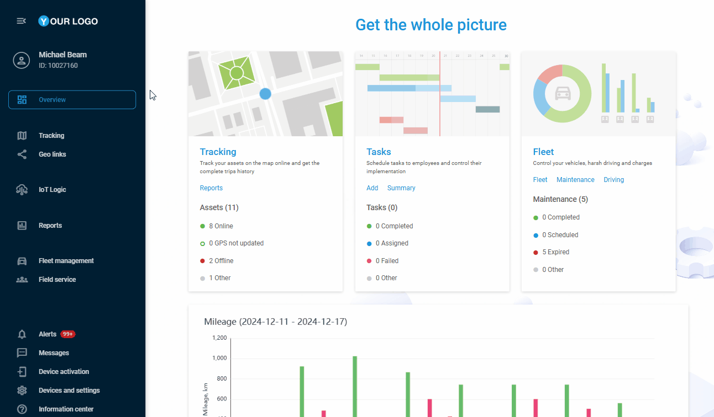

# Applications utilisateur

## Vue d'ensemble

Le présent vous permet d'étendre et de personnaliser les fonctionnalités de votre plateforme en intégrant de manière transparente des outils tiers et des modules complémentaires personnalisés. Les applications sont des éléments de base qui vous permettent de créer un espace de travail personnalisé où tous vos outils essentiels sont à portée de clic. Que vous ayez besoin d'analyser des données complexes, de rationaliser la communication ou d'intégrer des outils industriels spécialisés, cette fonctionnalité vous permet de le faire sans avoir besoin d'une expertise technique.

Vous choisissez comment les outils externes s'intègrent à votre espace de travail. Certaines applications fonctionnent mieux lorsqu'elles sont intégrées directement dans l'interface, devenant ainsi partie intégrante de votre flux de travail quotidien. D'autres peuvent bénéficier de l'ouverture de nouveaux onglets, ce qui vous permet de profiter d'une expérience en plein écran lorsque cela est nécessaire. Le système s'adapte à vos préférences tout en maintenant la sécurité et la facilité d'utilisation grâce à des fonctionnalités telles que les paramètres URL, l'identification de l'utilisateur et la gestion sécurisée des sessions.

Voici les principaux avantages de l'utilisation de **Applications utilisateur**:

- **Personnalisation sur mesure**  
Étendre la plateforme pour répondre aux besoins spécifiques de l'entreprise avec des fonctionnalités et des flux de travail personnalisés.
- **Intégration transparente**  
Connectez facilement des applications tierces pour rationaliser votre flux de travail. Réduisez les changements de contexte et gagnez du temps en accédant à tout au sein d'une seule plateforme.
- **Contrôle renforcé**  
Prenez en charge vos opérations quotidiennes grâce à une configuration flexible de la plateforme, en découvrant potentiellement des moyens innovants d'exploiter notre plateforme.
- **Favoriser l'innovation**  
Développez et accédez à de nouvelles applications et solutions directement à partir de Navixy, en stimulant l'innovation au sein de votre organisation.
- **Croissance de la Communauté**  
Développez notre réseau de professionnels de la télématique et partagez des informations précieuses issues de vos développements personnalisés.

## Accès aux applications utilisateur

En fonction du niveau d'accès défini par le rôle de l'utilisateur, la disponibilité de la fonctionnalité peut varier :

- Compte **Propriétaires** ont un accès complet à la gestion des applications. Ils peuvent créer de nouvelles applications, voir toutes les applications existantes dans le compte et les modifier.
- Compte **Utilisateurs** ne peuvent voir que les applications activées pour eux dans la barre latérale de la plateforme.

Le **Applications utilisateur** l'espace est disponible pour le compte **Propriétaires** dans le **Paramètres du compte** section. Pour y accéder :

1. Cliquez sur l'icône de profil dans le coin supérieur gauche de l'écran pour ouvrir les paramètres de votre compte.
2. Dans la barre latérale des paramètres, sélectionnez **Applications utilisateur**

Vous verrez une liste complète de tous vos modules complémentaires existants, ainsi que des options permettant d'en créer de nouveaux.

## Contenu de la section

En savoir plus sur la création et la configuration des applications utilisateur :

- [Création de nouvelles applications utilisateur](applications-utilisateur/creation-de-nouvelles-applications-utilisateur.md)
- [Gestion des applications utilisateur existantes](applications-utilisateur/gestion-des-applications-utilisateur-existantes.md)