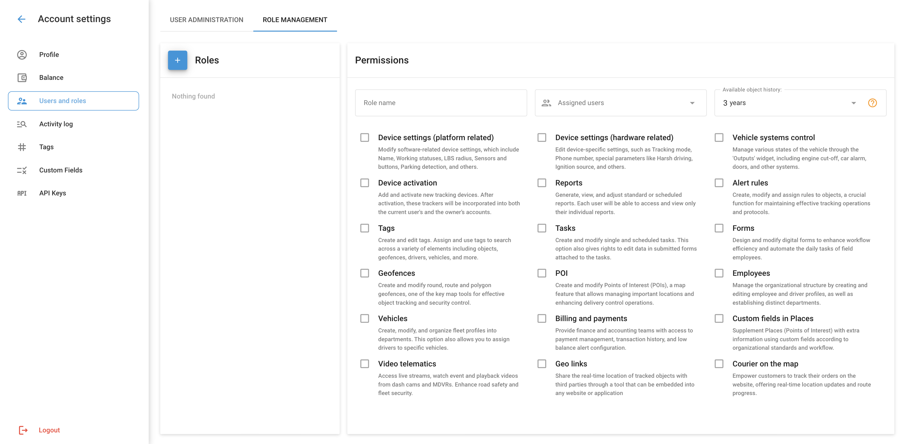

# Role Management

Un rôle d'utilisateur dans Navixy est un ensemble de permissions et de droits d'accès assignés à un utilisateur, définissant ce qu'il peut voir et gérer dans la plateforme. Les rôles d'utilisateur sont personnalisables et permettent au propriétaire de contrôler le niveau d'accès de chaque utilisateur à différentes fonctionnalités et données. Les rôles déterminent la capacité d'un utilisateur à :

- Gérer les véhicules, les employés et les actifs
- Visualiser les données télématiques provenant de dispositifs GPS et de capteurs
- Travailler avec des géofences et des points d'intérêt (POI)
- Générer des rapports, utiliser des plugins et des outils spécifiques à l'application

En attribuant des rôles, le propriétaire peut s'assurer que les utilisateurs disposent de l'accès approprié pour accomplir leurs tâches sans compromettre la sécurité ou l'intégrité des données et des opérations de l'entreprise. Chaque rôle peut comprendre des droits de base accessibles à tous les utilisateurs, ainsi que des droits supplémentaires adaptés aux besoins et responsabilités spécifiques des différents utilisateurs.

## Ajout et gestion des rôles

Pour ajouter un nouveau rôle, accédez à Paramètres du compte → Utilisateurs et rôles et sélectionnez l'onglet "Gestion des rôles". Cliquez sur le bouton "Ajouter un rôle" (le bouton avec le signe "+").

2. **Créer un nouveau rôle**:

- Pensez à un nom pour le rôle.
- Sélectionnez les droits d'accès nécessaires pour ce rôle.
- Cliquez sur "Enregistrer" pour créer le rôle.

### Types de droits

Tous les droits sont répartis en trois catégories : Propriétaire, de base et additionnel.

#### Droits des propriétaires

Les droits du propriétaire ne sont accessibles qu'au propriétaire du compte (utilisateur principal) et ne peuvent pas être attribués à d'autres rôles. Il s'agit notamment des droits suivants

- Ajouter et modifier des utilisateurs
- Gérer les groupes d'objets
- Configurer le transfert de données
- Plan de changement

**Droits fondamentaux**

Les droits de base sont accessibles à tous les rôles et ne peuvent pas être désactivés. Il s'agit notamment de

- Outils cartographiques (couches, planification d'itinéraires, etc.)
- Historique des voyages et des événements
- Opérations de service
- Widgets interactifs (modification de l'état du travail, modification de l'état des sorties, etc.)
- Accès aux données liées (tâches assignées, règles de contrôle, etc.)

**Droits supplémentaires**

Des droits supplémentaires sont configurés individuellement pour chaque rôle. Il s'agit notamment des droits suivants

- **Paramètres de l'appareil (côté logiciel)**: Modifier les paramètres de l'appareil liés au logiciel, y compris le nom, l'état de fonctionnement, le rayon LBS, les capteurs et les boutons, la détection de stationnement, etc.
- **Paramètres de l'appareil (côté matériel)**: Modifier les paramètres pour des appareils spécifiques, tels que le mode de suivi, le numéro de téléphone, les paramètres spéciaux comme la conduite difficile, la source d'allumage, etc.
- **Contrôle des systèmes de véhicules**: Contrôlez divers états du véhicule à l'aide du widget "Outputs", y compris l'arrêt du moteur, l'alarme du véhicule, les portes et d'autres systèmes.
- **Activation du dispositif**: Ajouter et activer de nouveaux dispositifs de suivi. Après l'activation, les traceurs seront activés à la fois pour le compte de l'utilisateur actuel et pour le compte du propriétaire.
- **Rapports**: Créer, visualiser et configurer des rapports standard ou programmés. Chaque utilisateur ne peut consulter que ses propres rapports.
- **Règles d'alerte**: Créer, modifier et attribuer des règles aux objets afin de maintenir des opérations efficaces et des protocoles de suivi.
- **Tags**: Créez et modifiez des balises. Attribuez et utilisez des balises pour rechercher divers éléments, notamment des objets, des géofences, des conducteurs, des véhicules, etc.
- **Tâches**: Créer et modifier des tâches individuelles et planifiées. Cette option donne également le droit d'éditer les données des formulaires attachés aux tâches.
- **Les géofences**: Créez et modifiez des géofences circulaires, routières et polygonales, un outil cartographique essentiel pour suivre les objets et assurer la sécurité.
- **Lieux**: Créer et modifier des points d'intérêt (POI) - une fonction cartographique qui permet de gérer les emplacements importants et d'améliorer les opérations de contrôle des livraisons.
- **Salariés**: Gérer la structure organisationnelle, créer et modifier les profils des employés et des conducteurs, et créer des départements.
- **Véhicules**: Créer, modifier et distribuer des profils de flotte par département. Cette option permet également d'affecter des conducteurs à des véhicules spécifiques.
- **Facturation et paiements**: Permettre aux groupes financiers et comptables d'accéder à la gestion des paiements, à l'historique des transactions et aux paramètres d'alerte en cas de solde insuffisant.
- **Télématique vidéo**: Accédez à des flux en direct, visualisez des événements et lisez des vidéos à partir de DVR et de MDVR, ce qui améliore la sécurité routière et la sécurité de la flotte.
- **Weblocator**: Partager avec des tiers la localisation en temps réel des objets suivis au moyen d'un plugin qui peut être intégré dans un site web ou une application.
- **Courier sur la carte**: Permettre aux clients de suivre leurs commandes sur le site web, en leur offrant des mises à jour en temps réel de leur localisation et de l'état d'avancement de l'itinéraire du courrier.