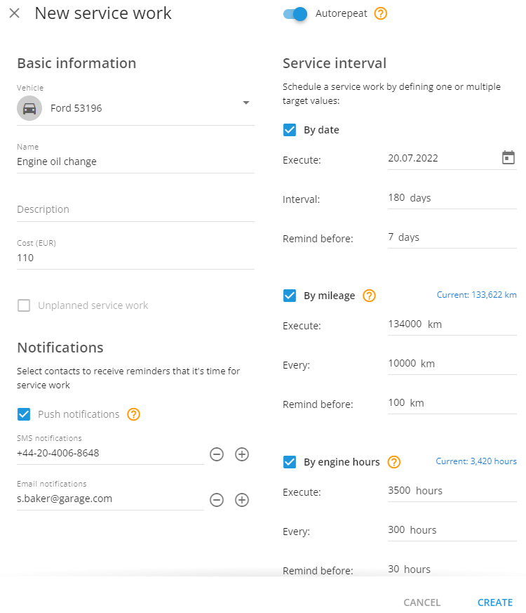

# Maintenance

Les **Travaux d'entretien** La fonctionnalité "Entretien" de l'application Navixy Fleet Management est un outil complet conçu pour gérer efficacement les tâches d'entretien des véhicules. Ce guide explique comment créer, gérer et contrôler les tâches d'entretien afin de maintenir votre flotte en parfait état.

## Ajouter un travail de service

Pour garantir des performances optimales de votre flotte, commencez par planifier et gérer vos tâches d'entretien.

1. **Aller à la maintenance :**
  - Naviguez jusqu'à la page **Gestion du parc automobile** et cliquez sur **Maintenance**.
2. **Créer de nouveaux services :**
  - Cliquez sur **Ajouter** dans le coin supérieur gauche.
  - Sélectionnez le véhicule que vous souhaitez entretenir.
  - Choisissez une ou plusieurs des conditions suivantes :
    - **Par date :** Fixez une date pour le service et recevez des rappels avant la date d'échéance.
    - **Par kilomètre :** Saisissez le kilométrage auquel le service doit être effectué et définissez un rappel.
    - **Par moteur Heures :** Précisez les heures d'ouverture du moteur pour le service et soyez prévenu à l'avance.
3. **Ajouter des détails :**
  - Si vous le souhaitez, vous pouvez ajouter un **Description** et **Coût**.
  - Configurez des notifications par push, SMS ou e-mail.
  - Joignez des fichiers tels que des factures si nécessaire.
4. **Sauvegarder la tâche :**
  - Enregistrez la tâche de service et le système enverra des notifications en fonction de vos paramètres.

## Gérer les travaux de service

Après avoir créé des tâches de service, vous pouvez avoir besoin de les modifier, de les supprimer ou de les dupliquer. Voici comment gérer efficacement ces actions :

#### Modifier une tâche

- Trouver la tâche dans le **Maintenance** et mettre à jour les détails si nécessaire.

#### Supprimer une tâche

- Si une tâche n'est plus nécessaire, supprimez-la de la section Maintenance. N'oubliez pas que les tâches supprimées ne peuvent pas être récupérées.

#### Copier une tâche

- Pour attribuer des tâches similaires à d'autres véhicules, utilisez la fonction de copie et ajustez les paramètres selon vos besoins.

## Mise en place d'un travail de service reproductible

Rationalisez l'entretien de votre flotte en configurant les tâches répétitives, une fonction qui génère automatiquement de nouvelles tâches d'entretien à des intervalles prédéfinis. Suivez les étapes suivantes pour la configurer.

1. **Activer la répétition automatique :**
  - Allumez le **Répétition automatique** en basculant le commutateur.
2. **Sélectionnez le véhicule :**
  - Choisissez un véhicule pour la tâche de service. Le système utilisera les données du traceur GPS pour contrôler les heures de fonctionnement du moteur et le kilométrage.
3. **Saisir les détails de la tâche :**
  - Ajouter un **Nom**et, éventuellement, un **Description** et **Coût**.
4. **Définir les notifications :**
  - Choisissez qui doit recevoir les notifications.
5. **Définir l'intervalle de service :**
  - **Par date :** Planifiez le premier entretien et définissez des intervalles pour les tâches ultérieures.
  - **Par kilomètre :** Saisissez le kilométrage cible et définissez des intervalles récurrents.
  - **Par moteur Heures :** Indiquez le nombre d'heures de fonctionnement du moteur et fixez les intervalles de répétition de l'entretien.
6. **Joindre des fichiers :**
  - Joindre tout document pertinent si nécessaire.

Le système créera automatiquement de nouvelles tâches en fonction des intervalles que vous aurez définis.

### Suivi des tâches de service

Surveillez efficacement les activités de maintenance de votre flotte grâce à la vue d'ensemble de l'état de la situation :

- **Prévu :** Tâches planifiées mais non encore échues.
- **En temps voulu :** Tâches à venir.
- **Complété :** Tâches terminées.
- **Expiré :** Tâches qui n'ont pas été accomplies dans les délais.

Le tableau de bord offre un résumé concis, vous permettant de visualiser instantanément l'état de toutes les tâches d'entretien en un coup d'œil.