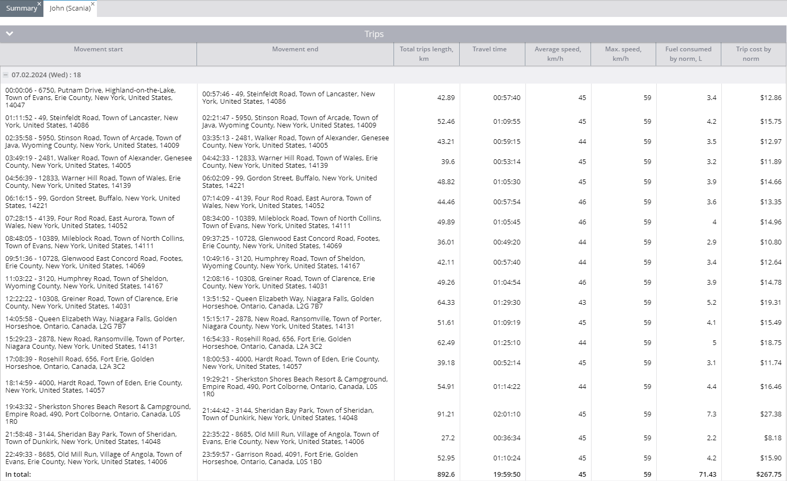

# Rapport de voyage

Le **Rapport de voyage** dans Navixy fournit une analyse complète de l'historique des déplacements de votre véhicule, offrant des informations sur la distance parcourue, le temps de trajet, la durée des arrêts, la vitesse et la consommation de carburant.

Ce rapport est d'une valeur inestimable pour les gestionnaires de flotte qui doivent surveiller l'utilisation des véhicules, calculer les coûts opérationnels et évaluer l'efficacité de la conduite. Vous trouverez ci-dessous un guide détaillé sur le fonctionnement du rapport sur les trajets, les paramètres impliqués et la manière d'interpréter efficacement les données.

## Vue d'ensemble

Le rapport sur les trajets détaille chaque trajet effectué par vos véhicules, y compris les heures de début et de fin, les distances, les vitesses et la consommation de carburant. Le rapport présente également un résumé de tous les trajets effectués au cours de la période sélectionnée, ce qui permet d'avoir une vue d'ensemble des performances des véhicules.

## Comment le rapport peut-il être utile ?

Le rapport de voyage fournit des informations précieuses qui peuvent être utilisées de plusieurs manières :

- **Analyse opérationnelle :** En examinant les schémas d'utilisation des véhicules, vous pouvez évaluer la fréquence, la distance et la durée des déplacements. Ces données sont essentielles pour calculer la dépréciation et prévoir l'utilisation future du véhicule.
- **Gestion des coûts :** Le rapport peut aider à identifier les déplacements imprévus ou non autorisés qui pourraient entraîner une augmentation des dépenses. Il fournit également des informations détaillées sur la consommation de carburant, ce qui vous permet d'évaluer les coûts en fonction des différents itinéraires et chargements.
- **Performance du conducteur :** Le rapport met en évidence le temps passé par les conducteurs sur des itinéraires spécifiques, leurs vitesses moyennes et maximales, et la durée d'immobilisation des véhicules après les trajets.
- **Évaluation de l'efficacité :** Vous pouvez évaluer la consommation de carburant pour différents types de trajets, tels que les trajets très chargés par rapport aux trajets légers ou sans charge, afin d'optimiser les dépenses de carburant.

## Paramètres du rapport

Le rapport de voyage offre plusieurs paramètres configurables pour adapter le rapport à vos besoins :

- **Résumé de l'affichage :** Bascule la visibilité d'une page de résumé qui fournit une vue d'ensemble de tous les appareils.
- **Afficher uniquement le résumé :** Génère une fiche récapitulative pour tous les appareils sélectionnés sans informations détaillées sur les déplacements. Nécessite la sélection d'au moins deux appareils.
- **Diviser par les arrêts :** Sépare les déplacements en fonction des intervalles de stationnement. Si cette option n'est pas sélectionnée, le rapport considérera le premier point enregistré de la journée comme le début du déplacement et le dernier point enregistré comme la fin du déplacement.
- **Afficher la durée de l'arrêt :** Affiche la durée de stationnement après chaque trajet.
- **Coordonnées de l'exposition :** Inclut les coordonnées GPS des points de départ et d'arrivée de chaque voyage, en plus des adresses.
- **Utilisez un filtre intelligent :** Exclut du rapport les déplacements de courte durée (moins de 300 mètres, moins de quatre points de données ou dans un petit rayon).
- **Regroupement par conducteurs :** Organise des voyages en [conducteurs](../../gestion-du-parc-automobile/conducteurs.md). Si un conducteur n'a pas été affecté au cours de la période de référence, les trajets seront attribués à un conducteur non identifié.

### Colonnes du rapport

Le rapport organise les informations dans les colonnes suivantes :

| Nom de la colonne | Description |
| --- | --- |
| **Début du mouvement** | Détails de la date et du lieu de départ du voyage, y compris l'heure et l'adresse. Si les coordonnées sont masquées, seules l'heure et l'adresse sont affichées. |
| **Fin du mouvement** | Indique quand et où le voyage s'est terminé. Si le trajet se termine à l'intérieur d'un périmètre ou d'un point d'intérêt, son nom est indiqué. |
| **Durée totale des voyages** | Indique la distance totale du voyage telle que mesurée par le GPS. |
| **Durée du voyage** | Affiche la durée totale du trajet. |
| **Vitesse moyenne** | La vitesse moyenne pendant le voyage. |
| **Vitesse maximale** | La vitesse maximale atteinte pendant le trajet, telle qu'enregistrée par l'appareil. |
| **Carburant consommé par norme** | Estimation de la consommation de carburant pour le voyage sur la base de taux standard, nécessite des données sur la consommation de carburant des véhicules par 100 km dans la base de données de l [profil du véhicule](../../gestion-du-parc-automobile/vehicules.md). |
| **Coût du voyage par norme** | Affiche le coût du carburant sur la base du taux de consommation standard fourni dans la base de données du [profil du véhicule](../../gestion-du-parc-automobile/vehicules.md). |
| **Consommation de carburant (capteur)** | Affiche la consommation réelle de carburant si un capteur de carburant est installé et transmet des données à la plateforme. Le capteur doit mesurer en litres ou en gallons. |
| **Durée de stationnement** | Indique la durée du stationnement entre ce voyage et le suivant. |

**Exemple :**

Une ligne dans le rapport peut indiquer :

- **Heure et lieu de départ :** Le 7 février 2024, à 00:00:06, 6750 Putnam Drive, Highland-on-the-Lake, ville d'Evans, comté d'Érié, New York, États-Unis, 14047.
- **Heure de fin et lieu :** Le 7 février 2024, à 00:57:46, 49 Steinfeldt Road, Town of Lancaster, New York, USA, 14086.
- **Distance parcourue :** 42,89 kilomètres.
- **Durée du voyage :** 57 minutes et 40 secondes.
- **Vitesse maximale :** 59 km/h.
- **Vitesse moyenne :** 45 km/h.
- **Consommation de carburant :** 3,4 litres (sur la base des tarifs standard), pour un coût de 12,86 $.

### Bloc de résumé

Le rapport fournit également un résumé de tous les déplacements effectués au cours de la période sélectionnée. Par exemple, le rapport contient un résumé de tous les déplacements effectués au cours de la période sélectionnée :

- **Nombre total de voyages :** 34
- **Distance totale :** 1514,9 kilomètres
- **Durée totale du voyage :** 33 heures, 56 minutes et 45 secondes
- **Vitesse maximale :** 59 km/h
- **Vitesse moyenne :** 45 km/h
- **Consommation de carburant estimée :** 121,2 litres, coûtant 454,50
- **Relevé du compteur kilométrique à la fin de la période :** 762052.8 km