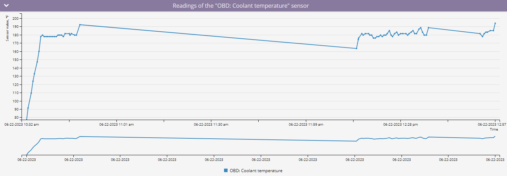
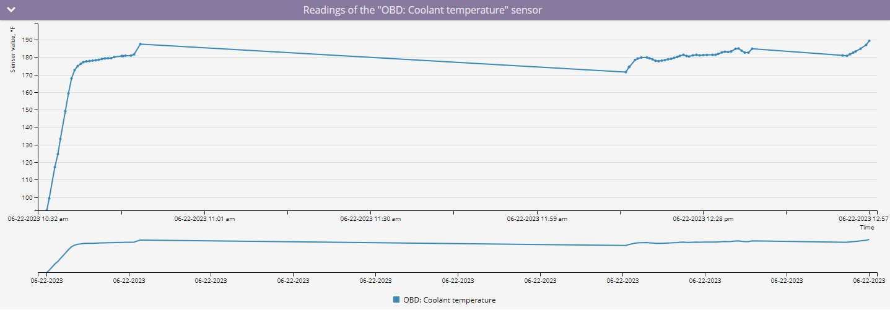

# Rapport sur les relevés CAN / OBDII du véhicule

Le **Rapport sur l'état des véhicules** dans Navixy offre un aperçu détaillé des données reçues des instruments de votre véhicule par le biais de capteurs CAN/OBD ou de capteurs virtuels au cours d'une période sélectionnée. Ce rapport comprend des informations telles que le kilométrage, le régime moteur, la vitesse, la consommation de carburant, la température du liquide de refroidissement et d'autres mesures critiques, aidant les gestionnaires de flotte et les opérateurs de véhicules à surveiller et à optimiser les performances du véhicule.

## Exigences pour la génération du rapport

Pour générer le **Rapport sur l'état des véhicules**Les conditions suivantes doivent être remplies :

- **Compatibilité des appareils :** L'appareil doit prendre en charge les lectures CAN/OBD sur la plate-forme. Vous pouvez vérifier si un type spécifique de capteur est pris en charge en consultant la liste des entrées prises en charge pour votre [modèle d'appareil](https://www.navixy.com/devices/).
- **Capacité du véhicule :** Le véhicule doit être capable de transmettre les données CAN/OBD requises au modèle d'appareil installé. Ceci peut être confirmé auprès du constructeur du véhicule.
- **Transmission active des données :** L'appareil et les capteurs doivent être configurés pour transmettre des données et les envoyer activement à la plateforme.
- **Configuration du capteur :** Les capteurs CAN/OBD ou virtuels doivent être correctement configurés sur la plate-forme.

## Paramètres du rapport

Le rapport utilise plusieurs paramètres pour personnaliser la sortie :

- **Intervalle de détail :** Affiche les relevés reçus dans le tableau des données détaillées par incréments de 30 minutes, 1 heure, 3 heures ou 6 heures. Le graphique affiche tous les points reçus du capteur.
- **Axe des X sur le graphique :** Choisissez d'afficher les informations sur le graphique en fonction du temps ou du kilométrage.
- **Graphique lisse :** Appliquer un lissage au graphique pour filtrer les valeurs maximales et établir une moyenne des données en cas de variance importante.

Pour chaque appareil, vous devez sélectionner le capteur pour lequel vous souhaitez générer un rapport. Seuls les appareils avec des capteurs CAN/OBD ou virtuels configurés apparaîtront dans la liste. Si un capteur virtuel utilise une méthode de calcul autre que le [valeur de la source](../../appareils-et-parametres/capteurs-pour-vehicules/capteurs-virtuels.md)le rapport indiquera "Il ne s'agit pas d'un capteur de mesure".

## Visualisations

### Graphique avec les relevés des capteurs

Le **graphique** affiche les relevés des capteurs CAN/OBD ou virtuels dans un format visuel, ce qui permet de visualiser clairement les tendances des données dans le temps ou sur la distance.

- **Survoler les points :** Lorsque vous survolez un point du graphique dont l'axe X est réglé sur le temps, vous voyez l'heure exacte et la valeur du capteur enregistrée. Si l'axe des X est réglé sur le kilométrage, vous verrez la valeur du capteur ainsi que le kilométrage auquel elle a été enregistrée.

### Tableau de données statistiques

Le rapport comprend une **tableau de données statistiques** qui résume les relevés des capteurs par jour.

**Colonnes du tableau de données statistiques :**

- **Date :** La date spécifique pour les données enregistrées.
- **Minimum :** La valeur la plus basse enregistrée par le capteur à cette date.
- **Maximum :** La valeur la plus élevée enregistrée par le capteur à cette date.
- **Valeur moyenne :** La moyenne de tous les relevés de capteurs pour cette date.

Note : Les unités de mesure varient en fonction du type de capteur utilisé.

### Tableau de ventilation des données

Le **tableau de ventilation des données** présente les relevés des capteurs sur des intervalles de temps spécifiés, en commençant par l'heure définie et en passant à l'incrément suivant. Par exemple, si le rapport utilise des incréments de 30 minutes, les données de la ligne 00:00 se rapportent à la période comprise entre 00:00 et 00:30.

- **Interprétation du tableau :** Si le message "Aucune donnée" apparaît, cela signifie qu'aucune lecture n'a été reçue pendant cet intervalle de temps. Les raisons possibles sont les suivantes :
  - L'appareil n'a pas envoyé de données CAN/OBD ou de données de capteur virtuel pendant cette période en raison des réglages du capteur.
  - L'appareil ne transmettait aucune donnée, peut-être parce qu'il était éteint ou déconnecté de l'objet.