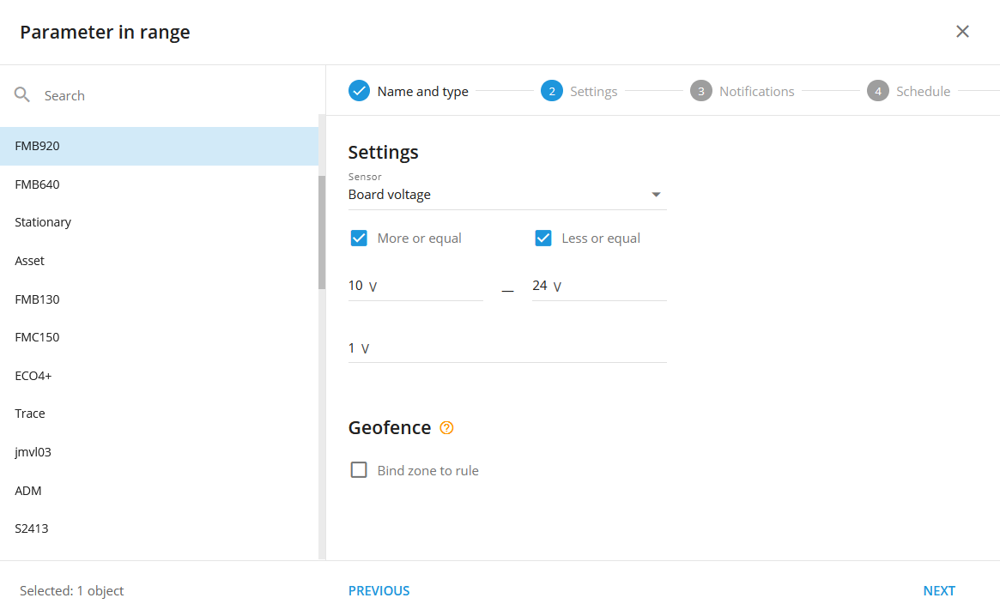
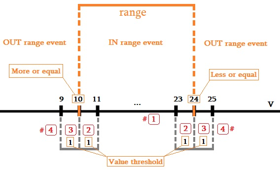
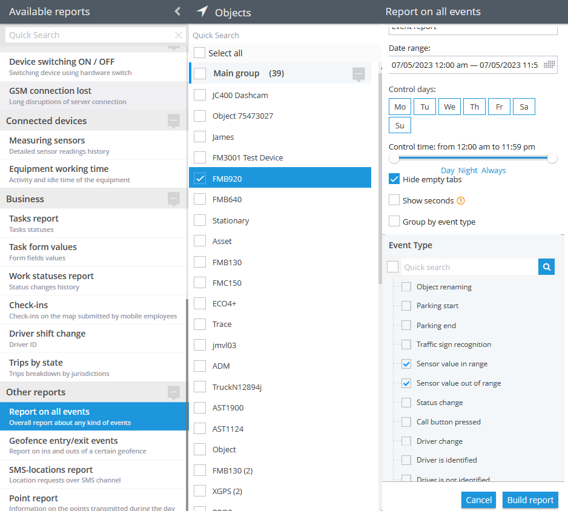
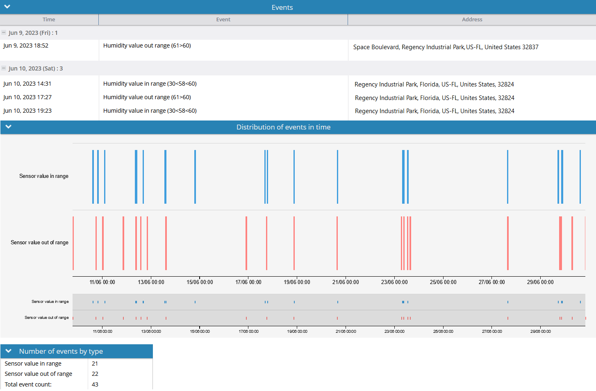

# Paramètre dans la plage

## Description

Cette règle est spécialement conçue pour l'utilisation de capteurs de mesure et sert à générer des notifications lorsque les données du capteur reçues par la plateforme se situent dans ou en dehors de la plage spécifiée. La règle surveille en permanence les relevés du capteur et déclenche des notifications lorsque les valeurs des données dépassent les seuils définis. En configurant cette règle, les utilisateurs peuvent recevoir des alertes en temps réel concernant les mesures des capteurs, ce qui leur permet de rester informés de tout écart ou changement dans les valeurs mesurées. Cette fonction améliore les capacités de surveillance et permet des réponses proactives basées sur les données du capteur, assurant ainsi une gestion et un contrôle efficaces des paramètres mesurés. Par exemple, si un utilisateur a besoin de surveiller la température ou la tension dans une plage spécifique, la règle peut l'aider à définir cette plage et l'avertir lorsque les unités dépassent les limites spécifiées.

## Paramètres

**Capteur :**

La source des données pour les alertes. Il ne peut être spécifié qu'une seule mesure ou un seul capteur virtuel (uniquement pour les capteurs virtuels avec "Méthode de calcul : Valeur source"). Par conséquent, chaque tracker doit faire l'objet d'une règle distincte.

**Plus ou égal :**

Le paramètre décrit la limite inférieure de la plage.

**Inférieur ou égal :**

Ce paramètre décrit la limite supérieure de la plage.

**Seuil de valeur :**

- est un tampon qui est ajouté à la "**Plus ou égal**" et "**Inférieur ou égal**"de part et d'autre de chaque paramètre. Cette valeur permet à la plate-forme de faire la distinction entre **IN** et **OUT** Le système permet d'obtenir des états de la plage de mesure plus larges, même en cas de données "floues" (telles que le bruit ou l'imprécision des capteurs). Pour ce faire, il crée une plage plus large autour des points "10" et "24", ce qui permet une plus grande tolérance et réduit le risque de fausses alertes. Il est difficile d'obtenir un capteur analogique qui atteigne exactement la valeur spécifiée, mais en même temps, les imprécisions déclencheront l'événement trop fréquemment. Il peut y avoir deux cas des occurrences de valeurs entrantes. Le comportement de la plate-forme dépendra de la règle (événement) **État** à un moment donné. L'événement a deux états :

1. **IN** gamme
2. **OUT** gamme

Cas n° 1, De la **IN** à la **OUT** état :

Chaque fois que l'événement (la règle) se trouve dans la **IN** cet état ne passera qu'à l'état de la gamme **OUT** lorsque la valeur entrante se situe à l'extérieur de la fourchette (#**4**) les tampons extérieurs (#**3**).

Cas n°2, De la **OUT** à la **IN** état :

Chaque fois que l'événement (la règle) se trouve dans la **OUT** cet état ne passera qu'à l'état de la gamme **IN** lorsque la valeur entrante atteint **dans l'intervalle** (#**1**) mais en dehors des tampons intérieurs (#**2**).

Si le paramètre "Seuil de valeur" n'est pas spécifié, il devient égal à 0,03 (valeur absolue) par défaut. Ainsi, comme pour l'exemple ci-dessus, l'espace des tampons serait de 9,97 à 10, de 10 à 10,03, de 23,97 à 24, et de 24 à 24,03.

**Géofence :**

Remplissez la section si la règle doit fonctionner uniquement à l'intérieur ou à l'extérieur des géofences sélectionnées.

**Lier la zone à la règle :**

Active la liaison des règles de géofence.

**Bouton de carte :**

Affiche les géofences délimitées sur la carte.

**Capteur virtuel comme source pour une règle de paramètre dans la gamme :**

Les capteurs virtuels permettent de contrôler les valeurs des champs d'état, tandis que les capteurs de mesure ne permettent de contrôler que les données non liées à l'état, telles que le niveau de carburant, la tension, etc. Les utilisateurs peuvent toujours sélectionner une entrée de données non liées à l'état dans le capteur virtuel et l'utiliser dans la règle.

Dans le cas où un capteur virtuel est sélectionné comme source de données, l'utilisateur spécifie la plage en fonction de la valeur (originale) de la source du capteur virtuel :

Cela peut être utile si les utilisateurs doivent spécifier une source de champ d'état dans une règle de plage de paramètres. Supposons qu'il y ait un tracker avec une plage de codes d'événements de 1 à 100, et qu'il soit nécessaire de contrôler les codes de 20 à 30. Créez le paramètre dans la règle de plage et spécifiez le code d'événement comme source pour le capteur virtuel :

> [!INFO]
> La notification "Paramètre dans la plage" peut contenir une ou toutes les valeurs spécifiées dans la plage de la règle, mais elle n'inclut pas les traductions du capteur virtuel. Par exemple, si des événements dont les valeurs sont comprises entre 20 et 30 se produisent, chaque événement individuel compris dans cette plage déclenchera une notification "Paramètre dans la plage" distincte, que des valeurs spécifiques soient ou non absentes du tableau du capteur virtuel susmentionné.

Prenons par exemple le cas d'une entreprise de logistique. L'entreprise envoie plusieurs camions sur différents itinéraires, et il y a une section critique avec des problèmes potentiels, comme un trafic intense ou des accidents. Pour surveiller efficacement cette zone à risque, l'entreprise a mis en place une règle "Paramètre à portée" avec des capteurs virtuels utilisant le "code d'événement" comme source de données. Ils définissent une fourchette de 20 à 30 pour les événements sur ce tronçon de route particulier. Chaque fois qu'un camion rencontre un événement dans cette plage critique (20-30), il reçoit une notification. Cela permet de prendre des mesures rapides pour résoudre les problèmes potentiels, garantissant ainsi la sécurité et l'efficacité de leurs opérations. Cette approche leur permet de rester informés des événements critiques que les capteurs traditionnels ne pourraient pas traiter, améliorant ainsi leur contrôle et leur prise de décision.

> [!INFO]
> Si un utilisateur modifie la méthode de calcul d'un capteur virtuel spécifié comme source de données dans une règle "Paramètre dans l'intervalle" pour une méthode autre que "Valeur source", la règle réinitialise sa source et cesse de fonctionner.

## Notifications

**Notification d'urgence :**

est utilisée pour les événements importants. Un message à l'écran et le signal sonore ne peuvent être désactivés qu'en cliquant sur la notification. Veuillez noter que certains navigateurs peuvent bloquer le son de la notification jusqu'à ce que l'activité de l'utilisateur soit enregistrée sur la page.

**Notifications push :**

Recevoir des notifications push sur l'application mobile et l'interface web.

**Ajouter le nom de la géofence à la notification :**

Ajoute les noms des géofences spécifiées au texte de la notification. Cette option n'est disponible que lorsque le bouton radio "Inside" geofence binding est sélectionné dans l'onglet "Settings".

**Notifications par SMS :**

Liste des destinataires des notifications par SMS lorsque l'événement se produit.

**Notifications par courrier électronique :**

Liste des destinataires des notifications par courrier électronique lorsque l'événement se produit.

## Calendrier

Définissez un calendrier pour l'exécution de la règle. Si votre calendrier indique que l'événement ne doit pas être exécuté pendant un certain jour ou une certaine période, il n'apparaîtra pas en tant que notification dans l'interface utilisateur et les notifications par SMS ou par courriel ne seront pas envoyées. En outre, vous pouvez choisir un modèle par défaut pour une planification rapide.

## Les spécificités de la plate-forme :

- Chaque fois que la plate-forme identifie un **IN** **gamme** ou un **OUT** **gamme** à partir d'un paquet de données de suivi ne contenant pas de coordonnées valides, la plate-forme considère l'événement comme valide et l'affiche, que l'événement se soit produit à l'intérieur ou à l'extérieur des géofences délimitées. La logique de la **Intérieur/extérieur** est également ignorée dans ce cas. Ce comportement est dû au fait qu'il est préférable d'afficher une nouvelle fois un événement controversé plutôt que de l'omettre.
- La règle ne prend en charge qu'un seul dispositif par règle. En effet, il n'est pas possible de croiser plusieurs sources différentes de capteurs de mesure avec plusieurs suiveurs, tables d'étalonnage et autres aspects de la mesure et du filtrage des données.
- L'alerte "Paramètre dans la plage" est assortie d'un délai de réinitialisation de 10 secondes, ce qui signifie que l'événement d'alerte ne se produira pas plus d'une fois toutes les 10 secondes. Si ce type d'événement se produit alors que la règle attend la réinitialisation, il sera omis par la plate-forme, y compris dans les rapports.

## Rapports d'événements

Pour visualiser les dates de réception des événements, vous pouvez créer le rapport "Rapport sur tous les événements".

Pour une représentation graphique de l'utilisation d'un capteur de mesure sur une période donnée, utilisez le rapport "Capteurs de mesure".