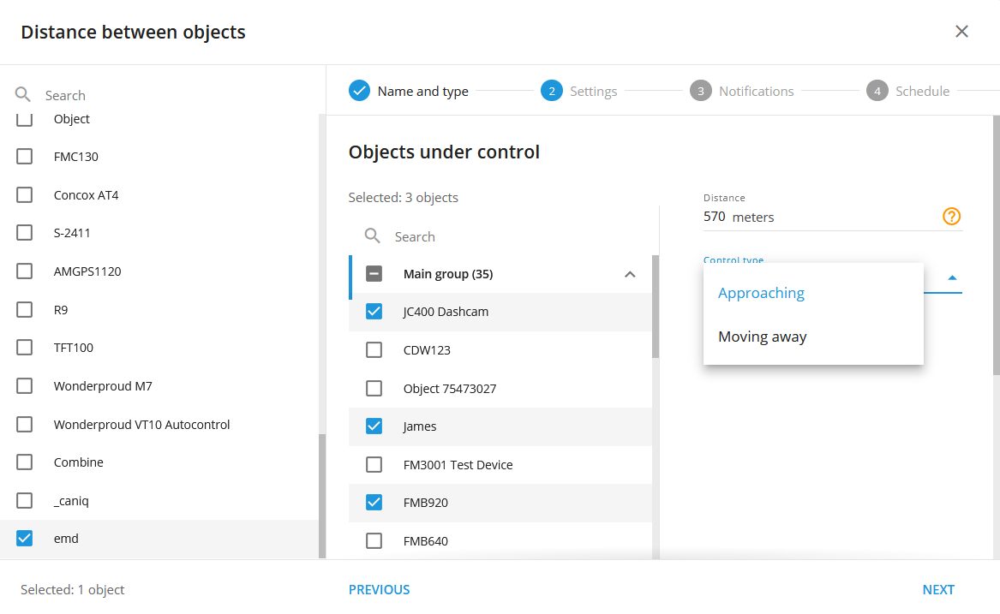

# Distance entre les objets

## Vue d'ensemble

La règle "Distance entre les objets" est conçue pour vous aider à gérer et à contrôler efficacement la distance entre différents biens, par exemple entre deux véhicules, un véhicule et sa cargaison, ou un camion et ses remorques.

Cette règle vous permet de définir des seuils de distance spécifiques entre les objets suivis. Si la distance dépasse ou est inférieure aux limites fixées, un événement est déclenché, enregistré et peut générer une notification.

### Comment cela fonctionne-t-il ?

Cette règle exploite les données GPS pour suivre en permanence la distance entre un objet principal désigné, tel qu'un véhicule de tête, et jusqu'à 100 objets secondaires, tels que des remorques ou des véhicules suiveurs. En définissant des paramètres de distance spécifiques, les utilisateurs peuvent recevoir des notifications en temps réel lorsque ces objets se rapprochent ou s'éloignent au-delà des limites autorisées. Le système calcule automatiquement les distances sur la base des coordonnées GPS les plus récentes, ce qui garantit des alertes précises et opportunes.

### Applications

- **Suivi des remorques et des actifs :** Contrôler la distance entre un véhicule et les biens qui lui sont attachés ou qui le suivent, tels que les remorques. Ce contrôle est essentiel pour éviter les déconnexions accidentelles, gérer l'espacement des convois et veiller à ce que les remorques restent dans un rayon d'action sûr.
- **Respect de la distance de sécurité :** Contrôler et faire respecter les distances de sécurité entre les véhicules d'une flotte. Cette application est essentielle pour prévenir les collisions et promouvoir le respect des protocoles de sécurité, en particulier dans les environnements à forte circulation ou lors de l'utilisation de véhicules lourds.
- **Coordination de la flotte et gestion du trafic :** Utilisez la règle pour gérer l'espacement des véhicules dans un convoi ou pour surveiller les positions relatives de plusieurs actifs de la flotte pendant les opérations. Ces données peuvent également être regroupées pour l'analyse du trafic, ce qui permet d'identifier les schémas de congestion et d'optimiser la planification des itinéraires.

## Paramètres des règles

### Paramètres de distance

- **En approche :** Configurez le système pour qu'il vous alerte lorsque des objets secondaires se rapprochent du véhicule principal. Ce réglage est essentiel pour maintenir des distances de sécurité et prévenir les collisions ou autres risques de sécurité.
- **Le déménagement :** Définissez des alertes lorsque des objets secondaires augmentent leur distance par rapport au véhicule principal. Cette fonction est particulièrement utile pour détecter les véhicules qui s'écartent d'un convoi ou les remorques qui se détachent du véhicule de tête.
- **Portée de la distance :** Définir une plage de distance spécifique autorisée entre les objets primaires et secondaires, allant de 5 à 200 000 mètres. Le système émet des notifications lorsque la distance se situe à l'intérieur ou à l'extérieur de cette plage prédéfinie, ce qui permet une gestion proactive des opérations de la flotte.

Pour les réglages courants, veuillez vous référer à [Règles et notifications](../../regles-et-notifications.md).

### Détails du fonctionnement du système

- **Calcul de la distance par GPS :** La règle calcule les distances sur la base des dernières coordonnées GPS disponibles, ce qui garantit la précision de la surveillance de la proximité des objets.
- **Remise à zéro de la minuterie :** L'alerte "Distance entre les objets" est dotée d'une minuterie de réinitialisation de 10 secondes, ce qui signifie que les alertes ne se déclencheront pas plus d'une fois toutes les 10 secondes. Cela permet d'éviter les notifications redondantes et de s'assurer que les alertes sont significatives et exploitables.
- **Plusieurs appareils :** Cette règle est indépendante du matériel et peut être appliquée simultanément à plusieurs systèmes de suivi, ce qui offre une certaine souplesse dans la gestion de grands parcs de véhicules dotés d'actifs divers.