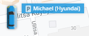

# Icônes d'objets

Les icônes associées à chaque objet fournissent des indications visuelles importantes sur l'état actuel de l'objet, par exemple s'il est en mouvement, arrêté ou garé.

Outre les icônes standard, vous pouvez également choisir parmi notre sélection d'icônes. Ces icônes sont particulièrement utiles lorsque vous gérez de nombreux objets, car elles améliorent l'identification visuelle et l'organisation, ce qui vous permet de différencier rapidement les objets tout en contrôlant efficacement leur état.

## Icônes standard

Selon l'état actuel de l'objet (en mouvement, arrêté, stationné), son icône sur la carte changera en conséquence. Le passage d'un état à l'autre est étroitement lié à la fonction ***"Détection de stationnement*** les paramètres du dispositif GPS associé à l'objet.

Vous trouverez ci-dessous les différentes icônes et leur signification :

| **Icône** | **Statut du déménagement et description** |
| --- | --- |
|  | **En mouvement**   Le traceur se déplace et le trajet est enregistré. |
|  | **Arrêté (pas encore stationné)**   Le traceur s'est arrêté, sa vitesse est nulle, mais le voyage n'est pas encore terminé. |
|  | **Stationnement**   Le voyage est terminé et le traceur est garé. |
|  | **Localisation approximative (pas de signaux GPS)**, **l'utilisation de l'AFB)**   Il n'y a pas de signal GPS et l'emplacement est déterminé par les stations de base cellulaires et/ou les points d'accès Wi-Fi. Aucune trace, aucun stationnement ni aucun arrêt n'est enregistré dans ce statut en raison de la faible précision des coordonnées. |

## Icônes sélectionnées

Le choix de l'icône peut améliorer l'identification visuelle, en permettant de différencier rapidement les divers objets sur la carte, et améliorer l'organisation grâce à des icônes spécifiques pour les différents types d'actifs. Elles facilitent également un contrôle efficace en permettant une reconnaissance immédiate du type d'objet, ce qui accélère la prise de décision et les temps de réponse.

Pour modifier l'icône d'un objet dans la plate-forme Navixy, procédez comme suit :

1. **Naviguez jusqu'à la liste des objets :** Ouvrez la section "Objets" dans le menu principal.
2. **Cliquez avec le bouton droit de la souris sur l'objet souhaité :** Localisez l'objet dont vous souhaitez modifier l'icône. Cliquez avec le bouton droit de la souris sur le nom de l'objet pour ouvrir le menu contextuel.
3. **Sélectionnez "Changer d'icône" :** Dans le menu du clic droit, sélectionnez l'option "Changer d'icône". La boîte de dialogue de sélection de l'icône s'ouvre alors.

4. **Choisissez une nouvelle icône :** Dans la boîte de dialogue de sélection des icônes, choisissez une nouvelle icône parmi les options disponibles. Confirmez votre sélection pour appliquer la nouvelle icône à l'objet.

Si vous choisissez d'utiliser l'une de nos icônes, l'état de l'objet sera affiché à côté de l'étiquette de l'objet.

