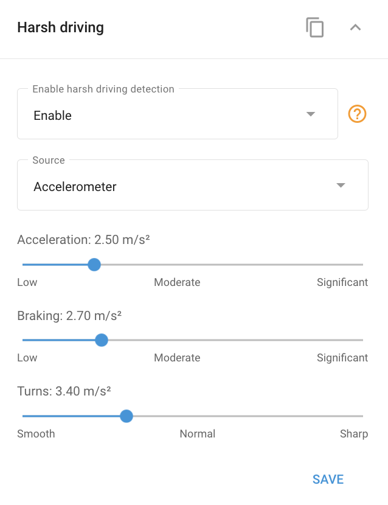

# Widget de conduite difficile

De nombreux dispositifs GPS avancés pour véhicules sont dotés d'un **Détecteur de conduite difficile**. Ce détecteur surveille en permanence les valeurs d'accélération pendant l'accélération, le freinage et le virage. Lorsque ces valeurs dépassent des seuils prédéfinis, le système génère un événement de "conduite difficile" correspondant. Ces événements peuvent être suivis et analysés à l'aide du logiciel [Notifications](../../regles-et-notifications/safety/conduite-difficile.md) et [Rapports sur l'éco-conduite](../../../guide-de-litilizateur/gestion-du-parc-automobile/conduite-ecologique.md)permettant une évaluation détaillée du comportement au volant.

## Configuration des seuils des détecteurs de conduite difficile

Comme les véhicules varient dans leurs caractéristiques techniques - par exemple la capacité d'une berline à accélérer plus vite qu'un bus - les valeurs d'accélération critique diffèrent également. Navixy vous permet de personnaliser les paramètres de conduite difficiles des appareils GPS en fonction du type spécifique de véhicule que vous surveillez.

Pour accéder à la **Widget de conduite difficile** dans Navixy, naviguez jusqu'à la page **Appareils et paramètres** sélectionnez l'appareil souhaité, puis développez le widget "Conduite difficile" pour ajuster les paramètres.

Dans le widget, vous pouvez ajuster les valeurs seuils pour l'accélération, le freinage et les virages. Le dépassement de ces seuils déclenche différents types d'événements, qui peuvent être analysés ultérieurement par le biais de rapports d'événements ou de rapports d'écoconduite. Cette personnalisation garantit que le système reflète fidèlement les conditions de conduite et les exigences de sécurité de votre flotte.
