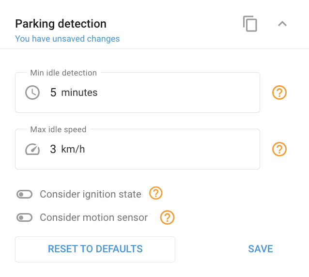

# Widget de détection de stationnement

La détection de stationnement permet de savoir si un objet est resté immobile pendant un laps de temps donné et dans les limites d'un seuil de vitesse défini, à l'aide de données GPS.

**Paramètres pour la détection du stationnement :**

* **Durée minimale de détection de l'inactivité** (`min_parking`) : Il s'agit de la durée minimale pendant laquelle un objet doit rester immobile avant d'être considéré comme stationné.
* **Vitesse maximale de ralenti** (`min_speed`) : Il s'agit du seuil de vitesse en dessous duquel l'objet doit rester pour être détecté comme étant en stationnement.

Par défaut, ces paramètres sont fixés à 5 minutes et 3 km/h, respectivement.

**Conditions de détection du stationnement :**

* **Par la vitesse et le temps**:\
  L'état de stationnement est détecté lorsque la vitesse de l'objet passe en dessous du seuil défini. `min_speed` et y reste plus longtemps que `min_parking`. Arrêts plus courts que `min_parking` ne sont pas considérées comme un stationnement et n'interrompent pas le voyage.
* **Envisager l'allumage**:
  * Le voyage commence si la vitesse est supérieure ou égale à `min_speed` et que le contact est mis.
  * Le voyage se termine si la vitesse descend en dessous de `min_speed` et que le temps écoulé dépasse `min_parking` ou le contact est coupé.
* **Envisager un capteur de mouvement**:
  * Le voyage commence si la vitesse est supérieure ou égale à `min_speed` et le capteur de mouvement détecte les mouvements.
  * Le voyage se termine si la vitesse descend en dessous de `min_speed` ou le capteur de mouvement ne détecte aucun mouvement, et le temps écoulé est supérieur à `min_parking`.
* **En tenant compte à la fois du mouvement et de l'allumage**:
  * L'état de l'allumage a la priorité sur le détecteur de mouvement.
  * Le voyage commence si la vitesse est supérieure ou égale à `min_speed`Le détecteur de mouvement détecte un mouvement et l'allumage est activé.
  * Le voyage se termine si la vitesse descend en dessous de `min_speed` ou le capteur de mouvement ne détecte aucun mouvement, et le temps écoulé est supérieur à `min_parking` avec le contact coupé.

Ces paramètres permettent d'affiner la détection du stationnement afin de refléter avec précision le comportement réel du véhicule, de minimiser les fausses détections et d'améliorer la précision du suivi des trajets.
