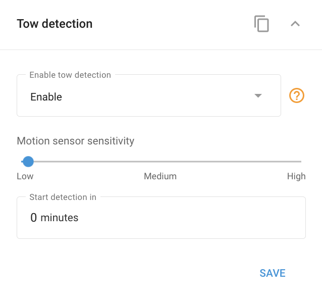

# Widget de détection de remorquage

Le **Détection de remorquage**Le détecteur de mouvement, disponible dans de nombreux dispositifs GPS pour véhicules, est conçu pour détecter les mouvements non autorisés sur la base des signaux émis par le capteur de mouvement intégré. Une fois le contact du véhicule coupé, le capteur passe en mode actif et surveille en permanence les vibrations, les chocs ou les mouvements. Si l'un de ces éléments est détecté, une notification est immédiatement envoyée à la plateforme à partir de l'appareil et peut être signalée à l'utilisateur comme configuré dans la section [Règles et notifications](../../regles-et-notifications/securite/deplacement-non-autorise.md).

Dans le logiciel Navixy, vous pouvez configurer cette fonction en accédant à l'option **"Détection de remorquage** dans le widget **"Appareils et paramètres"** section. Ce panneau vous permet de régler la sensibilité du détecteur de mouvement et de spécifier le délai avant le début de la détection.

