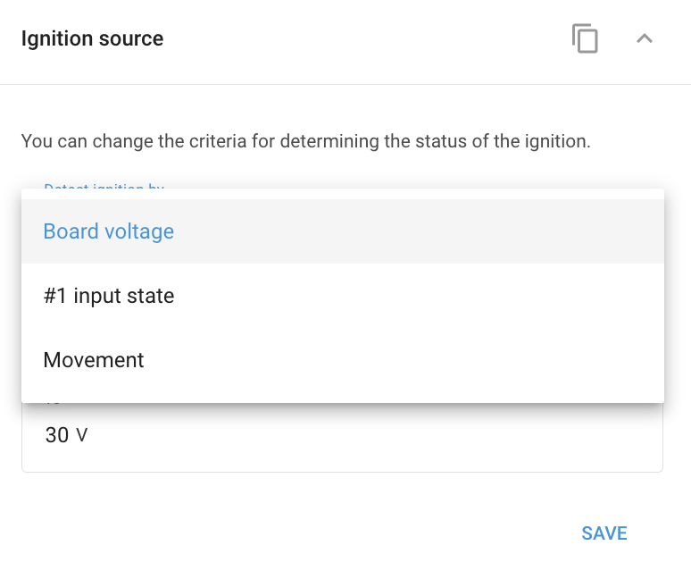

# Widget de la source d'allumage

De nombreux appareils GPS avancés offrent la possibilité de déterminer la position de l'avion. **État de l'allumage** non seulement par une connexion directe du câble d'allumage, mais aussi par l'utilisation d'un câble d'allumage. **source d'allumage virtuelle** en fonction des relevés du capteur de mouvement ou de la tension embarquée du véhicule.

## Options de sources d'allumage virtuelles

* **Détection d'allumage basée sur la tension**: Lorsque le moteur tourne, le générateur du véhicule fournit du courant à une tension supérieure à celle de la batterie pour la maintenir chargée. En surveillant cette augmentation de tension, l'appareil peut déterminer avec précision quand le contact est mis.
* **Détection d'allumage basée sur un capteur de mouvement**: Cette option est utile lorsque l'appareil n'est pas connecté au système électrique du véhicule. L'état de l'allumage est déduit du mouvement du véhicule. Toutefois, il convient de noter que cette méthode peut également détecter l'allumage lorsque le véhicule est remorqué, même si le moteur ne tourne pas.

## Configuration de la source d'allumage virtuelle

Pour configurer la source d'allumage dans Navixy, utilisez la commande **Widget de la source d'allumage** dans l'application "Appareils et paramètres" :

1. Sélectionnez la source d'allumage souhaitée dans la liste déroulante du widget "Source d'allumage".
2. Si l'on utilise la tension de bord du véhicule, spécifier la plage de tension dans laquelle l'allumage est considéré comme étant "sous tension".

Cette configuration permet une surveillance souple et précise de l'état de l'allumage du véhicule et s'adapte à différents scénarios d'installation.

#### Exemple de configuration

La capture d'écran ci-dessous illustre les options disponibles pour sélectionner la source d'allumage dans la plateforme Navixy.

Le widget "Source d'allumage" permet aux utilisateurs de choisir les critères pour déterminer l'état de l'allumage. Vous pouvez choisir parmi les options suivantes :

1. **Tension de la carte**: Détecte l'allumage sur la base de la tension embarquée du véhicule, utile lorsque la tension augmente lorsque le moteur tourne.
2. **État de l'entrée #1**: Utilise l'état d'une entrée spécifique, généralement un câble d'allumage, pour déterminer si l'allumage est activé ou désactivé.
3. **Mouvement**: Détecte l'allumage en fonction du mouvement du véhicule, ce qui est idéal pour les scénarios dans lesquels l'appareil n'est pas directement connecté au système électrique du véhicule. Toutefois, cette méthode peut également enregistrer l'allumage pendant le remorquage ou d'autres mouvements non liés au moteur.
