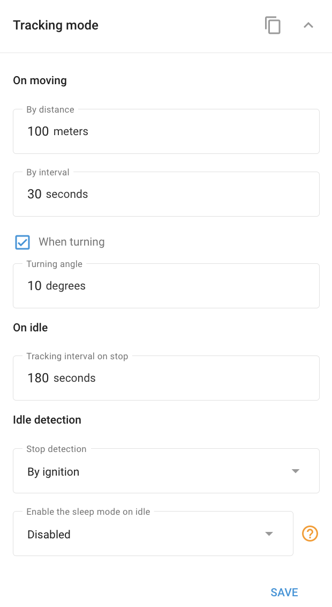

# Widget du mode de suivi

Le **Mode de suivi** vous permet de configurer la transmission des données et les modes de fonctionnement de vos dispositifs de repérage GPS. Les paramètres disponibles dans ce panneau peuvent varier en fonction du modèle du traceur, de ses principes de fonctionnement et de ses fonctionnalités.

#### Configuration des paramètres du mode de suivi

Pour ajuster les paramètres du mode de suivi, ouvrez le panneau et configurez les paramètres suivants :

* **A distance :** La transmission des données a lieu lorsque l'appareil s'est déplacé d'une certaine distance.
* **A l'heure actuelle :** La transmission des données s'effectue à des intervalles de temps déterminés.
* **En tournant :** La transmission des données a lieu lorsque l'appareil tourne d'un angle déterminé.

Les données sont transmises lorsqu'au moins une de ces conditions est remplie, ce qui garantit des mises à jour opportunes et précises sur l'état et la localisation de l'appareil.
