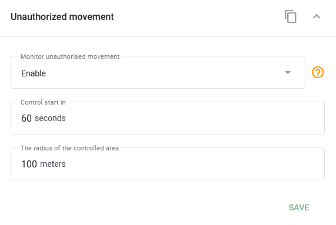

# Widget de clôture automatique

L'autoguidage, également connu sous le nom de détection des mouvements non autorisés, est une fonction disponible sur de nombreux traceurs GPS pour véhicules. Lorsque le contact est coupé et que le traceur détecte des coordonnées GPS en dehors d'une zone de clôture automatique prédéfinie, il indique que le véhicule quitte sa zone de stationnement désignée.

Le traceur GPS génère alors immédiatement un événement et l'envoie à la plateforme Navixy. Les utilisateurs peuvent configurer des notifications pour événements de clôture automatique.

## Configuration de l'autorégulation

Dans le cadre de la **Appareils et paramètres** de Navixy, il y a un panneau dédié à la configuration de la fonction de géofencing automatique. Ici, vous pouvez :

* **Régler le délai après la coupure de l'allumage**: Définir le délai d'activation de la fonction de clôture automatique après la coupure du contact.
* **Définir le rayon de déclenchement**: Indiquez la distance par rapport à l'emplacement de stationnement à partir de laquelle le mouvement déclenchera l'événement de clôture automatique.

Ces réglages permettent de contrôler précisément quand et où la fonction de clôture automatique s'active, ce qui garantit que les véhicules restent en sécurité même lorsqu'ils sont sans surveillance.

## Voir aussi

* [Clôture automatique](../regles-et-notifications/securite/cloture-automatique.md) dans Règles et notifications
