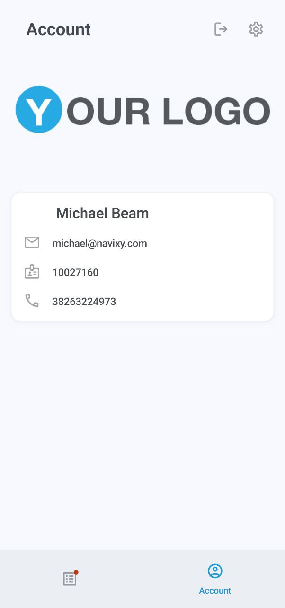

# Compte et paramètres

### Compte



L'écran Compte affiche votre logo, nom, e-mail et numéro de téléphone.







### Paramètres



Cet écran vous permet de configurer l'application et d'accéder rapidement aux paramètres de notifications de votre appareil.






