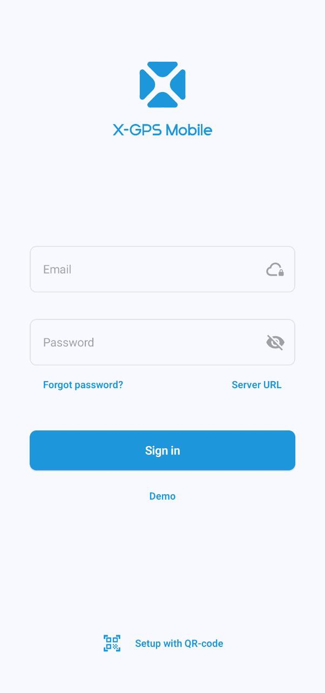

# Démarrage rapide de X-GPS Mobile

Suivez ces étapes pour apprendre à utiliser X-GPS Mobile.

### Étape 1. Télécharger l'application

1. Ouvrez Google Play ou App Store et saisissez X-GPS Mobile dans le champ de recherche.
2. Sélectionnez-la et appuyez sur **Installer**.

### Étape 2. Se connecter

1. Ouvrez l'application.
2. Saisissez votre nom d'utilisateur et votre mot de passe, puis appuyez sur **Se connecter**.
3. Si nécessaire, saisissez l'URL de votre serveur (par défaut, le serveur Navixy est utilisé). Vous pouvez également utiliser un code QR pour éviter de saisir l'URL et configurer automatiquement vos paramètres.

> \[!INFO] Si vous avez oublié votre mot de passe, appuyez sur le bouton correspondant et saisissez votre adresse e-mail. Vous recevrez un e-mail contenant un lien pour réinitialiser votre mot de passe.

### Étape 3. Définir les autorisations

Autorisez l'application à vous envoyer des notifications et à accéder à la localisation de l'appareil pendant son utilisation. Notez que vous recevrez des notifications push pour tous les actifs de votre flotte.

### Étape 4. Ouvrir l'écran principal

L'écran principal affiche vos actifs : véhicules, personnel et objets (unités représentant des dispositifs GPS) avec des icônes indiquant leur état de mouvement.

Vous pouvez les filtrer par catégorie ou par état (en mouvement, en stationnement, etc.) et les trier par nom ou par état.

Pour trier ou filtrer la liste des actifs et accéder aux outils de surveillance, appuyez sur les icônes dans le coin supérieur droit :&#x20;

|                                                                                                                                              |                                                                                                                                                                                            |
| -------------------------------------------------------------------------------------------------------------------------------------------- | ------------------------------------------------------------------------------------------------------------------------------------------------------------------------------------------ |
|              | Ouvre le [journal des événements](https://squaregps.atlassian.net/wiki/spaces/~7120201a6252f8d34242e3bdb7409b5d34d953/pages/3182821465/new+Assets+list#events-list) pour toutes les unités |
|  | Vous permet de saisir une requête de recherche                                                                                                                                             |
|            | Ouvre le menu de [filtrage et de tri](https://squaregps.atlassian.net/wiki/spaces/~7120201a6252f8d34242e3bdb7409b5d34d953/pages/3182821465/new+Assets+list#sorting-and-filtering)          |
|               | Ouvre l'[écran de carte](https://squaregps.atlassian.net/wiki/spaces/~7120201a6252f8d34242e3bdb7409b5d34d953/pages/3182821465/new+Assets+list#map-fullscreen)                              |

Utilisez le panneau inférieur pour basculer entre l'écran principal et votre profil.

### Étape 5. Commencer à travailler

Appuyez sur un actif pour voir sa localisation, son état, l'historique des trajets et des événements, les capteurs, les rappels, les détails du dispositif GPS et d'autres informations.

