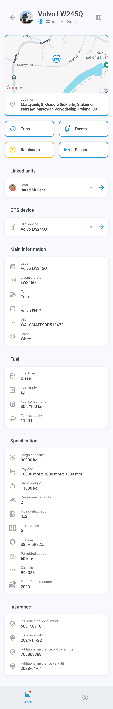
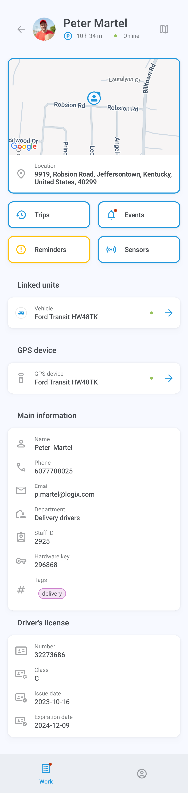
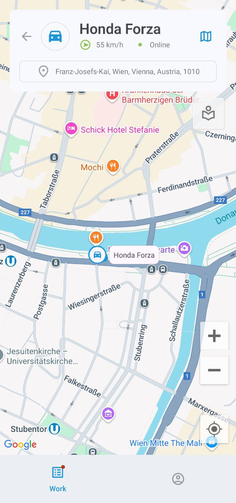
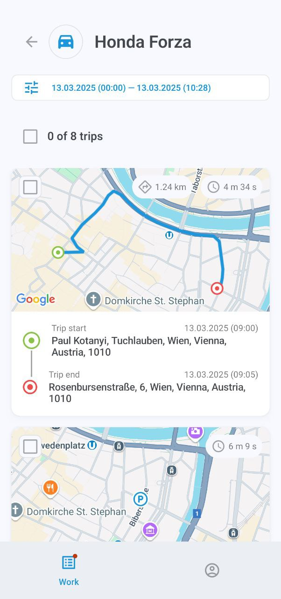
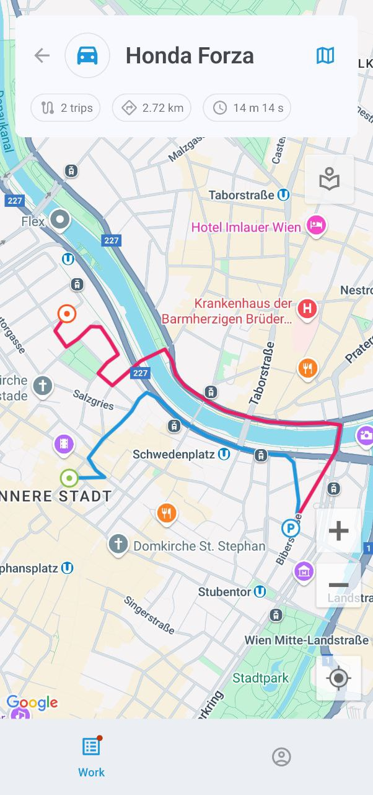
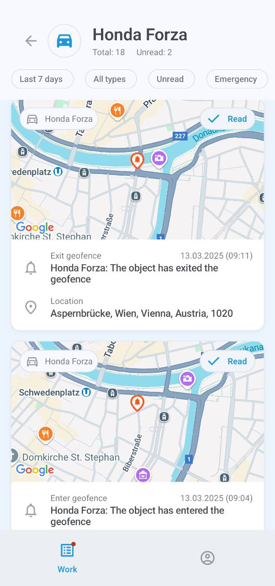
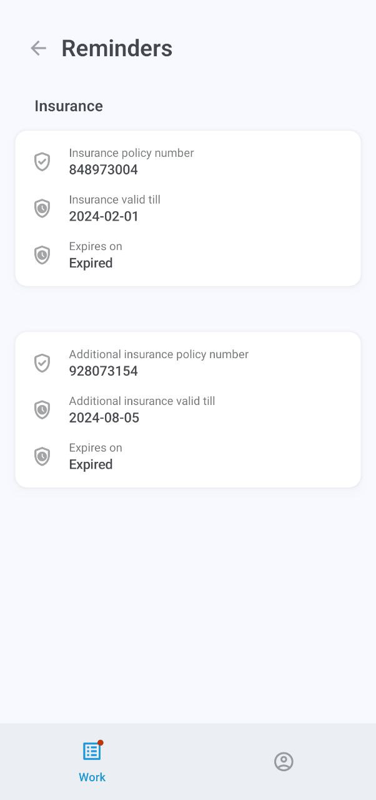
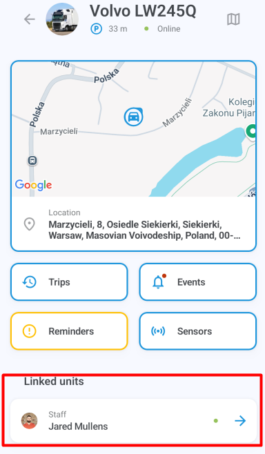

# Informations sur l'actif

L'écran d'informations sur l'actif affiche des informations détaillées sur l'actif, y compris sa position sur la carte, l'historique des trajets et des événements, les rappels, les unités liées, le dispositif GPS assigné, les étiquettes et d'autres données.

### Carte

Par défaut, la carte apparaît en haut de l'écran d'informations. Appuyez longuement sur l'adresse pour la copier, ou appuyez sur l'image pour passer en mode plein écran. La carte suit automatiquement l'itinéraire de l'actif s'il est en mouvement. Vous pouvez également zoomer et dézoomer et centrer la carte sur vos propres coordonnées GPS.

Appuyez sur 

pour afficher le menu des options de carte, où vous pouvez sélectionner les lieux, les géofences et le type de carte. Notez que la sélection du type de carte n'est actuellement disponible que sur les appareils Android.

### Trajets

Appuyez sur **Trajets** pour afficher la liste des trajets effectués par votre actif. Appuyez sur n'importe quel trajet pour voir ses détails, y compris les POI et géofences visités. Vous pouvez également visualiser l'historique d'un ou plusieurs trajets sur la carte en plein écran.

Pour filtrer l'affichage des trajets, par exemple par période et autres paramètres, appuyez sur 

et ouvrez la **Plage de dates et paramètres** :

### Événements

Appuyez sur **Événements** pour consulter l'historique des événements de l'actif, comme quitter ou entrer dans une géofence, passer au ralenti, excès de vitesse, accomplissement de tâches, accident, déviation de l'itinéraire, arrivée à un point de contrôle, et plus encore.

Le menu sous le nom de l'actif affiche vos filtres actuels, qui peuvent tous être configurés : période, véhicules ou personnel spécifiques, et types d'événements. Le filtre **Non lu** affichera uniquement les notifications non lues, tandis que **Urgence** limitera votre recherche aux événements urgents.

Appuyez sur un événement pour afficher ses détails. Vous pouvez également appuyer sur la carte en haut de l'écran pour la voir en plein écran. Le bouton 

permet de basculer entre différentes cartes.

> \[!WARNING] La sélection du type de carte n'est actuellement disponible que sur les appareils Android.

### Rappels

Le bouton **Rappels** n'est affiché que lorsqu'il y a des problèmes en attente, comme un permis de conduire ou une assurance véhicule qui expire ou a expiré. Appuyez dessus pour en savoir plus sur le problème.

### Capteurs

Appuyez sur le bouton **Capteurs** pour voir les relevés fournis par le ou les dispositifs GPS de l'actif, y compris les heures moteur, le niveau de carburant, la température, et les entrées et sorties personnalisées.

Les sorties permettent d'envoyer des commandes de contrôle aux dispositifs, comme l'arrêt du moteur. Pour envoyer une commande, appuyez sur 

et choisissez **Envoyer** dans l'invite de confirmation.

Les capteurs de véhicule sont configurés via la plateforme principale Navixy. Pour en savoir plus, consultez [Documentation utilisateur Navixy](https://squaregps.atlassian.net/wiki/spaces/UDOCFR/pages/3027440703/Capteurs+pour+v+hicules?atlOrigin=eyJpIjoiNmEzMjMzOTc5OWExNGNlZDk0YmUxODI3YmFjNTQ5NzYiLCJwIjoiYyJ9).

### Unités liées

Appuyez sur le nom ou l'étiquette dans l'entrée **Unités liées** pour accéder à l'écran d'informations de l'unité liée à l'actif, comme le conducteur ou le véhicule conduit.

### Dispositif GPS

Appuyez sur l'étiquette du dispositif dans l'entrée **Données GPS** pour afficher ses détails, y compris l'ID, le modèle, l'état de connexion et de mouvement, la position, la vitesse et d'autres données techniques.

