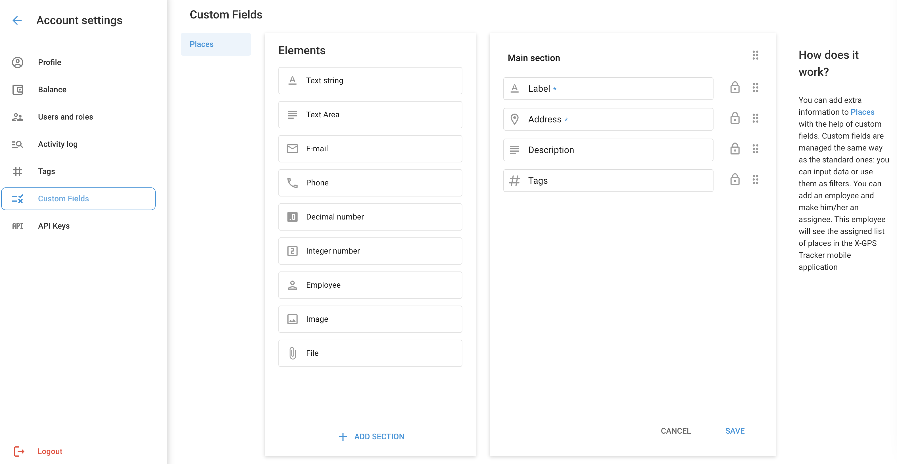

# Champs personnalisés

Les champs personnalisés vous permettent d'ajouter des informations personnalisées à la description des lieux. Les champs personnalisés fonctionnent de la même manière que les champs standard, ce qui vous permet de stocker des données précieuses qui peuvent être utilisées pour le filtrage et l'amélioration de l'efficacité opérationnelle.

**Exemples :**

* Dans la gestion des services extérieurs, les champs personnalisés peuvent compléter les informations sur les lieux visités. Un employé de terrain utilisant la fonction [Traceur X-GPS](https://x-gps.app/) L'application mobile peut afficher et modifier des informations détaillées sur les lieux, telles que les coordonnées du client et les exigences du service, ce qui facilite l'accomplissement des tâches. [Lire la suite dans le blog](https://www.navixy.com/blog/custom-fields-navixy/)

## Types de champs personnalisés

| **Type de champ**   | **Description**                                                                                                                            |
| ------------------- | ------------------------------------------------------------------------------------------------------------------------------------------ |
| **Chaîne de texte** | Longueur jusqu'à 700 caractères, possibilité d'utiliser n'importe quel caractère.                                                          |
| **Texte Area**      | Longueur jusqu'à 20 000 caractères.                                                                                                        |
| **Courriel**        | Pour les adresses électroniques uniquement.                                                                                                |
| **Téléphone**       | Pour les numéros de téléphone uniquement.                                                                                                  |
| **Nombre décimal**  | Pour les valeurs décimales.                                                                                                                |
| **Nombre entier**   | Pour les valeurs entières.                                                                                                                 |
| **Employé**         | Permet d'assigner un membre du personnel responsable, rendant le lieu visible dans l'application X-GPS Tracker pour l'employé en question. |
| **Image**           | Permet d'ajouter une image.                                                                                                                |
| **Fichier**         | Permet de joindre un fichier.                                                                                                              |

### Ajout et modification de champs personnalisés

Pour ajouter un nouveau champ personnalisé, naviguez vers **Paramètres du compte → Champs personnalisés**.

1. **Sélectionnez le type de champ :** Choisissez le type de champ dans la liste des éléments à gauche.
2. **Glisser-déposer :** Faites glisser le type de champ sélectionné dans la section principale à droite.
3. **Préciser l'information :**

* **Nom du champ :** Saisissez le nom du champ.
* **Description :** Fournir une description du champ.
* **Il s'agit d'une obligation :** Indiquez si le champ est obligatoire. Lors de l'ajout d'un nouveau lieu, celui-ci ne peut être enregistré que si tous les champs obligatoires sont remplis.

### Actions supplémentaires pour les champs personnalisés

* **Ajouter une section :** Répartir les champs personnalisés dans différentes sections pour une meilleure organisation.
* **Réorganiser :** Glissez-déposez les champs et les sections pour les disposer dans l'ordre de votre choix.
* **Supprimer :** Pour supprimer un champ, sélectionnez-le et cliquez sur l'icône de la corbeille. Notez que les champs primaires marqués d'une icône de cadenas ne peuvent pas être supprimés.

#### Important Notes

* **Nombre maximum de champs personnalisés :** Vous pouvez ajouter jusqu'à 50 champs personnalisés.
* **Mises à jour automatiques :** Lorsque vous modifiez des champs, les changements apportés à leur nom, à leur description et à leur ordre seront automatiquement répercutés dans tous les lieux créés.
* **Suppression :** La suppression d'un champ personnalisé le supprimera définitivement de tous les emplacements sans possibilité de récupération.

## FAQ et dépannage

* **Les champs personnalisés peuvent-ils être ajoutés à d'autres objets que les lieux ?** Actuellement, les champs personnalisés ne peuvent être ajoutés qu'aux lieux, mais il est prévu d'étendre cette fonctionnalité à l'avenir.
* **Comment les champs personnalisés peuvent-ils être remplis à partir de systèmes CRM via l'API Navixy ?** Oui, vous pouvez remplir des champs personnalisés dans Navixy en faisant des appels API pour synchroniser les données de votre CRM. Cela permet un transfert de données et des mises à jour transparentes, garantissant que toutes les informations sont à jour et accessibles dans les deux systèmes. Pour en savoir plus, consultez la page [Navixy API Documentation](https://www.navixy.com/docs/navixy-api).
