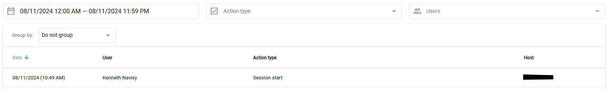

# Journal d'activité

En utilisant le journal d'activité, le propriétaire du compte peut suivre l'activité de tous les [utilisateurs de l'équipe](utilisateurs-et-roles/) ajouté dans la section "Utilisateurs et rôles". Cette fonction fournit des informations détaillées sur les actions des utilisateurs, ce qui permet de surveiller et de gérer efficacement l'utilisation du système.

Naviguez jusqu'à **Paramètres du compte → Journal d'activité**.

## Type d'actions

Le journal des activités permet de suivre diverses actions effectuées par les utilisateurs :

* **Début de la session :** Lorsqu'un utilisateur se connecte à un compte sans utiliser d'autorisation
* **Autorisation :** Lorsqu'un utilisateur se connecte en utilisant son nom d'utilisateur et son mot de passe
* **Session end:** Lorsqu'un utilisateur se déconnecte du système de surveillance
* **Se connecter à partir du compte du propriétaire :** Lorsqu'un client se connecte à partir du compte principal
* **Création/modification/suppression d'une géofence**
* **POI créés/modifiés/supprimés**
* **Règle créée/modifiée/supprimée**
* **Objet lié à la règle :** Lorsqu'un objet est spécifié pour la règle
* **Objet supprimé de la règle :** Lorsqu'un objet est supprimé des paramètres de la règle
* **Remplacement de l'appareil**
* **Clé API affichée/créée/supprimée**
* **Dispositif : mise à jour de la sortie / mise à jour de la sortie par lots / exécution de la commande :** Lorsque les sorties sont gérées

## Obtenir le journal d'activité

1. Saisir le **Journal d'activité** section
2. **Spécifier les paramètres :** Sélectionner les types d'actions et les utilisateurs
3. **Fixer des délais :** Définissez les délais et cliquez sur le bouton **Appliquer** bouton

### Regroupement et filtrage de listes

Utilisez le regroupement et le filtrage pour structurer la liste en fonction de vos critères :

* **Par date :** Regrouper les enregistrements par date
* **Par l'utilisateur :** Obtenir une liste des utilisateurs qui se sont connectés au compte
* **Par type d'action :** Voir les types d'actions effectuées sur le compte
