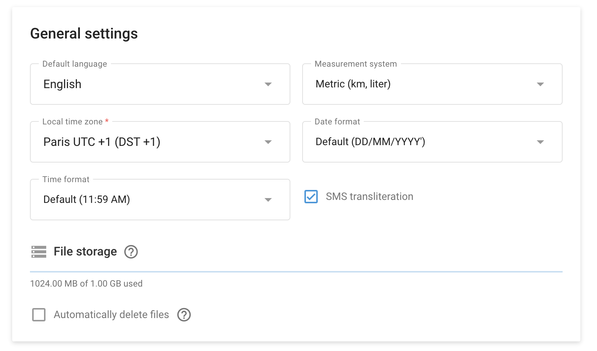

# Profil

La section Préférences de l'utilisateur située dans le menu **Paramètres du compte → Profil** vous permet de personnaliser quelques options pour mieux répondre à vos besoins individuels. Il s'agit notamment des options relatives à la langue, au système de mesure, au fuseau horaire, au format de la date et à la gestion du stockage des fichiers.

## Paramètres généraux

1. **Langue par défaut :** Définissez la langue par défaut de votre compte. Par exemple, l'anglais est sélectionné dans la capture d'écran ci-dessus.
2. **Système de mesure :** Choisissez votre système de mesure préféré. Les options comprennent le système métrique (km, litre) ou le système impérial (miles, gallons).
3. **Fuseau horaire local :** Définissez le fuseau horaire local de votre compte. Ce paramètre est essentiel pour assurer un suivi et un rapport précis des heures de travail.
4. **Format de la date :** Sélectionnez le format d'affichage des dates. Les formats disponibles permettent de s'assurer que les dates sont affichées de la manière qui vous est la plus familière, par exemple JJ/MM/AAAA.
5. **Format de l'heure :** Choisissez le format d'affichage de l'heure. Par défaut, l'heure est généralement affichée au format 12 heures.
6. **Translittération SMS :** Activer ou désactiver la translittération des SMS. Ce paramètre peut s'avérer utile si vous devez envoyer des SMS dans un jeu de caractères spécifique autre que les caractères latins.

> \[!INFO] Le système de mesure que vous choisissez sera appliqué à la plate-forme. Par exemple, si vous avez choisi le système impérial et qu'un capteur envoie des données en degrés Celsius, le système les convertira automatiquement en degrés Fahrenheit.

### Stockage de fichiers

* **Aperçu de l'utilisation.** Contrôlez l'espace de stockage actuellement utilisé.
* **Suppression automatique :** Activez l'option de suppression automatique des fichiers lorsque la limite de stockage est atteinte. Cette option supprime d'abord les fichiers les plus anciens.

> \[!INFO] Votre fournisseur de services peut demander que cet espace de stockage soit augmenté si nécessaire.
