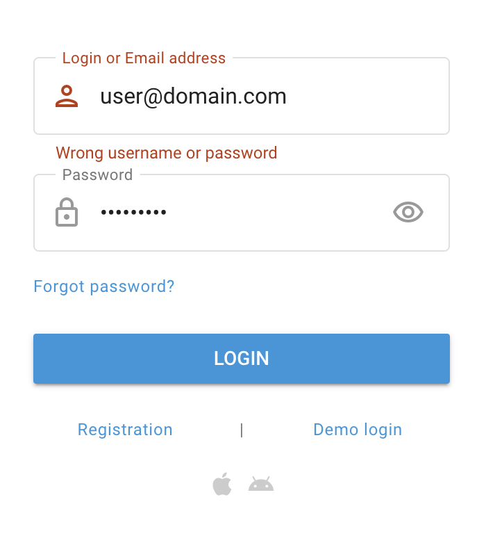

# Récupération du mot de passe

Si vous avez oublié votre mot de passe et que vous devez le récupérer, suivez les étapes suivantes :

1. **Accédez à la page de connexion :** Ouvrez la page de connexion. Veuillez contacter votre [Prestataire de services](../demarrage-rapide/fournisseur-de-services.md) pour l'URL si vous ne la connaissez pas.
2. **Cliquez sur "Mot de passe oublié".** Localisez et cliquez sur le lien "Mot de passe oublié ?" sous le champ du mot de passe.
3. **Entrez vos informations de connexion :** Indiquez votre adresse électronique enregistrée et entrez dans le CAPTCHA.
4. **Suivez les instructions :** Consultez votre courrier électronique pour trouver un lien de réinitialisation du mot de passe et suivez les instructions fournies dans le courrier électronique pour réinitialiser votre mot de passe.

## FAQ et dépannage

Si vous n'avez pas accès à l'adresse électronique, essayez de contacter votre [Fournisseur de services](../demarrage-rapide/fournisseur-de-services.md) pour retrouver l'accès à votre compte.
