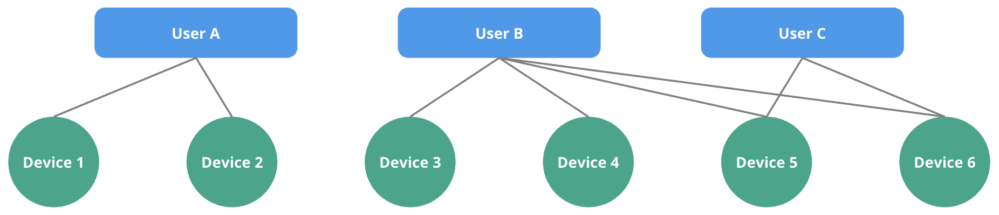

# Restreindre l'accès

Navixy permet aux organisations de gérer efficacement l'accès aux informations créées par les utilisateurs, y compris les dispositifs GPS et les artefacts associés tels que les géofences, les lieux et les règles de notification. Cette capacité est vitale pour maintenir la sécurité des données et l'efficacité opérationnelle, en particulier dans les organisations ayant plusieurs divisions ou unités commerciales. Cette approche garantit que :

* Les informations sensibles sont protégées contre tout accès non autorisé
* Les utilisateurs peuvent se concentrer sur les données et les outils correspondant à leur rôle.
* L'efficacité opérationnelle est maintenue dans les différentes divisions et unités commerciales.

Ce document décrit comment les appareils GPS et les informations créées par les utilisateurs sont sécurisés et partagés avec d'autres employés au sein de l'organisation.

## Dispositifs GPS

Lorsqu'un utilisateur ajoute un appareil GPS, celui-ci est effectivement créé sous le compte du propriétaire, de sorte que même après la suppression de l'utilisateur, l'appareil GPS reste dans le compte de l'organisation. Le propriétaire peut spécifier quels utilisateurs peuvent consulter les données de l'appareil GPS, telles que les trajets ou les données des capteurs, afin de s'assurer que seules les personnes autorisées peuvent consulter et gérer l'appareil.

## Artéfacts associés

* **Règles de notification**: Les règles de notification permettent aux utilisateurs de mettre en place des alertes basées sur différents critères, tels que l'excès de vitesse ou la sortie d'une zone géographique. Lorsqu'un utilisateur crée une règle, celle-ci est effectivement créée dans le compte du propriétaire. Les autres utilisateurs ayant accès à l'appareil concerné pourront également voir et utiliser ces règles.
* **Lieux et géofences**: Les utilisateurs peuvent créer des lieux et des géofences pour définir des zones d'intérêt spécifiques. Bien que ces artefacts soient gérés par l'utilisateur qui les a créés, ils sont effectivement liés au compte du propriétaire. Le propriétaire peut accorder l'accès à ces géofences à d'autres utilisateurs au sein de l'organisation. Seuls les utilisateurs disposant des autorisations appropriées peuvent visualiser et modifier ces géofences.
