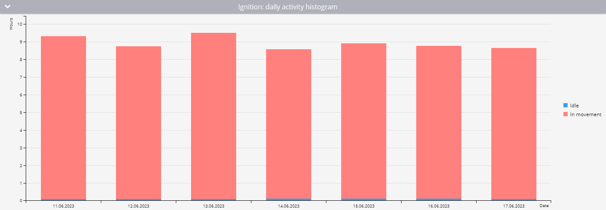

# Rapport sur le temps de travail des équipements

Le **Temps de fonctionnement de l'équipement** dans Navixy fournit des données essentielles sur le temps de fonctionnement de tout équipement connecté à vos véhicules via des entrées discrètes ou virtuelles. Ce rapport est crucial pour les gestionnaires de flotte qui ont besoin de surveiller l'efficacité opérationnelle de l'équipement, d'analyser les temps morts et d'assurer une utilisation optimale des actifs. Vous trouverez ci-dessous un guide détaillé sur le fonctionnement de ce rapport, les paramètres impliqués et la manière d'interpréter efficacement les données.

## Vue d'ensemble

Le rapport sur le temps de travail des équipements permet de suivre le temps de fonctionnement des équipements, en distinguant les périodes d'activité en mouvement et au ralenti. Ce rapport comprend des statistiques détaillées, des données d'activité quotidiennes et des représentations visuelles telles que des diagrammes d'activité et des histogrammes pour vous aider à comprendre et à analyser facilement les données.

## Fonctionnement du rapport

Le rapport calcule le temps de travail de l'équipement sur la base des points de données reçus par la plateforme Navixy. Il tient compte de l'état des entrées discrètes ou des capteurs virtuels et de l'état du parking pour répartir avec précision le temps de travail entre les périodes de mouvement et les périodes d'inactivité. Pour des calculs précis, les configurations et conditions suivantes doivent être respectées :

1. **Configuration des entrées discrètes :**

* L'entrée discrète de l'appareil doit être correctement câblée et capable d'enregistrer l'état de l'entrée avec précision.

2. **Configuration du capteur virtuel :**

* [Capteurs virtuels](../../appareils-et-parametres/capteurs-pour-vehicules/capteurs-virtuels/) avec deux états peuvent également être utilisés. Le capteur doit être correctement configuré pour enregistrer ces états.

3. **Réglages de la détection de stationnement :**

* Les paramètres de détection du stationnement sont essentiels pour faire la différence entre le temps de fonctionnement en mouvement et le temps d'inactivité. Si l'état de l'entrée est "on" alors que la plateforme détecte que le véhicule est stationné (par exemple, en se déplaçant à moins de 3 km/h pendant plus de 5 minutes), ce temps est enregistré comme du temps mort.

4. **Délai minimum :**

* La plate-forme ne calcule le temps de fonctionnement que si l'équipement est allumé pendant une durée minimale que vous pouvez spécifier (par exemple, 60 secondes).

### Exemple de calcul

<table><thead><tr><th width="101">Point</th><th width="99">L'heure</th><th width="125">État d'entrée</th><th>Temps de disponibilité des équipements</th></tr></thead><tbody><tr><td>1</td><td>10:00:00</td><td>Arrêt</td><td>0 minute</td></tr><tr><td>2</td><td>10:01:00</td><td>Sur</td><td>0 minute (l'entrée était désactivée au dernier point)</td></tr><tr><td>3</td><td>10:01:32</td><td>Sur</td><td>0 minute (moins de 60 secondes)</td></tr><tr><td>4</td><td>10:05:32</td><td>Arrêt</td><td>4 minutes et 32 secondes</td></tr></tbody></table>

## Paramètres du rapport

Le rapport sur le temps de travail des équipements comprend plusieurs paramètres configurables qui vous permettent d'adapter le résultat à vos besoins spécifiques :

* **Durée minimale de la période de travail :** Spécifie le nombre minimum de secondes pendant lesquelles un capteur discret doit être activé pour que l'heure soit enregistrée dans le rapport. Pour les capteurs virtuels, la valeur doit être supérieure à 0.
* **Afficher le pourcentage d'inactivité :** Il suit l'état du parking et répartit le temps de fonctionnement de l'équipement entre le mouvement et la marche au ralenti.
* **Utilisez un filtre intelligent :** Exclut les trajets courts du rapport. Les trajets courts sont définis comme des trajets de moins de 300 mètres pour lesquels l'appareil envoie moins de quatre points de données.
* **Sélection de l'appareil :** Le rapport n'inclut que les appareils dotés d'au moins un capteur discret ou virtuel configuré.

## Visualisations

### Diagramme d'activité global

* Ce diagramme donne un aperçu du temps de travail total de l'équipement pour la période sélectionnée. Il montre combien de temps l'équipement a été éteint, allumé et, si le suivi du pourcentage d'inactivité est activé, il fait la différence entre le temps passé en mouvement et le temps d'inactivité.
* Pour les capteurs virtuels, l'état correspondant à une valeur de 0 est représenté en gris, et toute autre valeur est représentée en rouge.

### Histogramme de l'activité quotidienne

* L'histogramme décompose le temps de travail de l'équipement en segments quotidiens. Si le pourcentage d'inactivité est suivi, il indique également la répartition entre le temps de mouvement et le temps d'inactivité. En survolant chaque jour, on obtient une vue plus détaillée de l'activité de la journée.

### Tableau des heures de fonctionnement quotidien des capteurs

Ce tableau présente des statistiques quotidiennes sur le fonctionnement de l'équipement, notamment :

* **Date :** Le jour spécifique pour lequel les informations sont calculées.
* **Durée de fonctionnement (durée de l'état du capteur virtuel) :** La durée totale de fonctionnement pour la journée.
* **Intervalle moyen :** La durée moyenne pendant laquelle l'équipement a été opérationnel après chaque mise en marche.
* **Kilométrage :** La distance parcourue avec l'équipement en marche.
* **Vitesse moyenne :** La vitesse moyenne pour la journée.
* **Intervalles :** Le nombre de fois où l'équipement a été mis en marche au cours de la journée.
* **En mouvement (si le pourcentage d'inactivité est activé) :** La durée du travail en mouvement et son pourcentage par rapport au temps de travail total.
* **Ralenti (si le pourcentage de ralenti est activé) :** La durée de fonctionnement sans mouvement et son pourcentage par rapport à la durée totale de fonctionnement.

## Interprétation du rapport

Pour utiliser efficacement le rapport sur le temps de travail de l'équipement, tenez compte des éléments suivants :

* **Analyse des données :** Utilisez le rapport pour contrôler la fréquence et l'efficacité de l'utilisation des équipements. Identifier les schémas de marche au ralenti excessive ou de sous-utilisation.
* **Efficacité opérationnelle :** Évaluez l'équilibre entre les temps d'activité et d'inactivité pour déterminer l'efficacité opérationnelle de votre équipement.
* **Planification de la maintenance :** Le rapport aide à planifier la maintenance en identifiant les périodes d'utilisation intensive ou les démarrages et arrêts fréquents, qui peuvent user l'équipement plus rapidement.
* **Gestion des coûts :** Recalculer les coûts de carburant et de lubrifiant en tenant compte des périodes d'inactivité et d'utilisation active, ce qui est particulièrement important pour les machines lourdes.
