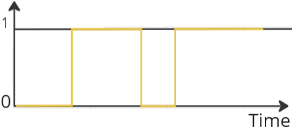
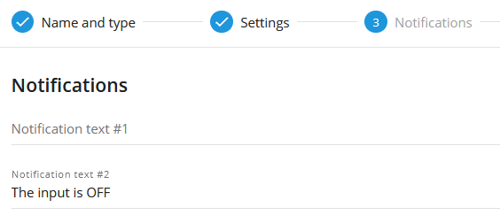

# Déclenchement d'entrée

Le déclenchement d'une entrée (ou changement d'entrée) fait référence à un changement d'état d'une entrée sur un dispositif de suivi de véhicule. Cette entrée peut être connectée à divers capteurs ou interrupteurs du véhicule, tels que les capteurs de porte, l'état de l'allumage ou d'autres composants du véhicule. Lorsque l'entrée change d'état, par exemple de marche à arrêt ou vice versa, le dispositif GPS détecte ce changement et peut déclencher un événement ou une notification en conséquence.

> \[!INFO] Le type de changement d'entrée de la règle s'applique aux entrées discrètes qui prennent deux positions logiques (0 ou 1). Pour les entrées indiquant des valeurs continues (par exemple, les entrées analogiques indiquant une plage de tension), il existe un type de règle spécifique appelé Paramètre dans la plage.

## Vue d'ensemble

De nombreux traceurs GPS pour véhicules sont équipés d'entrées qui peuvent être connectées à différents outils, tels qu'un capteur d'ouverture de traceur de voiture, l'état de l'allumage ou un bouton d'urgence. En configurant le système en conséquence, les utilisateurs peuvent recevoir des notifications pour les déclenchements d'entrée via l'interface utilisateur, des notifications push, des SMS ou des courriels.

La règle est conçue pour surveiller des entrées discrètes spécifiques et avertir les utilisateurs en cas de changement d'état. Ces entrées discrètes ne peuvent avoir que deux valeurs : 0 ou 1, d'où le terme "discret" : 0 ou 1, d'où le terme "discret". La règle attend que l'entrée spécifiée passe de vrai (1) à faux (0), ou vice versa, et génère des notifications pour chaque changement détecté.

Cette fonctionnalité permet aux utilisateurs de rester informés de l'état des outils ou des capteurs connectés, en fournissant des mises à jour en temps réel sur divers événements, par exemple l'activation d'un bouton SOS. La possibilité de recevoir des notifications en temps utile améliore les capacités de surveillance et facilite les réponses rapides aux situations critiques ou aux événements détectés par les entrées discrètes.

## Paramètres des règles

#### Numéro d'entrée

Le champ du numéro d'entrée spécifie le numéro du matériel ou du matériel virtuel de l'entrée utilisée. Pour déterminer quelle entrée correspond à une fonctionnalité spécifique, consultez la documentation du fabricant du traceur GPS. Le numéro d'entrée doit correspondre au capteur discret créé dans le widget "Device and Settings" → "Sensors and Buttons".

## Détails du fonctionnement du système

### Détails de l'opération système

* **Remise à zéro de la minuterie**: L'alerte "Inputs change" est assortie d'un délai de réinitialisation de 10 secondes, ce qui garantit que l'alerte ne se déclenchera pas plus d'une fois toutes les 10 secondes. Si un événement se produit pendant cette période de réinitialisation, il sera omis par la plate-forme, y compris dans les rapports.
* **Affectation de plusieurs traceurs**: Plusieurs traqueurs peuvent être affectés à une seule règle. Le numéro d'entrée spécifié dans les paramètres de la règle est utilisé comme source de données pour chaque suiveur. Par exemple, si la deuxième entrée est choisie et que plusieurs suiveurs sont sélectionnés, la règle informera l'utilisateur chaque fois que l'un des suiveurs sélectionnés enverra un changement dans son entrée n°2.
* **Validité de l'événement**: Si la plate-forme identifie un événement d'entrée (1 vrai/niveau élevé ou 0 faux/niveau faible) à partir d'un paquet de données de suivi sans coordonnées valides, elle comptera l'événement comme valide et l'affichera, que l'événement se soit produit à l'intérieur ou à l'extérieur des géofences délimitées. La logique des boutons radio Intérieur/Extérieur est ignorée dans ce cas, car il est préférable d'afficher une nouvelle fois un événement controversé plutôt que de l'omettre.
* **Alertes sélectives**: Les utilisateurs peuvent choisir de recevoir des alertes déclenchées par les entrées uniquement pour des changements spécifiques dans les entrées (par exemple, de 1 à 0 ou de 0 à 1) en supprimant le texte de notification pour le champ respectif pour lequel ils ne veulent pas recevoir d'alertes. Par exemple, les utilisateurs peuvent configurer les alertes de manière à recevoir des notifications uniquement pour les changements de "ON à OFF" tout en ignorant les événements de "OFF à ON".

