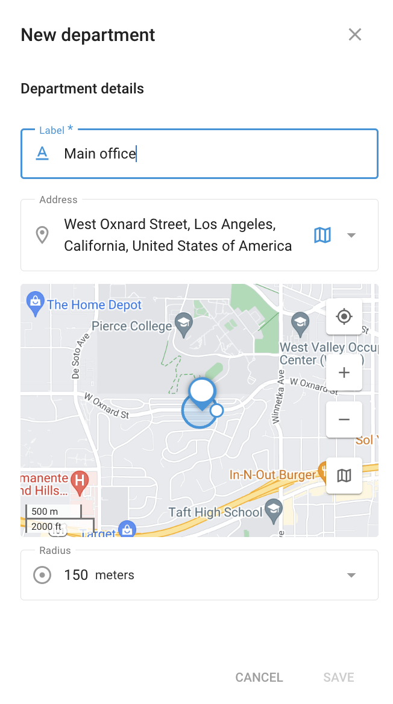

# Départements - Service extérieur

Les **Départements** dans la section **Service extérieur** vous permet d'organiser efficacement votre personnel en classant les employés dans des départements spécifiques. Cette structure organisationnelle permet de rationaliser l'attribution des tâches, l'établissement des rapports et la gestion globale des opérations sur le terrain.

## Gestion des services

Dans la section Départements, vous pouvez créer, afficher et gérer différents départements au sein de votre organisation. Chaque service peut être étiqueté de manière appropriée, par exemple "Service de livraison" ou "Service de vente", afin de refléter la fonction spécifique de l'équipe.

#### Création d'un nouveau département

1. **Naviguer vers l'onglet Départements**: Commencez par vous rendre dans la section Départements de l'application Service extérieur.
2. **Cliquez sur le bouton "+".**: Pour créer un nouveau département, cliquez sur le bouton "+".
3. **Saisir les coordonnées du service**:&#x20;
   1. **Étiquette**: Indiquez un nom pour le département, tel que "Bureau principal" ou "Département de service".
   2. **Adresse**: Saisissez l'emplacement physique du service ou utilisez la carte pour sélectionner un emplacement précis.
   3. **Rayon**: Définissez un rayon autour de l'emplacement du département. Cela permet d'attribuer des tâches en fonction de la proximité du département.
4. **Économiser**: Après avoir rempli les informations nécessaires, cliquez sur "Enregistrer" pour créer le département.

### Détails du département

Une fois qu'un département est créé, il est répertorié dans la section Départements, où vous pouvez consulter ses détails, tels que l'étiquette et l'adresse. Cette section vous permet également de modifier ou de supprimer des départements si nécessaire.

En utilisant efficacement la section Départements, vous pouvez vous assurer que les tâches sont assignées aux équipes appropriées, améliorant ainsi l'efficacité et la productivité de vos opérations de service sur le terrain.
