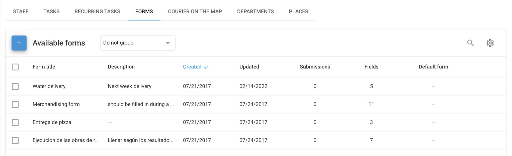

# Formulaires

**Formulaires** sont des documents électroniques qui peuvent être joints aux tâches, ce qui permet aux employés de soumettre les résultats des tâches directement par l'intermédiaire de l'application Traceur X-GPS l'application mobile. Ces formulaires peuvent inclure différents types de champs, tels que des champs de texte pour les commandes des clients, des rapports d'inspection et des sections médias pour le téléchargement de photos et de vidéos.

## Pour commencer

### Créer un formulaire

Pour commencer à utiliser les formulaires dans Navixy :

1. Lancez l'application Service extérieur à partir du menu principal.
2. Cliquez sur l'onglet "Formulaires" pour ouvrir l'interface de gestion des formulaires.
3. Commencez le processus de création du formulaire en cliquant sur l'icône "+".
4. Choisissez les composants nécessaires (par exemple, les champs de texte, les cases à cocher, les listes déroulantes, la date, l'évaluation, l'image, la pièce jointe, la signature et les séparateurs de section) dans la partie gauche de l'écran. Personnalisez le formulaire pour l'adapter au flux de travail et aux tâches spécifiques de votre entreprise.

Ce processus vous permet de créer autant de formulaires que nécessaire, en veillant à ce qu'ils soient adaptés aux tâches effectuées par vos employés.

Deux options sont disponibles lors de la création d'un formulaire :

* **"Utiliser par défaut lors de la création d'une tâche"**: Si cette option est activée, ce formulaire sera automatiquement joint aux nouvelles tâches, à moins qu'un autre formulaire ne soit sélectionné. Dans la liste des formulaires, ce formulaire sera marqué d'une "étoile".
* **"Soumettre le formulaire uniquement dans la zone"**: Si cette option est activée, le formulaire ne peut être soumis que si l'employé se trouve dans une zone géographique prédéfinie, ce qui garantit que les rapports de tâches sont établis au bon endroit.

Après l'enregistrement, les formulaires créés sont accessibles dans la liste des formulaires.

### Attacher un formulaire à une tâche

Pour joindre un formulaire à une tâche, procédez comme suit :

1. Ouvrez la fenêtre de création de tâches : naviguez jusqu'à l'onglet Tâches et cliquez sur le bouton "+" pour créer une nouvelle tâche.
2. Dans le champ "Formulaire de tâche", choisissez le formulaire que vous avez créé précédemment dans la liste déroulante.
3. Fournir d'autres détails sur la tâche, tels que la sélection de l'employé responsable de l'exécution de la tâche.
4. Finalisez la création de la tâche en cliquant sur "Enregistrer".

L'employé sélectionné recevra la tâche avec le formulaire joint dans l'application mobile X-GPS Tracker, en veillant à ce que tous les documents nécessaires soient disponibles lors de l'exécution de la tâche.

### Remplir un formulaire dans X-GPS Tracker

Les employés doivent remplir des formulaires pendant ou après l'exécution d'une tâche. Voici comment ils peuvent remplir et soumettre un formulaire :

1. Ouvrez l'application mobile X-GPS Tracker sur un appareil mobile.
2. Passez à la section "Tâches" pour afficher la liste des tâches assignées.
3. Sélectionnez la tâche à accomplir.
4. Cliquez sur le formulaire dans la description de la tâche et remplissez tous les champs obligatoires.
5. Une fois tous les champs remplis, le formulaire est automatiquement envoyé au service de suivi, marquant ainsi la tâche comme terminée.

### Configuration des notifications pour la soumission d'un formulaire

Pour garantir des notifications opportunes lorsqu'un formulaire est soumis, configurez des alertes en suivant les étapes suivantes :

1. Naviguez jusqu'à la page "[Règles et notifications](../regles-et-notifications/)"dans la plateforme.
2. Commencez à créer une nouvelle règle de notification en cliquant sur le bouton "Ajouter une règle".
3. Sélectionnez les objets (par exemple, les véhicules, les employés) auxquels cette règle s'appliquera.
4. Choisir "[Exécution des tâches](../regles-et-notifications/planification-et-repartition/execution-des-taches.md)" de la liste des événements et poursuivre.
5. Dans la section "Options de la règle", cochez la case "Formulaire soumis".
6. Dans l'onglet "Notifications", choisissez le mode de notification (par exemple, SMS, courriel).

Ces paramètres vous permettent d'être informé en temps réel de l'avancement des tâches et des soumissions de formulaires.

### Visualisation des formulaires remplis

Vous pouvez examiner et comparer les formulaires remplis pour évaluer les performances des employés et les résultats des tâches :

1. Naviguez jusqu'à l'application "Field service".
2. Cliquez sur l'onglet "Formulaires" pour afficher tous les formulaires disponibles.
3. Survolez le formulaire que vous souhaitez consulter et cliquez sur "Soumissions" sur le côté droit.
4. Choisissez la soumission de formulaire spécifique dans la liste du bas.

**Fonctionnalité des soumissions :**

* **Télécharger les formulaires :** Exporter les formulaires aux formats Excel, CSV ou PDF.
* **Filtrage :** Utilisez des filtres pour limiter les soumissions en fonction de paramètres tels que la date de création de la tâche ou le nom de l'employé.
* **Personnalisation de la table :** Ajoutez ou masquez des colonnes et des champs de formulaire pour vous concentrer sur les données les plus pertinentes.

### Rapport de données sur les formulaires de tâches

Le rapport "Données sur les formulaires de tâches" fournit des informations sur les performances des employés sur la base des formulaires remplis. Pour générer ce rapport :

1. Aller à la page [Rapports](../rapports/) section.
2. Cliquez sur le bouton "Créer un rapport".
3. Choisissez l'option "Données du formulaire de tâches".
4. Cochez les objets pertinents (par exemple, les employés, les tâches) pour lesquels vous avez besoin du rapport.
5. Spécifiez la période de temps pour le rapport.
6. Cliquez sur le bouton "Construire le rapport" pour générer le rapport.

**Détails du rapport :**\
Le rapport présente les statistiques du formulaire, y compris la fréquence et les types de composants sélectionnés. Ces données vous permettent d'évaluer plus efficacement les performances des employés et les résultats des tâches.
