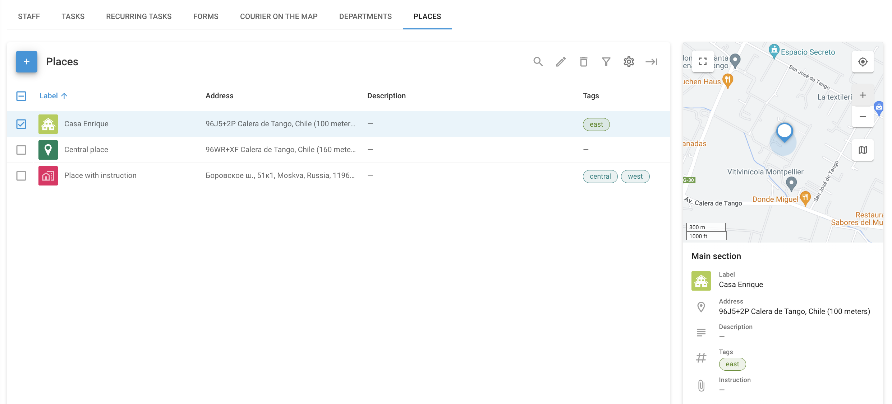

# Lieux - Service extérieur

**Lieux** dans le **Service extérieur** peut être utilisée pour organiser et gérer les lieux clés que votre personnel de terrain doit visiter, tels que les adresses des clients, les sites de l'entreprise ou d'autres points d'intérêt importants. Cela permet de rationaliser l'attribution des tâches, d'optimiser les itinéraires et de garantir l'efficacité des opérations sur le terrain.

En entrant dans la section Lieux, vous verrez une liste de tous les lieux disponibles avec leurs détails, y compris les champs personnalisés que vous avez ajoutés.

## Créer et gérer des lieux

Lorsque vous créez un nouveau lieu dans l'application Field Service de Navixy, vous pouvez saisir toutes les informations nécessaires pour faciliter son identification et sa gestion. Commencez par donner un nom au lieu, en spécifiant son adresse ou en sélectionnant son emplacement sur la carte. Vous pouvez également ajouter des détails tels qu'une description, des balises et toute instruction pertinente pour le site.

### Champs personnalisés

Les champs personnalisés vous permettent d'ajouter des détails supplémentaires qui ne sont pas couverts par les options standard. Ces champs sont adaptés aux besoins de votre entreprise, ce qui vous permet d'avoir toutes les informations importantes à portée de main. En voici un exemple :

* **Type d'équipement**: Notez les équipements présents sur le site, comme "antenne 4G" ou "groupe électrogène".
* **Calendrier d'entretien**: Indiquez la fréquence à laquelle le site doit être entretenu, par exemple "mensuel" ou "trimestriel".
* **Code d'accès**: Stocker les codes de sécurité ou les instructions nécessaires pour accéder au site.
* **Contact gestionnaire**: Indiquez les coordonnées de la personne responsable de l'emplacement.

L'utilisation de champs personnalisés garantit que toutes les informations nécessaires sont organisées et facilement accessibles, ce qui rend les opérations sur le terrain plus efficaces.
