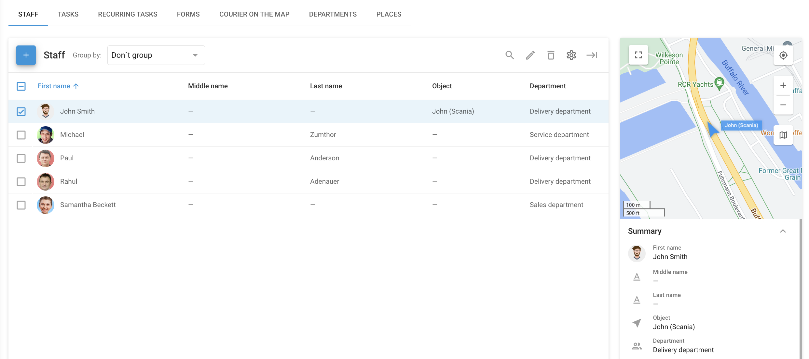

# Personnel

Les **Personnel** dans la section **Service extérieur** est spécialement conçue pour gérer et organiser efficacement les informations relatives à votre personnel itinérant. Cet outil vous permet de disposer de tout ce dont vous avez besoin pour coordonner efficacement votre personnel mobile.

Pour accéder à la section Personnel, connectez-vous à la plateforme Navixy et sélectionnez "Service extérieur" dans le menu principal. Cliquez ensuite sur l'onglet "Personnel". Cette section fournit une vue d'ensemble de tous les employés de votre organisation, en affichant leurs informations essentielles sous forme de liste.

## Liste des employés

La liste des employés est conçue pour une gestion rapide et pratique de votre personnel. Elle est particulièrement utile en conjonction avec la fonction "[Tâches](taches.md)"Vous pouvez y assigner des tâches, communiquer avec les employés et suivre leurs progrès.

Les informations relatives à chaque employé comprennent les détails suivants :

* **Nom de l'employé :** Informations d'identification de base pour chaque employé.
* **Photo :** Une photo de profil pour faciliter l'identification visuelle.
* **Téléphone et courriel :** Coordonnées permettant une communication rapide directement par l'intermédiaire de l'application.
* **Adresse du lieu :** Le lieu de travail principal de l'employé, qui peut être différent de l'adresse du bureau ou de la succursale.
* **Informations sur le permis de conduire :** Indispensable pour les employés qui conduisent dans le cadre de leur travail.
* **Département :** Indique le département ou la branche auquel l'employé appartient.

La liste peut être personnalisée en ajoutant ou en supprimant des colonnes afin d'afficher les informations les plus pertinentes, telles que les détails du permis de conduire, l'identifiant de l'employé, la clé du matériel, etc.

### Ajouter un nouveau salarié

Pour ajouter un nouvel employé au système, procédez comme suit :

1. **Cliquez sur le bouton Ajouter :** Situé dans le coin supérieur gauche de la section "Personnel".
2. **Remplir les détails de l'employé :** Saisissez le nom de l'employé, ses coordonnées, son lieu de travail et tout autre détail pertinent.
3. **Affecter à un département :** Sélectionnez le département ou la branche approprié(e) dans le menu déroulant.
4. **Enregistrer l'information :** Une fois tous les détails saisis, cliquez sur "Enregistrer" pour créer l'enregistrement de l'employé.

### Importation de salariés

Pour ajouter efficacement plusieurs employés à votre application de service extérieur, suivez les étapes suivantes :

1. **Ouvrir la section Personnel**: Allez dans la section "Personnel" de l'application Service extérieur.
2. **Lancer le processus d'importation**: Cliquez sur le bouton "+" et sélectionnez "XLS" dans la liste déroulante.
3. **Télécharger le fichier Excel**: Téléchargez le fichier d'exemple et saisissez les informations dont vous avez besoin. Cliquez ensuite sur "Parcourir" pour sélectionner votre fichier Excel (XLS, XLSX ou CSV). Assurez-vous que la case "Utiliser les en-têtes du fichier" est cochée si votre fichier contient des en-têtes.
4. **Réviser et poursuivre**: Vérifiez les champs obligatoires tels que le "First Name" et les champs supplémentaires. Cliquez sur "Continuer" pour terminer l'importation.

Ce processus permet d'ajouter rapidement des employés à votre répertoire, ce qui fait gagner du temps et garantit l'exactitude des données.

## Gestion des dossiers des employés

Une fois les employés ajoutés au système, vous pouvez facilement gérer et mettre à jour leurs informations si nécessaire. La section Personnel fournit une vue d'ensemble des détails de chaque employé, avec des options pour :

* **Modifier les informations relatives à l'employé :** Mettre à jour des informations telles que les coordonnées, le service ou les tâches assignées.
* **Voir l'emplacement de l'employé :** Voir la localisation en temps réel des employés affectés à un objet ou à un véhicule spécifique.
* **Personnaliser l'affichage de la liste des employés :** Ajustez les colonnes affichées dans la liste afin de présenter les informations les plus pertinentes pour vos opérations.
