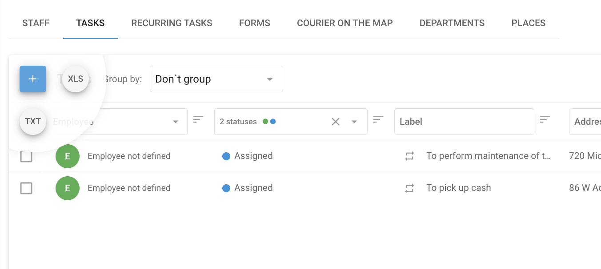

# Tâches

A **Tâche** dans Navixy désigne une mission ou un travail spécifique qui doit être réalisé par un employé ou un travailleur de terrain. Elle comprend des instructions détaillées sur ce qui doit être fait, où cela doit être fait et dans quel délai. Les tâches peuvent aller de missions simples et ponctuelles, comme la livraison d'un colis à un seul endroit, à des opérations plus complexes, comme la visite de plusieurs points de contrôle le long d'un itinéraire pour effectuer des inspections, des installations ou d'autres services.

Les tâches sont essentielles pour gérer et coordonner les opérations sur le terrain, pour s'assurer que les employés connaissent bien leurs responsabilités et pour permettre aux responsables de suivre les progrès, d'optimiser les itinéraires et de s'assurer que tous les travaux sont effectués de manière efficace.

## Comment créer une tâche

1. Naviguer vers l'onglet Tâches dans l'application Service extérieur
2. Cliquez sur le bouton **"+"** pour lancer le processus de création d'une nouvelle tâche.
3. **Définir le nom de la tâche :** \
   Saisissez un nom de tâche descriptif permettant d'identifier l'objectif de la tâche. Il peut s'agir du nom du client ou d'une brève description de la tâche, telle que "Installer l'équipement" ou "Inspecter les communications".
4. **Spécifiez l'adresse de la tâche :** \
   Saisissez manuellement l'adresse de la tâche, sélectionnez un point sur la carte ou utilisez les coordonnées géographiques. Cela permet de définir l'emplacement principal d'une tâche unique ou le premier point de contrôle d'une tâche d'itinéraire.
5. **Définir la durée de la tâche :** \
   Définissez la date et l'intervalle de temps pendant lesquels l'employé doit effectuer la tâche. Cela permet de s'assurer que la tâche est accomplie dans les délais impartis.
6. **Ajouter des points de contrôle pour les tâches d'itinéraire :** \
   Pour créer une tâche d'itinéraire, cliquez sur "Ajouter un nouveau point de contrôle" après avoir défini l'emplacement initial. Chaque point de contrôle représente un arrêt supplémentaire le long de l'itinéraire, et ils seront automatiquement connectés dans l'ordre. L'employé doit effectuer ces points de contrôle dans l'ordre spécifié.
7. **Attribuer la tâche à un employé :** \
   Sélectionnez l'employé qui sera responsable de la tâche. Si nécessaire, vous pouvez assigner la tâche ultérieurement à l'aide de la liste des tâches ou utiliser des outils supplémentaires fournis dans l'interface pour faciliter l'assignation.
8. **Détails de la tâche supplémentaire :**&#x20;
   1. **Description de la tâche :** Fournissez tout détail supplémentaire qui pourrait être utile à l'employé, comme des informations de contact ou des instructions spéciales.
   2. **forme :** Sélectionnez le formulaire que l'employé doit remplir lors de l'exécution de la tâche. Les formulaires peuvent être remplis directement dans l'application X-GPS Tracker.
   3. **Tags :** Ajoutez des étiquettes pertinentes à la tâche pour faciliter la recherche et la catégorisation ultérieures.
   4. **ID de commande :** Attribuer un identifiant de commande que le client peut utiliser pour suivre l'état de la tâche via la fonction "Courrier sur la carte".
9. Cliquez sur **"Sauvegarder** pour finaliser et envoyer la tâche sur l'appareil mobile de l'employé.

### Tâches uniques et itinéraires

* **Tâches uniques :** Il s'agit de tâches simples dans le cadre desquelles l'employé se rend à un seul endroit pour effectuer les tâches qui lui sont confiées. La tâche est achevée une fois que l'employé est arrivé à l'adresse spécifiée et a effectué les actions requises.
* **Tâches d'acheminement :** Il s'agit de points de contrôle multiples que l'employé doit visiter dans un ordre précis. Ce type de tâche est idéal pour les situations où l'employé doit se rendre à plusieurs endroits le long d'un itinéraire planifié, par exemple pour des livraisons ou des inspections.

L'interface est conçue pour être intuitive, permettant aux responsables et aux dispatchers de créer et de gérer rapidement des tâches uniques et des itinéraires avec facilité, garantissant ainsi que toutes les opérations sur le terrain sont traitées de manière efficace.

### Fonction d'optimisation des itinéraires

Navixy's **Optimisation des itinéraires** aide les coursiers à livrer les colis de manière efficace en déterminant la meilleure séquence pour visiter plusieurs adresses dans une ville. Elle tient compte de l'emplacement de chaque adresse, des délais de livraison spécifiques et du point de départ de la tâche pour créer l'itinéraire le plus optimal.

#### Principaux avantages :

* **Économies de carburant :** Minimise la distance à parcourir, réduisant ainsi la consommation de carburant.
* **Des livraisons plus rapides :** Optimise la séquence pour une exécution plus rapide des tâches.
* **Amélioration de la productivité :** Automatise la planification des itinéraires, ce qui permet aux coursiers de se concentrer sur les livraisons.

La plateforme peut optimiser jusqu'à 25 points dans une seule tâche d'itinéraire, garantissant ainsi que toutes les livraisons sont effectuées à temps et dans l'ordre le plus efficace.

## Importation de tâches

Lorsque vous gérez un effectif important ou de nombreuses tâches, il est plus efficace d'importer des tâches à partir d'un fichier Excel que de les créer manuellement et de les assigner une à une. Cela est particulièrement utile lorsque les tâches sont générées par des systèmes externes tels que les systèmes de gestion de la relation client (CRM).

### Importation d'un fichier Excel

Bien que les développeurs puissent utiliser une API pour l'importation de tâches, il existe une méthode plus simple : l'importation de tâches à partir d'un fichier Excel. Les données doivent être présentées au format XLS, XLSX ou CSV.

#### Comment importer des tâches à partir d'un fichier Excel

1. **Lancer le processus d'importation :**&#x20;
   1. Passez votre souris sur le bouton "+" dans la section des tâches.
   2. Cliquez sur l'icône **XLS** option.
2. **Fenêtre d'importation des tâches :**&#x20;
   1. Dans la fenêtre "Importation de tâches", vous pouvez télécharger une **Exemple de fichier** modèle.&#x20;
   2. Définir les paramètres de la tâche si nécessaire.
3. **Champs obligatoires :** \
   Les champs marqués comme "obligatoires" doivent être remplis pour que l'importation réussisse. Le système rejettera l'importation si des champs obligatoires sont manquants.
4. **Adresse ou coordonnées :** \
   Vous pouvez spécifier une adresse au lieu de coordonnées ; le système déterminera automatiquement l'emplacement.

#### Paramètres d'importation

Outre les paramètres des tâches individuelles, vous pouvez configurer les paramètres globaux suivants :

* **Rayon par défaut :** Définit l'écart autorisé par rapport à l'emplacement spécifié. Si l'employé (ou le véhicule) arrive dans ce rayon, la tâche sera considérée comme accomplie, même s'il n'atteint pas l'endroit exact.
* **Attribution automatique des tâches :**
  * **Ignorer l'adresse :** Les tâches sont réparties équitablement entre tous les employés.
  * **Utiliser l'adresse de l'employé :** Les tâches sont attribuées en fonction de la proximité de l'adresse du domicile de l'employé.
  * **Utiliser l'adresse du département :** Les tâches sont attribuées en fonction de la distance par rapport au département de l'employé._Remarque :_ Les adresses des services et des employés doivent être précisées sur leurs cartes de profil respectives.

En utilisant ces paramètres, vous pouvez rationaliser le processus d'affectation des tâches, en veillant à ce que les tâches soient distribuées et achevées de manière efficace.

### Importation à partir d'un fichier TXT

#### Comment importer des tâches à partir d'un fichier TXT ?

1. **Lancer le processus d'importation :**&#x20;
   1. Passez votre souris sur le **"+"** dans la section des tâches.
   2. Cliquez sur l'icône **TXT** option.
2. **Fenêtre d'importation des tâches :**&#x20;
   1. La fenêtre "Importation de tâches" s'affiche et contient un grand champ.
   2. Collez la liste des tâches de votre feuille de calcul directement dans ce champ à l'aide du presse-papiers (copier-coller).

Ce processus vous permet d'importer efficacement plusieurs tâches à la fois, ce qui rationalise votre flux de travail de gestion des tâches.
